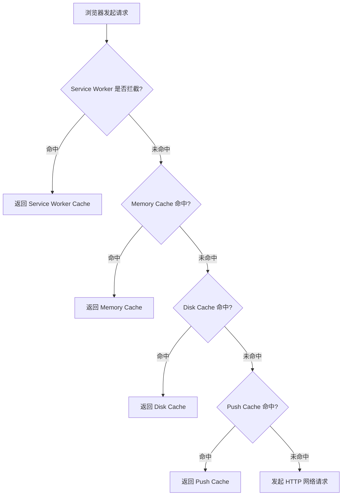
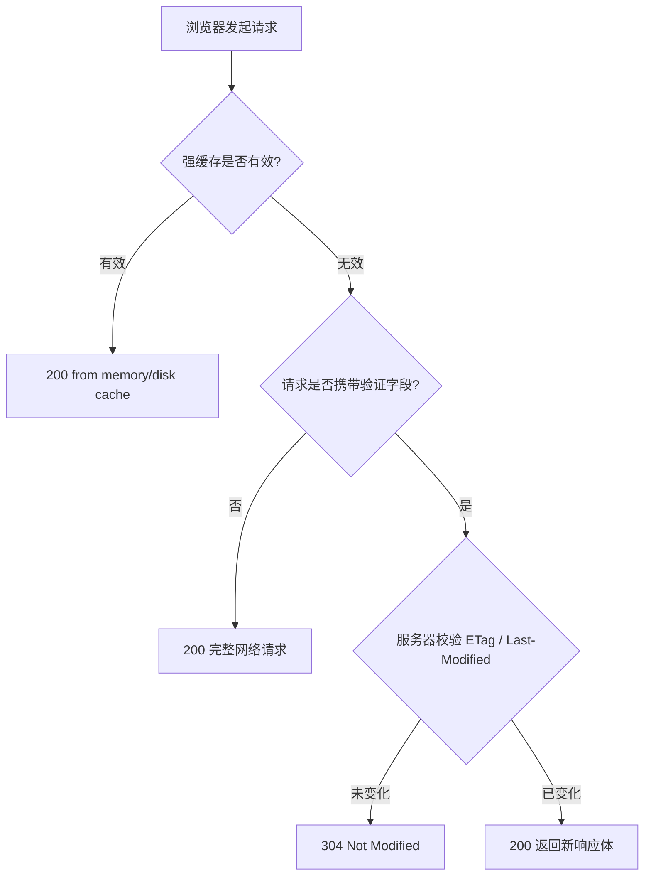
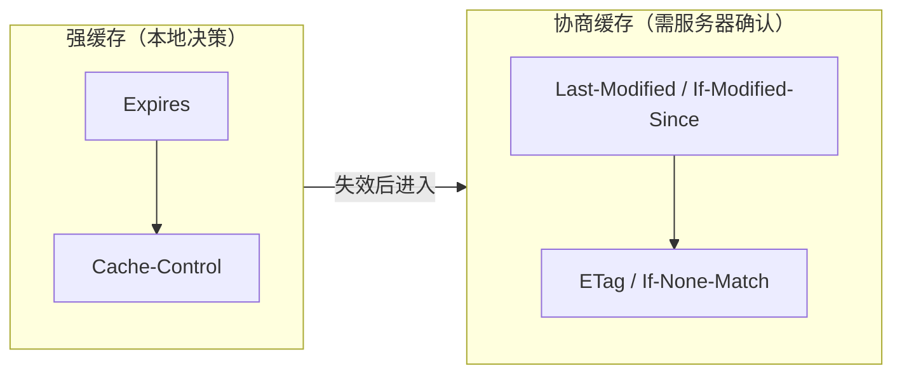
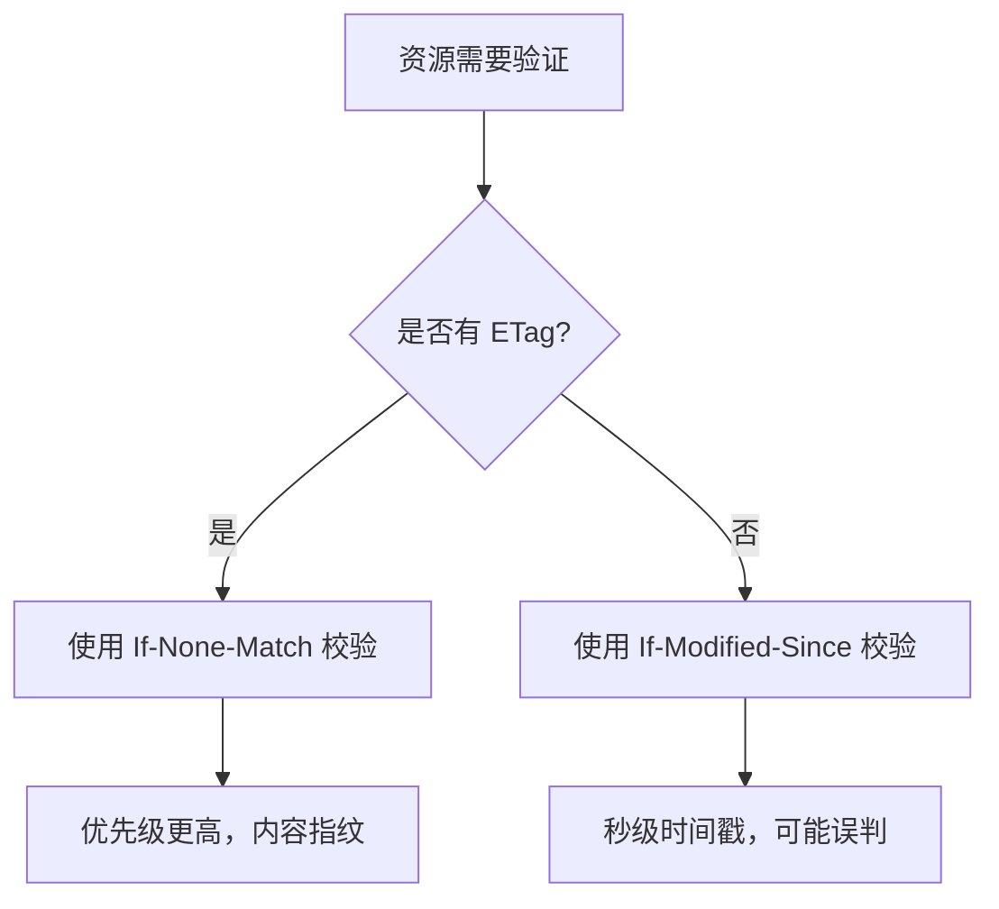

# 浏览器缓存机制 Implementation Plan

> **For agentic workers:** 本计划规模较大，建议按 Phase 1（overview + http-cache）先落地一个可独立运行的核心文章；Phase 2~4（storage-cache、service-worker-cache、cache-strategy）在 Phase 1 完成后再继续规划。

**Goal:** 在 `react-interview` 主应用的网络专题下新增「浏览器缓存机制」子专题，首先完成 `overview` 与 `http-cache` 两个子页面，包含 MDX 正文、Mermaid 图表、CodeDiff 代码对比与可交互的缓存命中模拟器。

**Architecture:** 每个子页面按 `index.tsx` + `content.mdx` + `data.ts` + 交互组件 + `demos/` + `diagrams/` 组织；正文全部写在 MDX，交互逻辑与表格数据下沉到 React 组件与 `data.ts`；通过 Vite `?raw` 导入源码与 Mermaid 文件；路由懒加载注册到 `src/router/config.tsx`。

**Tech Stack:** React 19, TypeScript, Vite, MDX, Ant Design 6, Mermaid, react-syntax-highlighter

---

## File Structure

```text
src/pages/network/browser-cache/
├── overview/
│   ├── index.tsx
│   ├── content.mdx
│   ├── data.ts
│   ├── diagrams/
│   │   └── cache-layers.mmd
│   └── CacheLayersDemo.tsx
└── http-cache/
    ├── index.tsx
    ├── content.mdx
    ├── data.ts
    ├── LiveDemo.tsx
    ├── demos/
    │   ├── cache-headers.bad.conf
    │   ├── cache-headers.good.conf
    │   ├── etag-implementation.bad.js
    │   └── etag-implementation.good.js
    └── diagrams/
        ├── http-cache-flow.mmd
        ├── strong-vs-negotiate.mmd
        └── etag-vs-last-modified.mmd
```

---

## Task 1: Create directory structure

**Files:**
- Create directories only.

**Step 1:** Run the following commands from the repository root.

```bash
mkdir -p src/pages/network/browser-cache/overview/diagrams
mkdir -p src/pages/network/browser-cache/http-cache/demos
mkdir -p src/pages/network/browser-cache/http-cache/diagrams
```

---

## Task 2: overview diagram

**Files:**
- Create: `src/pages/network/browser-cache/overview/diagrams/cache-layers.mmd`



---

## Task 3: overview data

**Files:**
- Create: `src/pages/network/browser-cache/overview/data.ts`

```typescript
export interface CacheLayer {
  key: string;
  name: string;
  priority: number;
  speed: string;
  capacity: string;
  lifecycle: string;
  examples: string;
}

export const cacheLayers: CacheLayer[] = [
  {
    key: 'service-worker',
    name: 'Service Worker Cache',
    priority: 1,
    speed: '极快（JS 直接控制）',
    capacity: '取决于磁盘配额',
    lifecycle: '由 Service Worker 控制，可离线持久化',
    examples: 'PWA 离线包、预缓存的 JS/CSS',
  },
  {
    key: 'memory',
    name: 'Memory Cache',
    priority: 2,
    speed: '最快',
    capacity: '小（受 tab 内存限制）',
    lifecycle: '页面关闭即释放',
    examples: 'base64 小图、当前页高频脚本',
  },
  {
    key: 'disk',
    name: 'Disk Cache',
    priority: 3,
    speed: '较慢（需要磁盘 IO）',
    capacity: '大（几百 MB 级别）',
    lifecycle: '跨会话持久，可被浏览器清理',
    examples: '大图、字体、视频、低频 JS',
  },
  {
    key: 'push',
    name: 'Push Cache',
    priority: 4,
    speed: '快',
    capacity: '小',
    lifecycle: 'HTTP/2 会话期内有效',
    examples: 'HTTP/2 Server Push 推送的资源',
  },
];

export const layersColumns = [
  { title: '缓存层', dataIndex: 'name', key: 'name' },
  { title: '优先级', dataIndex: 'priority', key: 'priority' },
  { title: '速度', dataIndex: 'speed', key: 'speed' },
  { title: '容量', dataIndex: 'capacity', key: 'capacity' },
  { title: '生命周期', dataIndex: 'lifecycle', key: 'lifecycle' },
  { title: '典型资源', dataIndex: 'examples', key: 'examples' },
];

export const whyCacheList = [
  '减少网络请求，降低服务器带宽与负载',
  '加速页面渲染，提升首屏与二次访问体验',
  '在弱网或离线场景下保持核心功能可用',
  '减少用户流量消耗，especially on mobile',
];
```

---

## Task 4: overview interactive demo component

**Files:**
- Create: `src/pages/network/browser-cache/overview/CacheLayersDemo.tsx`

```tsx
import React, { useState } from 'react';
import { Card, Col, Descriptions, Row, Tag, Typography } from 'antd';
import type { CacheLayer } from './data';

interface CacheLayersDemoProps {
  layers: CacheLayer[];
}

const CacheLayersDemo: React.FC<CacheLayersDemoProps> = ({ layers }) => {
  const [selected, setSelected] = useState<CacheLayer>(layers[0]);

  return (
    <div>
      <Row gutter={[16, 16]} style={{ marginBottom: 24 }}>
        {layers.map((layer) => (
          <Col xs={24} sm={12} md={6} key={layer.key}>
            <Card
              hoverable
              onClick={() => setSelected(layer)}
              style={{
                borderColor: selected.key === layer.key ? '#1890ff' : undefined,
                background: selected.key === layer.key ? '#e6f7ff' : undefined,
              }}
            >
              <Typography.Text strong>
                <Tag color="blue">{layer.priority}</Tag> {layer.name}
              </Typography.Text>
            </Card>
          </Col>
        ))}
      </Row>
      <Card title={`${selected.name} 详情`}>
        <Descriptions bordered column={{ xs: 1, md: 2 }}>
          <Descriptions.Item label="优先级">{selected.priority}</Descriptions.Item>
          <Descriptions.Item label="速度">{selected.speed}</Descriptions.Item>
          <Descriptions.Item label="容量">{selected.capacity}</Descriptions.Item>
          <Descriptions.Item label="生命周期">{selected.lifecycle}</Descriptions.Item>
          <Descriptions.Item label="典型资源" span={2}>
            {selected.examples}
          </Descriptions.Item>
        </Descriptions>
      </Card>
    </div>
  );
};

export default CacheLayersDemo;
```

---

## Task 5: overview MDX content

**Files:**
- Create: `src/pages/network/browser-cache/overview/content.mdx`

```mdx
import { Card, List, Table, Typography } from 'antd';
import MermaidViewer from '@/components/MermaidViewer';
import CacheLayersDemo from './CacheLayersDemo';
import cacheLayersFlow from './diagrams/cache-layers.mmd?raw';
import { cacheLayers, layersColumns, whyCacheList } from './data';

<Typography.Title level={2}>浏览器缓存机制概览</Typography.Title>

<Typography.Paragraph type="secondary">
  浏览器缓存是前端性能优化与面试中的高频考点。理解缓存分层、命中顺序以及每层的特点，才能在工程实践中做出合理的缓存决策。
</Typography.Paragraph>

<Card title="一、为什么需要缓存" style={{ marginBottom: 24 }}>
  <List
    dataSource={whyCacheList}
    renderItem={(item) => <List.Item>• {item}</List.Item>}
  />
</Card>

<Card title="二、浏览器缓存分层" style={{ marginBottom: 24 }}>
  当浏览器需要某个资源时，会按照以下优先级逐层查找：

  <MermaidViewer source={cacheLayersFlow} />

  <CacheLayersDemo layers={cacheLayers} />
</Card>

<Card title="三、各层缓存对比">
  <Table
    dataSource={cacheLayers}
    columns={layersColumns}
    pagination={false}
    bordered
    rowKey="key"
  />
</Card>
```

---

## Task 6: overview page entry

**Files:**
- Create: `src/pages/network/browser-cache/overview/index.tsx`

```tsx
import Content from './content.mdx';

const BrowserCacheOverview: React.FC = () => {
  return <Content />;
};

export default BrowserCacheOverview;
```

---

## Task 7: http-cache Mermaid diagrams

**Files:**
- Create: `src/pages/network/browser-cache/http-cache/diagrams/http-cache-flow.mmd`
- Create: `src/pages/network/browser-cache/http-cache/diagrams/strong-vs-negotiate.mmd`
- Create: `src/pages/network/browser-cache/http-cache/diagrams/etag-vs-last-modified.mmd`

`http-cache-flow.mmd`:



`strong-vs-negotiate.mmd`:



`etag-vs-last-modified.mmd`:



---

## Task 8: http-cache demo source files

**Files:**
- Create: `src/pages/network/browser-cache/http-cache/demos/cache-headers.bad.conf`
- Create: `src/pages/network/browser-cache/http-cache/demos/cache-headers.good.conf`
- Create: `src/pages/network/browser-cache/http-cache/demos/etag-implementation.bad.js`
- Create: `src/pages/network/browser-cache/http-cache/demos/etag-implementation.good.js`

`cache-headers.bad.conf`:

```nginx
server {
    listen 80;

    location / {
        # 错误：没有为静态资源配置合理的 Cache-Control
        # 浏览器将依赖启发式缓存，行为不可控
    }

    location ~* \.(js|css|png|jpg|jpeg|gif|ico|svg|woff|woff2|ttf|eot)$ {
        # 错误：一刀切禁用缓存，导致每次访问都重新下载静态资源
        add_header Cache-Control "no-store";
    }
}
```

`cache-headers.good.conf`:

```nginx
map $uri $asset_cache {
    ~* \.(js|css|png|jpg|jpeg|gif|ico|svg|woff|woff2|ttf|eot)$ "public, max-age=31536000, immutable";
    default "no-cache";
}

server {
    listen 80;

    location / {
        add_header Cache-Control $asset_cache;
    }

    location /api/ {
        # API 响应通常不缓存或短时间缓存
        add_header Cache-Control "no-store";
    }
}
```

`etag-implementation.bad.js`:

```javascript
// ❌ 反面教材：ETag 只基于文件路径生成，内容变化后 ETag 不变
const express = require('express');
const app = express();

app.get('/api/config', (req, res) => {
  // 无论内容怎么变，ETag 始终是 "config"
  res.setHeader('ETag', '"config"');
  res.json({ version: '1.0.0' });
});
```

`etag-implementation.good.js`:

```javascript
// ✅ 最佳实践：ETag 基于响应体内容哈希生成
const crypto = require('crypto');
const express = require('express');
const app = express();

function generateETag(body) {
  return '"' + crypto.createHash('md5').update(body).digest('hex') + '"';
}

app.get('/api/config', (req, res) => {
  const body = JSON.stringify({ version: '1.0.0' });
  const etag = generateETag(body);

  if (req.headers['if-none-match'] === etag) {
    res.status(304).end();
    return;
  }

  res.setHeader('ETag', etag);
  res.send(body);
});
```

---

## Task 9: http-cache data

**Files:**
- Create: `src/pages/network/browser-cache/http-cache/data.ts`

```typescript
export const directives = [
  { key: 'max-age', desc: '资源在多少秒内有效，单位秒', example: 'Cache-Control: max-age=3600' },
  { key: 'no-cache', desc: '使用前必须向服务器验证，不是不缓存', example: 'Cache-Control: no-cache' },
  { key: 'no-store', desc: '完全不缓存，每次都重新请求', example: 'Cache-Control: no-store' },
  { key: 'public', desc: '可被任意中间缓存（CDN 等）缓存', example: 'Cache-Control: public, max-age=86400' },
  { key: 'private', desc: '仅浏览器可缓存，中间 CDN 不应缓存', example: 'Cache-Control: private' },
  { key: 'must-revalidate', desc: '过期后必须重新验证，不允许使用过期缓存', example: 'Cache-Control: must-revalidate' },
  { key: 'immutable', desc: '在 max-age 内资源不会变，浏览器无需再验证', example: 'Cache-Control: immutable' },
];

export const directivesColumns = [
  { title: '指令', dataIndex: 'key', key: 'key' },
  { title: '含义', dataIndex: 'desc', key: 'desc' },
  { title: '示例', dataIndex: 'example', key: 'example' },
];

export const comparisonData = [
  { key: '1', item: '决策位置', strong: '浏览器本地', negotiate: '浏览器 + 服务器协商' },
  { key: '2', item: '状态码', strong: '200 (from memory/disk cache)', negotiate: '304 Not Modified 或 200' },
  { key: '3', item: '是否发请求', strong: '不发请求', negotiate: '发请求，但可能只返回响应头' },
  { key: '4', item: '核心头部', strong: 'Expires / Cache-Control', negotiate: 'Last-Modified / ETag' },
  { key: '5', item: '适用场景', strong: '不常变化的静态资源', negotiate: '可能变化但需要节省带宽的资源' },
];

export const comparisonColumns = [
  { title: '对比项', dataIndex: 'item', key: 'item' },
  { title: '强缓存', dataIndex: 'strong', key: 'strong' },
  { title: '协商缓存', dataIndex: 'negotiate', key: 'negotiate' },
];

export const interviewQuestions = [
  {
    key: '1',
    question: '强缓存和协商缓存的区别是什么？',
    answer: '强缓存由浏览器根据 Expires/Cache-Control 直接决定是否使用本地缓存，状态码通常是 200 (from cache)，不发网络请求。协商缓存是强缓存失效后，浏览器携带 If-Modified-Since / If-None-Match 向服务器验证，服务器返回 304 表示未变化，只返回响应头，不返回响应体。',
  },
  {
    key: '2',
    question: '为什么有了 Last-Modified 还需要 ETag？',
    answer: 'Last-Modified 是秒级时间戳，存在两个缺陷：1) 文件在 1 秒内多次修改无法感知；2) 文件内容未变但修改时间变化时会导致不必要的 200 响应。ETag 是内容指纹（通常基于内容哈希），只要内容不变 ETag 就不变，精度更高。',
  },
  {
    key: '3',
    question: 'F5 和 Ctrl+F5 对缓存的影响分别是什么？',
    answer: '普通地址栏回车/跳转会按正常缓存策略处理。F5 / 点击刷新按钮会让强缓存失效，但协商缓存仍会携带验证字段尝试 304。Ctrl+F5 / Cmd+Shift+R 会强制禁用缓存，不携带验证字段，直接向服务器重新请求完整资源。',
  },
];
```

---

## Task 10: http-cache interactive demo component

**Files:**
- Create: `src/pages/network/browser-cache/http-cache/LiveDemo.tsx`

```tsx
import React, { useMemo, useState } from 'react';
import { Card, Radio, Select, Space, Steps, Tag, Typography } from 'antd';

const { Option } = Select;

interface CacheResult {
  status: string;
  fromCache: string;
  requestSent: boolean;
  explanation: string;
}

const HttpCacheLiveDemo: React.FC = () => {
  const [cacheControl, setCacheControl] = useState<string>('max-age=3600');
  const [etag, setEtag] = useState<string>('present');
  const [lastModified, setLastModified] = useState<string>('present');
  const [action, setAction] = useState<string>('normal');

  const result = useMemo<CacheResult>(() => {
    if (action === 'force') {
      return {
        status: '200（强制刷新）',
        fromCache: '无',
        requestSent: true,
        explanation: 'Ctrl+F5 / Cmd+Shift+R 会跳过所有缓存，直接请求服务器',
      };
    }

    if (action === 'f5') {
      if (etag === 'none' && lastModified === 'none') {
        return {
          status: '200',
          fromCache: '无',
          requestSent: true,
          explanation: 'F5 会让强缓存失效，且没有协商缓存字段，只能重新请求完整资源',
        };
      }
      return {
        status: '304 Not Modified',
        fromCache: '磁盘/内存',
        requestSent: true,
        explanation: 'F5 让强缓存失效，但协商缓存仍可能命中，服务器返回 304',
      };
    }

    if (cacheControl === 'no-store') {
      return {
        status: '200',
        fromCache: '无',
        requestSent: true,
        explanation: 'no-store 禁止任何缓存，每次都需要重新请求',
      };
    }

    if (cacheControl === 'no-cache') {
      if (etag === 'none' && lastModified === 'none') {
        return {
          status: '200',
          fromCache: '无',
          requestSent: true,
          explanation: 'no-cache 要求每次验证，但没有 ETag/Last-Modified 时只能重新请求',
        };
      }
      return {
        status: '304 Not Modified',
        fromCache: '磁盘/内存',
        requestSent: true,
        explanation: 'no-cache 每次都要发请求验证，服务器返回 304',
      };
    }

    return {
      status: '200 (from cache)',
      fromCache: cacheControl === 'max-age=0' ? '无' : '内存/磁盘',
      requestSent: cacheControl === 'max-age=0',
      explanation:
        cacheControl === 'max-age=0'
          ? 'max-age=0 表示立即过期，进入协商缓存'
          : '在 max-age 有效期内，浏览器直接使用本地缓存，不发请求',
    };
  }, [cacheControl, etag, lastModified, action]);

  return (
    <Card bordered style={{ border: '2px solid #1890ff' }}>
      <Space direction="vertical" style={{ width: '100%' }} size="large">
        <div>
          <Typography.Text strong>1. 响应头 Cache-Control：</Typography.Text>
          <Select
            value={cacheControl}
            onChange={setCacheControl}
            style={{ width: 240, marginLeft: 8 }}
          >
            <Option value="max-age=3600">max-age=3600</Option>
            <Option value="max-age=0">max-age=0</Option>
            <Option value="no-cache">no-cache</Option>
            <Option value="no-store">no-store</Option>
          </Select>
        </div>

        <div>
          <Typography.Text strong>2. 协商缓存字段：</Typography.Text>
          <Space>
            <span>ETag</span>
            <Select value={etag} onChange={setEtag}>
              <Option value="present">有</Option>
              <Option value="none">无</Option>
            </Select>
            <span>Last-Modified</span>
            <Select value={lastModified} onChange={setLastModified}>
              <Option value="present">有</Option>
              <Option value="none">无</Option>
            </Select>
          </Space>
        </div>

        <div>
          <Typography.Text strong>3. 用户操作：</Typography.Text>
          <Radio.Group value={action} onChange={(e) => setAction(e.target.value)}>
            <Radio value="normal">正常访问 / 地址栏回车</Radio>
            <Radio value="f5">F5 刷新</Radio>
            <Radio value="force">Ctrl+F5 强制刷新</Radio>
          </Radio.Group>
        </div>

        <Steps
          direction="vertical"
          size="small"
          current={result.requestSent ? 1 : 0}
          items={[
            { title: '检查强缓存', description: cacheControl },
            { title: result.requestSent ? '发起网络请求' : '命中本地缓存', description: result.status },
          ]}
        />

        <Card size="small" title="模拟结果">
          <Space direction="vertical">
            <div>
              状态码：<Tag color="blue">{result.status}</Tag>
            </div>
            <div>缓存来源：{result.fromCache}</div>
            <div>是否发送请求：{result.requestSent ? '是' : '否'}</div>
            <div>说明：{result.explanation}</div>
          </Space>
        </Card>
      </Space>
    </Card>
  );
};

export default HttpCacheLiveDemo;
```

---

## Task 11: http-cache MDX content

**Files:**
- Create: `src/pages/network/browser-cache/http-cache/content.mdx`

```mdx
import { Card, Table, Typography } from 'antd';
import CodeDiff from '@/components/CodeDiff';
import MermaidViewer from '@/components/MermaidViewer';
import HttpCacheLiveDemo from './LiveDemo';
import httpCacheFlow from './diagrams/http-cache-flow.mmd?raw';
import strongVsNegotiate from './diagrams/strong-vs-negotiate.mmd?raw';
import etagVsLastModified from './diagrams/etag-vs-last-modified.mmd?raw';
import cacheHeadersBad from './demos/cache-headers.bad.conf?raw';
import cacheHeadersGood from './demos/cache-headers.good.conf?raw';
import etagBad from './demos/etag-implementation.bad.js?raw';
import etagGood from './demos/etag-implementation.good.js?raw';
import {
  directives,
  directivesColumns,
  comparisonData,
  comparisonColumns,
  interviewQuestions,
} from './data';

<Typography.Title level={2}>HTTP 缓存机制</Typography.Title>

<Typography.Paragraph type="secondary">
  HTTP 缓存是浏览器缓存体系中最核心的一层。它分为强缓存和协商缓存：强缓存命中时浏览器不发请求，协商缓存命中时浏览器发请求但服务器只返回 304。
</Typography.Paragraph>

<Card title="一、HTTP 缓存完整决策流程" style={{ marginBottom: 24 }}>
  <MermaidViewer source={httpCacheFlow} />
</Card>

<Card title="二、强缓存" style={{ marginBottom: 24 }}>
  强缓存由浏览器根据响应头自主判断，命中后直接从本地读取资源，不发送网络请求。

  ## 2.1 Expires

  `Expires` 是 HTTP/1.0 的头部，指定资源的绝对过期时间。它的缺点是依赖客户端本地时钟，如果用户修改了系统时间，缓存行为就会异常。

  ## 2.2 Cache-Control

  `Cache-Control` 是 HTTP/1.1 引入的强缓存头部，优先级高于 `Expires`。常见指令如下：

  <Table
    dataSource={directives}
    columns={directivesColumns}
    pagination={false}
    bordered
    rowKey="key"
  />

  ## 2.3 刷新行为对强缓存的影响

  - **地址栏回车 / 正常跳转**：按正常缓存策略处理。
  - **F5 / 点击刷新按钮**：强缓存失效，但协商缓存仍可能命中。
  - **Ctrl+F5 / Cmd+Shift+R**：强制禁用所有缓存，重新请求完整资源。
</Card>

<Card title="三、协商缓存" style={{ marginBottom: 24 }}>
  强缓存失效后，浏览器会携带验证字段向服务器确认资源是否变化。

  ## 3.1 Last-Modified / If-Modified-Since

  服务器在响应中返回 `Last-Modified`，浏览器再次请求时携带 `If-Modified-Since`。如果资源在该时间后未修改，服务器返回 304。

  缺陷：
  - 秒级精度，1 秒内多次修改无法感知。
  - 文件内容未变但修改时间变化时，会误返回 200。

  ## 3.2 ETag / If-None-Match

  `ETag` 是服务器为资源生成的唯一标识（通常是内容哈希）。浏览器再次请求时携带 `If-None-Match`，服务器比对后决定是否返回 304。

  `ETag` 优先级高于 `Last-Modified`，因为它直接反映内容变化。

  <MermaidViewer source={etagVsLastModified} />

  ## 3.3 ETag 实现对比

  <CodeDiff
    oldValue={etagBad}
    newValue={etagGood}
    leftTitle="❌ 基于路径的 ETag"
    rightTitle="✅ 基于内容哈希的 ETag"
    type="error"
    hideDiffMarkers={true}
  />
</Card>

<Card title="四、强缓存 vs 协商缓存" style={{ marginBottom: 24 }}>
  <MermaidViewer source={strongVsNegotiate} />

  <Table
    dataSource={comparisonData}
    columns={comparisonColumns}
    pagination={false}
    bordered
    rowKey="key"
    style={{ marginTop: 24 }}
  />
</Card>

<Card title="五、缓存响应头配置对比" style={{ marginBottom: 24 }}>
  以下 Nginx 配置展示了静态资源缓存的常见错误与正确写法：

  <CodeDiff
    oldValue={cacheHeadersBad}
    newValue={cacheHeadersGood}
    leftTitle="❌ 反面教材"
    rightTitle="✅ 最佳实践"
    type="error"
    hideDiffMarkers={true}
  />
</Card>

<Card title="六、互动演示：缓存命中模拟器" style={{ marginBottom: 24, border: '2px solid #1890ff' }}>
  通过下方的模拟器观察不同响应头与用户操作下的缓存行为：

  <HttpCacheLiveDemo />
</Card>

<Card title="七、面试高频考点" style={{ background: '#f0f5ff' }}>
  {interviewQuestions.map((item) => (
    <div key={item.key} style={{ marginBottom: 16 }}>
      <Typography.Text strong>{item.question}</Typography.Text>
      <Typography.Paragraph type="secondary">{item.answer}</Typography.Paragraph>
    </div>
  ))}
</Card>
```

---

## Task 12: http-cache page entry

**Files:**
- Create: `src/pages/network/browser-cache/http-cache/index.tsx`

```tsx
import Content from './content.mdx';

const HttpCachePage: React.FC = () => {
  return <Content />;
};

export default HttpCachePage;
```

---

## Task 13: Register routes

**Files:**
- Modify: `src/router/config.tsx`

Add imports near other network route imports (around line 117-128):

```tsx
const BrowserCacheOverview = lazy(() => import('../pages/network/browser-cache/overview/index'));
const HttpCachePage = lazy(() => import('../pages/network/browser-cache/http-cache/index'));
```

Add a new entry inside `dashboardRoutes` under the `/dashboard/network` children array. Insert before the existing `silent-refresh` block for logical grouping:

```tsx
{
  path: '/dashboard/network/browser-cache',
  label: '浏览器缓存机制',
  icon: <GlobalOutlined />,
  children: [
    {
      path: '/dashboard/network/browser-cache/overview',
      label: '缓存分层概览',
      element: <BrowserCacheOverview />,
    },
    {
      path: '/dashboard/network/browser-cache/http-cache',
      label: 'HTTP 缓存',
      element: <HttpCachePage />,
    },
  ],
},
```

---

## Task 14: Run lint

**Step 1:** Run lint.

```bash
npm run lint
```

Expected: no new lint errors introduced by the added files.

---

## Task 15: Manual verification

**Step 1:** Start the dev server.

```bash
npm run dev
```

**Step 2:** Open the browser and navigate to:

- `http://localhost:5173/dashboard/network/browser-cache/overview`
- `http://localhost:5173/dashboard/network/browser-cache/http-cache`

**Step 3:** Verify:

- Left menu shows「浏览器缓存机制」with two children.
- `overview` page renders the cache layers diagram and the interactive demo.
- `http-cache` page renders the three Mermaid diagrams, the two code diffs, the table, and the live demo.
- The live demo updates its result when changing Cache-Control, ETag, Last-Modified, and refresh action.

---

## Phase 2~4 (后续计划)

- **Phase 2:** `storage-cache` 页面（内存 vs 磁盘缓存、容量模拟器）。
- **Phase 3:** `service-worker-cache` 页面（SW 生命周期、Cache API、缓存策略选择器）。
- **Phase 4:** `cache-strategy` 页面（工程实践、webpack/vite 缓存配置、面试问答）。

每个 Phase 的结构与 Phase 1 相同：新增 `index.tsx` + `content.mdx` + `data.ts` + `LiveDemo.tsx` + `demos/` + `diagrams/`，并补充 `src/router/config.tsx` 中的子路由。
