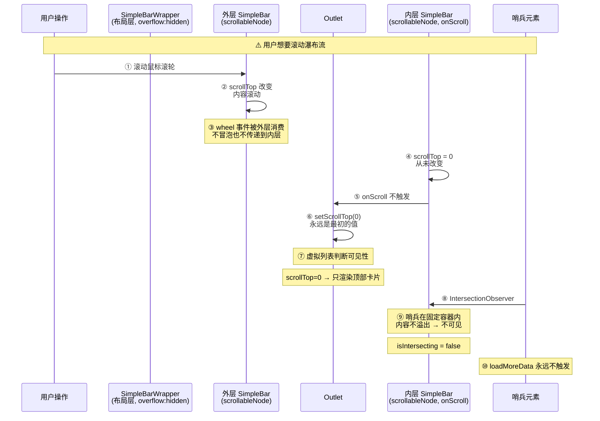
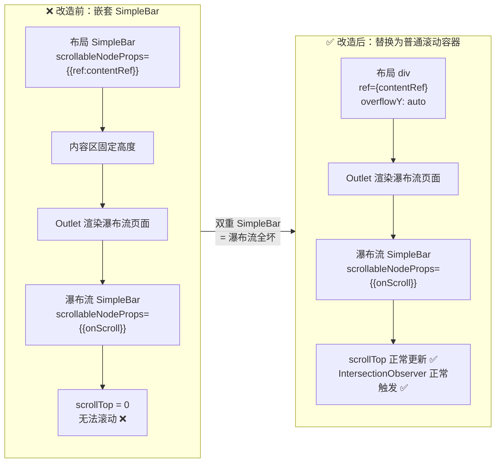
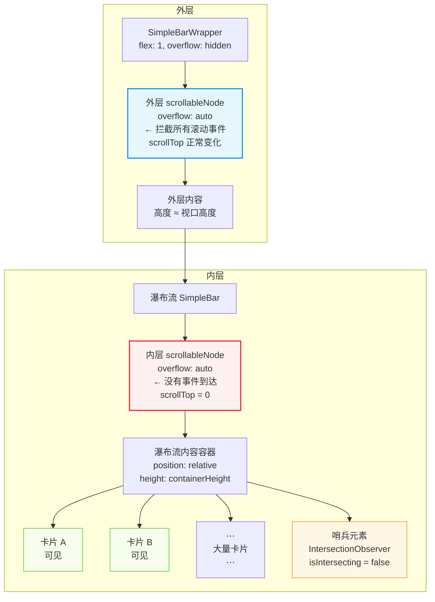

# SimpleBar 嵌套布局：问题追溯与架构决策

> 本文档记录 react-interview 主应用布局中 `SimpleBar` 的两轮改造过程、出现的问题以及背后的深层原因。

---

## 一、初始状态

在未修改之前，`MainLayout` 的内容区使用一个原生 `<div>` 作为滚动容器：

```tsx
// 原始的 MainLayout 内容区（被注释掉的旧代码）
<Content
  ref={contentRef}
  style={{
    padding: '16px 12px 18px 16px',
    margin: 0,
    flex: 1,
    overflowY: 'auto',
    position: 'relative',
  }}
>
  <Outlet />
</Content>
```

这个方案的问题：

1. 路由切换时，内容区高度可能瞬间超过视口，而 `html`/`body` 没有 `overflow: hidden`
2. 浏览器检测到 `body` 溢出 → 显示原生全局滚动条
3. 等 SimpleBar 在瀑布流等页面内初始化完成 → 全局滚动条消失
4. 6px 宽度变化（`App.css` 中 `::-webkit-scrollbar { width: 6px }`）→ 页面闪动

---

## 二、第一轮改造：布局层也套 SimpleBar

为了解决全局滚动条闪动，第一反应是把布局层的滚动容器也替换成 SimpleBar，让整个页面所有滚动都由 SimpleBar 管理：

```tsx
// 简化示意图
<Layout style={{ height: '100vh', overflow: 'hidden' }}>
  <Sider>...</Sider>
  <Layout>
    <Header>...</Header>
    <TabsContainer>...</TabsContainer>
    <SimpleBarWrapper>
      <SimpleBar style={{ height: '100%' }}>
        <Suspense>
          <Outlet />
            ├── 普通页面（正常 ✅）
            └── 瀑布流页面
                  └── <SimpleBar onScroll={...}>
                        └── 瀑布流内容
      </SimpleBar>
    </SimpleBarWrapper>
  </Layout>
</Layout>
```

### 问题：瀑布流全部失效

所有 4 个瀑布流组件出现了相同症状：

- 滚动无响应，只显示顶部少量卡片
- 无限加载失效，永远不会加载新数据

---

## 三、问题深层分析

### 3.1 SimpleBar 的内部结构

`<SimpleBar>` 并非一个普通的 DOM 元素，它在渲染时生成多层 DOM：

```
<SimpleBar>                             → className="simplebar-wrapper"
  <div class="simplebar-mask">          → 遮罩层
    <div class="simplebar-offset">      → 偏移容器
      <div class="simplebar-content-wrapper" ref={scrollableNodeRef}>
        ← 这就是 scrollableNodeProps 绑定的节点
        ← 拥有 overflow: auto，是真正的滚动容器
        ← 这里是所有 children 被渲染的位置
        <div class="simplebar-content">
          ← 实际的 children 内容
        </div>
      </div>
    </div>
  </div>
  <div class="simplebar-track horizontal">...</div>
  <div class="simplebar-track vertical">...</div>
</SimpleBar>
```

关键事实：

- `<SimpleBar>` 自身是一个**非溢出容器**（`overflow: hidden` 或不溢出）
- `scrollableNode`（`simplebar-content-wrapper`）是实际的滚动容器
- SimpleBar 的滚动事件**绑定在 `scrollableNode` 上**，**不会冒泡到外层**
- 外层 SimpleBar 的 `scrollableNode` 先于内层创建，且物理上位于父级位置

### 3.2 事件流截断

```
用户滚动鼠标滚轮
  ↓
事件首先到达外层 SimpleBar 的 scrollableNode
  ↓
外层 scrollableNode 的 overflow:auto 检测到内容溢出 → scrollTop 改变
  ↓
wheel 事件被外层消费，不继续冒泡/传递
  ↓
内层 SimpleBar 的 scrollableNode 内容未溢出（高度受限）
  → scrollTop 恒为 0
```

如果用引水渠来比喻：

```
用户滚动 → 水渠（外层 SimpleBar）
           ↕ 水全被这一层吸走了
           灌溉渠（内层 SimpleBar）
              ↕ 永远没水
```

### 3.3 `onScroll` 监听视角

```tsx
// 瀑布流代码
const handleScroll = useCallback((e: React.UIEvent<HTMLElement>) => {
  const currentScrollTop = e.currentTarget.scrollTop;
  setScrollTop(currentScrollTop);
}, []);

// 渲染
<SimpleBar scrollableNodeProps={{ onScroll: handleScroll }}>
```

| 变量 | 期望 | 嵌套后的实际值 |
|------|------|---------------|
| `e.currentTarget.scrollTop` | 随滚动变化 | 始终为 0 |
| `setScrollTop` | 不断更新 | 初始值之后从未更新 |

虚拟列表的核心判断：

```tsx
const isVisible =
  pos.top + (pos.itemHeight || 0) > scrollTop - buffer &&
  pos.top < scrollTop + windowHeight + buffer;
```

`scrollTop = 0` → 只有 `pos.top ∈ [0, windowHeight + buffer]` 的卡片可见 → 只渲染最顶部几项。

### 3.4 IntersectionObserver 的隐式 root

`IntersectionObserver` 不传 `root` 时，默认选取**最近的、可滚动的祖先元素**作为观察根。在内层 SimpleBar 场景中：

```
距离哨兵最近的可滚动祖先：
  └─ 内层 SimpleBar 的 scrollableNode（期望 ✅）
  
但实际滚动行为：
  └─ 内层 SimpleBar 的 scrollableNode 不滚动
  └─ 哨兵始终不可见 → isIntersecting = false
  └─ loadMoreData 不触发
```

兜底检查同样失效：

```tsx
const rect = sentinelRef.current.getBoundingClientRect();
const windowHeight = window.innerHeight;
if (rect.top <= windowHeight + 100) {
  loadMoreRef.current();
}
```

因为哨兵被嵌套在两层固定高度容器内，`getBoundingClientRect` 虽然返回相对于浏览器视口的坐标，但哨兵本身在物理布局上处于外层 SimpleBar 的可滚动区域深处，而外层 SimpleBar 内部又包裹了多层 DOM 结构，导致哨兵的位置计算异常。

### 3.5 全局滚动条闪动（为什么之前在瀑布流页面特别明显）

```
路由切换到瀑布流页面
  ↓
瀑布流内容多、需要渲染大量 DOM → 渲染耗时
  ↓
body 内容高度 > 视口高度
  ↓
body 没有 overflow 限制 → 浏览器显示原生滚动条
  ↓
瀑布流的 SimpleBar JS 初始化完成 → 接管滚动
  ↓
原生滚动条消失（宽度减少 6px）
  ↓
页面宽度变化 → 卡片布局抖动
```

---




---



---



---

## 四、最终方案

两步修复：

### 4.1 `src/index.css`

```css
html {
  overflow: hidden;
}
```

**为什么**：告诉浏览器永远不要在 `body` 层产生原生滚动条。这个应用的所有滚动都由 100vh 布局内部的 SimpleBar 管理，body 层不需要、也不应该出现原生滚动条。

### 4.2 `src/layout/MainLayout.tsx`

```tsx
// 之前：嵌套 SimpleBar — 破坏所有内部 SimpleBar 页面
<SimpleBarWrapper>
  <SimpleBar scrollableNodeProps={{ref:contentRef}} style={{ ... }}>
    <Outlet />
  </SimpleBar>
</SimpleBarWrapper>

// 之后：普通滚动容器 — 不拦截滚动事件
<SimpleBarWrapper>
  <div ref={contentRef} style={{ height: '100%', overflowY: 'auto', padding: '...' }}>
    <Outlet />
  </div>
</SimpleBarWrapper>
```

**为什么**：普通 `<div>` 的滚动行为是原生的，它不会拦截或重新绑定 wheel 事件。内层瀑布流的 SimpleBar 可以正常接收到滚动事件。

### 最终布局结构

```
Layout (height: 100vh, overflow: hidden)
├── Sider (左侧菜单, 256px)
│   └── SimpleBarMenuWrapper
│       └── SimpleBar → Menu
└── Layout (flex: 1)
    ├── Header (64px, 顶部导航)
    ├── TabsContainer (标签页)
    └── SimpleBarWrapper (flex: 1, overflow: hidden)
        └── div (overflowY: auto, contentRef)    ← 非瀑布流页由它滚动
            └── Suspense > Outlet
                ├── 普通 MDX 页面（正常）
                └── 瀑布流页面
                    └── SimpleBar (onScroll)      ← 瀑布流自己管自己
```

---

## 五、关键认知

1. **SimpleBar 不是普通的 `<div>`**，它有自己的内部滚动容器（`scrollableNode`），会拦截并消费 wheel/scroll 事件

2. **SimpleBar 嵌套必然导致内层滚动失效**，因为外层的 scrollableNode 截走了所有滚动事件，内层的 scrollableNode 永远收不到

3. **`IntersectionObserver` 不传 `root` 时使用最近的可滚动祖先**，这个隐式行为在内层 SimpleBar 不滚动时会导致哨兵永远不可见

4. **`html { overflow: hidden }` 是"单层滚动"架构的必需品**：当应用使用 100vh 固定布局 + 内部滚动容器时，必须在 html/body 层阻止原生溢出，否则路由切换时的 DOM 渲染时序会导致全局滚动条闪烁

5. **选择正确的抽象层级**：
   - 布局层：不需要 SimpleBar，普通 `overflowY: auto` 足够
   - 内容层（需要自定义滚动条的页面）：用 SimpleBar
   - 两者之间：用 `overflow: hidden` 隔断，互不干扰
