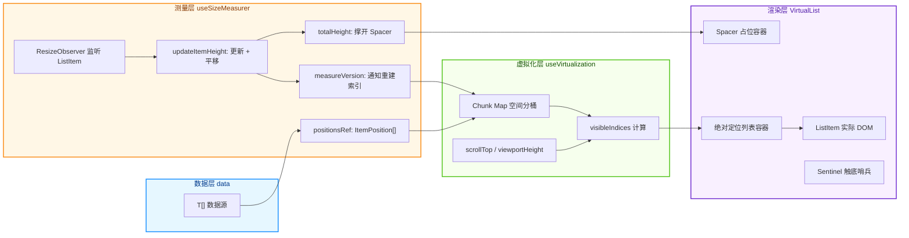
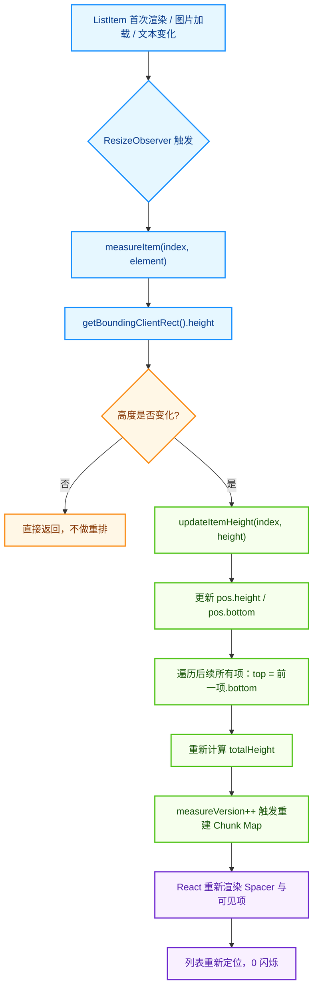
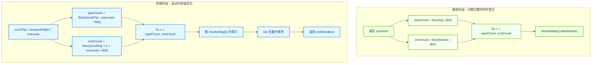
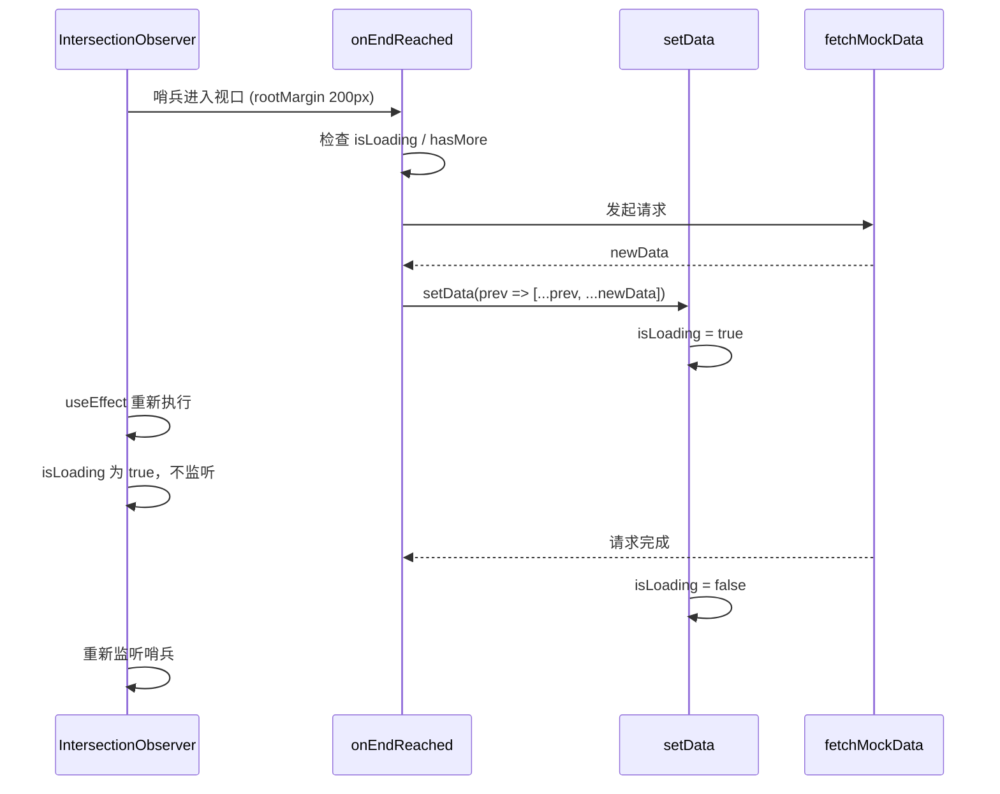

# 不定高虚拟列表面试精讲 —— 从 ResizeObserver 到空间分桶

> **目标读者**：准备面试、希望把项目里「不定高虚拟列表」讲清楚的前端开发者。
>
> **对应源码**：`src/pages/performance/NoStableHeightVirtualList/VirtualList.tsx`、`useSizeMeasurer.ts`、`useVirtualization.ts`、`index.tsx`。
>
> **阅读建议**：把本文当成“面试官连环追问”的逐题拆解，每道题都给出可直接背诵的“面试金句” + 源码佐证 + 关键流程图。

---

## 一句话总结

我们的不定高虚拟列表采用 **“先渲染 → 后测量 → 动态纠偏”** 的策略：每个列表项先用 `defaultItemHeight` 预估占位，渲染后用 `ResizeObserver` 监听真实高度，再更新内部 `positions` 缓存并平移后续所有项的坐标，同时通过 **空间分桶（Chunk Map）** 把可见项查找复杂度从 O(N) 降到 O(1)，实现 0 闪烁的高性能动态高度虚拟列表。

---

## 目录

1. [Q1：请整体介绍一下这个不定高虚拟列表的架构](#q1请整体介绍一下这个不定高虚拟列表的架构)
2. [Q2：不定高虚拟列表的核心难点是什么？怎么解决？](#q2不定高虚拟列表的核心难点是什么怎么解决)
3. [Q3：useSizeMeasurer 如何维护每个 item 的动态高度？](#q3usesizemeasurer-如何维护每个-item-的动态高度)
4. [Q4：ResizeObserver 触发后，如何更新 positions 并避免闪烁？](#q4resizeobserver-触发后如何更新-positions-并避免闪烁)
5. [Q5：useVirtualization 中的空间分桶是怎么工作的？](#q5usevirtualization-中的空间分桶是怎么工作的)
6. [Q6：为什么 ListItem 用 `translate3d` 而不是直接设置 `top`？](#q6为什么-listitem-用-translate3d-而不是直接设置-top)
7. [Q7：触底加载是怎么实现的？如何防止并发请求？](#q7触底加载是怎么实现的如何防止并发请求)
8. [Q8：这个方案做了哪些性能优化？](#q8这个方案做了哪些性能优化)
9. [Q9：生产环境还要注意什么？](#q9生产环境还要注意什么)
10. [面试金句速记](#面试金句速记)
11. [相关文件](#相关文件)

---

## Q1：请整体介绍一下这个不定高虚拟列表的架构

### 面试答法

整个架构可以分成四层：**数据层、测量层、虚拟化层、渲染层**。

- **数据层**：外部传入 `data: T[]`，配合 `renderItem` 决定每条数据渲染成什么卡片。
- **测量层**：由 `useSizeMeasurer` 负责。它维护一个 `positionsRef` 数组，记录每个 item 的 `top/height/bottom`。对渲染到 DOM 上的每个 `ListItem` 挂载 `ResizeObserver`，一旦高度变化就更新 `positions`，并平移后续所有项；同时递增 `measureVersion` 通知虚拟化引擎重建空间索引。
- **虚拟化层**：由 `useVirtualization` 负责。它根据 `positions` 建立纵向空间的 **Chunk Map**（分桶），滚动时根据 `scrollTop` 和 `viewportHeight` 直接查桶，O(1) 拿到可见索引 `visibleIndices`。
- **渲染层**：`VirtualList` 组件只渲染可见项。用一个 `Spacer` 撑开总滚动高度，用一个绝对定位的列表容器承载 `ListItem`，每个 `ListItem` 通过 `transform: translate3d(0, top, 0)` 定位，并挂载 `ResizeObserver` 回传测量数据。



### 源码对应

```typescript
// VirtualList.tsx
const { positions, totalHeight, measureVersion, measureItem } = useSizeMeasurer(data, defaultItemHeight);
const { visibleIndices, handleScroll, containerRef } = useVirtualization(positions, {
  chunkSize,
  overscan,
  measureVersion,
});
```

### 面试金句

> “整个架构采用‘先渲染后测量’的兜底策略：数据层只负责数据，测量层用 ResizeObserver 捕获真实高度，虚拟化层用空间分桶把查找降到 O(1)，渲染层只画可见项，Spacer 负责滚动条。”

---

## Q2：不定高虚拟列表的核心难点是什么？怎么解决？

### 面试答法

不定高虚拟列表的难点在于：**每个 item 的真实高度在渲染前是未知的**，而且可能在渲染后动态变化（比如图片加载、字体回退、文本展开等）。这会导致三个问题：

1. **无法提前精确计算每个 item 的 top 值**：如果不知道前面所有 item 的高度，就无法确定当前 item 应该渲染在哪里。
2. **总滚动高度不确定**：如果总高度算少了，滚动条会抖动；算多了，会出现大量空白。
3. **高度变化后需要重新定位后续所有项**：一个 item 变高了，它后面的所有 item 都要向下平移，否则会重叠或留白。

我们的解决方案是：

1. **预估高度先行**：未测量或不可见 item 先用 `defaultItemHeight` 占位，保证列表能立即渲染。
2. **ResizeObserver 实时测量**：对真实渲染到 DOM 上的 item 监听高度变化，获取真实高度后修正缓存。
3. **坐标平移纠偏**：每次某个 item 高度变化，更新该 item 的 `height/bottom`，并从下一项开始依次重新计算 `top` 和 `bottom`。
4. **Spacer 同步更新**：总高度 `totalHeight` 始终等于最后一个 item 的 `bottom`，保证滚动条和实际内容一致。

### 面试金句

> “不定高虚拟列表的本质矛盾是：滚动定位需要知道高度，但高度往往在渲染后才能拿到。我们用‘预估高度 + ResizeObserver 事后纠偏’来化解这个矛盾，先让列表能滚，再让它滚得准。”

---

## Q3：useSizeMeasurer 如何维护每个 item 的动态高度？

### 面试答法

`useSizeMeasurer` 内部维护三个核心状态：

- `positionsRef.current`：一个 `ItemPosition[]` 数组，记录每个 item 的 `index/top/height/bottom`。
- `totalHeight`（State）：用于撑开 `Spacer`，因为需要触发 React 重渲染。
- `measureVersion`（State）：因为 `positionsRef` 是 `useRef` 引用稳定，需要靠版本号通知虚拟化引擎数据已变化，从而重建 Chunk Map。

当数据源 `data` 增加时，`initPositions` 会为新增项填充预估高度，并基于上一项的 `bottom` 依次计算 `top`。这样新数据追加进来时，位置不会错乱。

### 源码对应

```typescript
// useSizeMeasurer.ts
const positionsRef = useRef<ItemPosition[]>([]);
const [totalHeight, setTotalHeight] = useState(0);
const [measureVersion, setMeasureVersion] = useState(0);

const initPositions = useCallback(() => {
  const prevLength = positionsRef.current.length;
  const newDataLength = data.length;

  if (newDataLength > prevLength) {
    const lastItem = positionsRef.current[prevLength - 1];
    let startTop = lastItem ? lastItem.bottom : 0;

    const newPositions: ItemPosition[] = [];
    for (let i = prevLength; i < newDataLength; i++) {
      newPositions.push({
        index: i,
        top: startTop,
        height: defaultItemHeight,
        bottom: startTop + defaultItemHeight,
      });
      startTop += defaultItemHeight;
    }

    positionsRef.current = [...positionsRef.current, ...newPositions];
    setTotalHeight(startTop);
  }
}, [data.length, defaultItemHeight]);
```

### 面试金句

> “`useSizeMeasurer` 是动态高度的‘单点真相源’。它用 `positionsRef` 缓存所有 item 的位置，用 `totalHeight` 驱动 Spacer，用 `measureVersion` 作为版本号通知消费方刷新。”

---

## Q4：ResizeObserver 触发后，如何更新 positions 并避免闪烁？

### 面试答法

当 `ResizeObserver` 发现某个 `ListItem` 的高度变化时，会调用 `measureItem`，传入 index 和 DOM 元素。`measureItem` 读取 `getBoundingClientRect().height`，然后调用 `updateItemHeight`。

`updateItemHeight` 做三件事：

1. 更新当前 item 的 `height` 和 `bottom`。
2. 从当前 item 的下一项开始，依次把 `top` 设为前一项的 `bottom`，并重新计算 `bottom`。
3. 更新 `totalHeight` 为最后一个 item 的 `bottom`，并递增 `measureVersion`。

关键点在于：**我们只更新受影响的项，而不是重算全部**。这保证了测量的性能；同时 `ListItem` 使用 `transform: translate3d` 做定位，不需要触发 Layout 重排，只触发 Composite，因此不会闪烁。



### 源码对应

```typescript
// useSizeMeasurer.ts
const updateItemHeight = useCallback((index: number, height: number) => {
  const pos = positionsRef.current[index];
  if (!pos || pos.height === height) return;

  pos.height = height;
  pos.bottom = pos.top + height;

  for (let i = index + 1; i < positionsRef.current.length; i++) {
    positionsRef.current[i].top = positionsRef.current[i - 1].bottom;
    positionsRef.current[i].bottom = positionsRef.current[i].top + positionsRef.current[i].height;
  }

  const lastItem = positionsRef.current[positionsRef.current.length - 1];
  setTotalHeight(lastItem ? lastItem.bottom : 0);
  setMeasureVersion((v) => v + 1);
}, []);

const measureItem = useCallback((index: number, element: HTMLElement) => {
  if (!element) return;
  const rect = element.getBoundingClientRect();
  if (rect.height > 0) {
    updateItemHeight(index, rect.height);
  }
}, [updateItemHeight]);
```

### 面试金句

> “ResizeObserver 触发后，我们不是重算整个列表，而是只更新当前项并平移后续项。配合 `transform` 的 GPU 合成定位，可以实现 0 闪烁的动态高度修正。”

---

## Q5：useVirtualization 中的空间分桶是怎么工作的？

### 面试答法

空间分桶（Chunk Map / Spatial Binning）是为了解决“滚动时快速找到可见项”的问题。

传统做法是遍历所有 `positions` 判断每个 item 是否在视口内，复杂度是 O(N)。当数据量很大时，每帧都遍历一遍会吃光 CPU。

我们的做法：

1. **建表阶段**：在计算或更新每个 item 的 `top/bottom` 后，把纵向空间按 `chunkSize`（默认 800px）切成一个个“房间”。计算 item 的 `top` 和 `bottom` 分别落在哪个房间，就把该 item 的索引加到这些房间的 Set 里。
2. **检索阶段**：滚动时，根据 `scrollTop`、视口高度和 `overscan`，算出当前覆盖了哪几个房间，直接查 Map 取索引，Set 去重后排序，得到 `visibleIndices`。

这样查找复杂度从 O(N) 降到 O(覆盖的房间数 × 每个房间的 item 数)，近似 O(1)。



### 源码对应

```typescript
// useVirtualization.ts
const chunksMap = useMemo(() => {
  const map = new Map<number, Set<number>>();
  const { chunkSize } = config;

  positions.forEach((pos, idx) => {
    const startChunk = Math.floor(pos.top / chunkSize);
    const endChunk = Math.floor(pos.bottom / chunkSize);

    for (let c = startChunk; c <= endChunk; c++) {
      if (!map.has(c)) {
        map.set(c, new Set());
      }
      map.get(c)!.add(idx);
    }
  });

  return map;
}, [positions, config.chunkSize, config.measureVersion]);

const visibleIndices = useMemo(() => {
  if (viewportHeight === 0) return [];

  const { chunkSize, overscan } = config;
  const startChunk = Math.floor((scrollTop - overscan) / chunkSize);
  const endChunk = Math.floor((scrollTop + viewportHeight + overscan) / chunkSize);

  const indicesSet = new Set<number>();
  for (let c = startChunk; c <= endChunk; c++) {
    const chunk = chunksMap.get(c);
    if (chunk) {
      chunk.forEach((idx) => indicesSet.add(idx));
    }
  }

  return Array.from(indicesSet).sort((a, b) => a - b);
}, [chunksMap, scrollTop, viewportHeight, config.overscan, config.chunkSize]);
```

### 面试金句

> “空间分桶借鉴了碰撞检测的空间分割思想。建表时把 item 索引按纵向位置写进桶里，检索时只查覆盖的几个桶，O(N) 的遍历变成了近似 O(1) 的 Map 查找。”

---

## Q6：为什么 ListItem 用 `translate3d` 而不是直接设置 `top`？

### 面试答法

`ListItem` 的样式设置如下：

```css
position: absolute;
top: 0;
transform: translate3d(0, ${position.top}px, 0);
```

这里不直接设置 `top: ${position.top}px`，有两个原因：

1. **避免触发 Layout 阶段**：直接修改 `top/left/width/height` 会让浏览器进入 Layout → Paint → Composite 的完整流程。而 `transform` 只触发 Composite 阶段，跳过 Layout 和 Paint，渲染效率更高。
2. **启用 GPU 加速**：`translate3d` 会强制把元素提升到独立的合成层，由 GPU 负责位图移动，CPU 主线程只做坐标计算，滚动时更流畅。

另外，`ListItem` 不设置固定高度，而是让内容自然撑开，高度由 `ResizeObserver` 测量。这种“只定位、不干预高度”的设计，避免了内容变化和布局逻辑之间的耦合。

### 源码对应

```tsx
// VirtualList.tsx
return (
  <div
    ref={itemRef}
    style={{
      position: 'absolute',
      left: 0,
      right: 0,
      top: 0,
      transform: `translate3d(0, ${position.top}px, 0)`,
    }}
  >
    {children}
  </div>
);
```

### 面试金句

> “我用 `translate3d` 把 item 的定位从 Layout 层下放到 Composite 层，让浏览器只做位图移动，不重新计算布局。这是滚动场景下 60 FPS 的关键之一。”

---

## Q7：触底加载是怎么实现的？如何防止并发请求？

### 面试答法

触底加载通过 **IntersectionObserver** 实现。在列表底部渲染一个高度为 1px 的 `Sentinel` 哨兵节点，当哨兵进入视口（或 `rootMargin: 200px` 范围内）时触发 `onEndReached`。

防止并发请求主要靠两个条件：

1. `isLoading` 为 true 时不再触发；
2. `hasMore` 为 false 时不再触发。

由于 `onEndReached`、`isLoading`、`hasMore` 都是 `useEffect` 的依赖项，React 会在它们变化时重新建立 IntersectionObserver。当用户触发加载时，`isLoading` 立即变为 true，旧的 observer 被清理，新的 observer 在 `isLoading` 为 true 时直接 return，不监听哨兵，从而天然避免了并发。



### 源码对应

```tsx
// VirtualList.tsx
const sentinelRef = useRef<HTMLDivElement>(null);
useEffect(() => {
  if (!onEndReached || isLoading || !hasMore) return;

  const observer = new IntersectionObserver(
    (entries) => {
      if (entries[0].isIntersecting) {
        onEndReached();
      }
    },
    { rootMargin: '200px' }
  );

  if (sentinelRef.current) {
    observer.observe(sentinelRef.current);
  }

  return () => observer.disconnect();
}, [onEndReached, isLoading, hasMore]);
```

### 面试金句

> “触底加载用 IntersectionObserver 代替 scroll 监听，性能更高。配合 `isLoading` 和 `hasMore` 作为 effect 的依赖，能在请求期间自动断开 observer，天然防止并发请求。”

---

## Q8：这个方案做了哪些性能优化？

### 面试答法

可以从“计算、渲染、加载、事件”四个维度总结：

| 维度 | 优化点 | 效果 |
|------|--------|------|
| **计算** | 空间分桶 Chunk Map | 可见项检索从 O(N) 降到近似 O(1) |
| **计算** | `measureVersion` 增量更新 | 只重建索引，不重算整个列表 |
| **计算** | 高度变化只平移后续项 | 避免每次测量都重算全部 positions |
| **渲染** | 只渲染可见 + overscan 项 | DOM 节点数量恒定，不随数据量增长 |
| **渲染** | `translate3d` + 绝对定位 | 跳过 Layout/Paint，只触发 Composite |
| **事件** | `requestAnimationFrame` 节流滚动 | 同一帧内多次滚动只更新一次 state |
| **事件** | 同步读取 scrollTop/clientHeight | 避免 React 事件回收导致的空指针 |
| **加载** | IntersectionObserver 触底 | 比 scroll 事件更高效、更精确 |
| **布局** | Spacer 撑开总高度 | 真实高度与预估高度共同决定滚动条，减少抖动 |

```mermaid
sequenceDiagram
    participant U as 用户
    participant SC as 滚动容器
    participant HOOK as useVirtualization
    participant VM as VirtualList
    participant LI as ListItem
    participant RO as ResizeObserver

    U->>SC: 滚动 / 触发 onScroll
    SC->>HOOK: handleScroll(e)
    HOOK->>HOOK: 同步读取 scrollTop/clientHeight
    HOOK->>HOOK: requestAnimationFrame(setState)
    HOOK->>HOOK: 查 Chunk Map
    HOOK-->>VM: visibleIndices
    VM->>VM: positions[dataIdx] 取 top
    VM->>LI: renderItem(item) + transform: translate3d(0, top, 0)
    LI->>LI: 内容渲染完成
    LI->>RO: 监听尺寸变化
    RO->>LI: 高度变化回调
    LI->>HOOK: measureItem(index, el)
    HOOK->>HOOK: 更新 positions + 平移后续项
    HOOK->>HOOK: measureVersion++
    HOOK->>HOOK: 重建 Chunk Map

    classDef user fill:#FFF7E6,stroke:#FA8C16,stroke-width:2px,color:#873800
    classDef sys fill:#E6F7FF,stroke:#1890FF,stroke-width:2px,color:#003A8C
    classDef hook fill:#F6FFED,stroke:#52C41A,stroke-width:2px,color:#135200
    classDef render fill:#F9F0FF,stroke:#722ED1,stroke-width:2px,color:#531DAB

    class U user
    class SC,RO sys
    class HOOK hook
    class VM,LI render
```

### 面试金句

> “这个方案的优化是立体的：计算层用空间分桶和增量平移把复杂度降到最低，渲染层用绝对定位 + GPU 合成把 DOM 开销降到零，事件层用 rAF 和同步快照避免掉帧和异常，加载层用 IntersectionObserver 替代 scroll 监听。”

---

## Q9：生产环境还要注意什么？

### 面试答法

1. **预估高度要合理**：`defaultItemHeight` 如果和真实高度偏差太大，会导致首屏加载后大量 item 同时发生高度修正，引起多次重排。可以通过统计用户真实 item 高度的中位数或平均值来动态调整。
2. **ResizeObserver 的 polyfill**：在部分旧浏览器或 SSR 环境下，需要兜底处理。
3. **列表项 key 的选择**：当前代码使用 `dataIdx` 作为 key。如果数据支持删除、排序、插入，建议改用稳定且唯一的 `item.id`，否则索引变化会导致 item 重新挂载和重新测量。
4. **快速滚动白屏**：如果 `overscan` 太小或 item 高度变化太剧烈，快速滚动时可能出现短暂空白。需要根据实际情况调整 `overscan` 和 `chunkSize`。
5. **大数据量下的内存**：`positions` 数组会随数据量线性增长。如果数据量极大（百万级），可以考虑只缓存已测量项和最近可见项，其余用预估高度。
6. **图片高度未知**：如果 item 内含图片，建议后端返回图片尺寸，或先用 `new Image()` 预加载获取真实宽高，再渲染列表，减少 ResizeObserver 的修正次数。

### 面试金句

> “这个方案在面试场景下能把不定高虚拟列表的核心思路讲透，但落地生产时还要注意：预估高度要尽量贴近真实、key 要用稳定唯一值、旧浏览器和 SSR 要兜底、大数据量下 positions 缓存要控制内存。”

---

## 面试金句速记

| 场景 | 金句 |
|------|------|
| 整体架构 | “数据层、测量层、虚拟化层、渲染层四层解耦，ResizeObserver 负责测量，空间分桶负责查找，绝对定位 + transform 负责渲染。” |
| 核心难点 | “不定高虚拟列表的本质矛盾是：滚动定位需要知道高度，但高度往往在渲染后才能拿到。” |
| 解决策略 | “先预估高度让列表能滚，再用 ResizeObserver 事后纠偏，让它滚得准。” |
| 高度更新 | “高度变化时只更新当前项并平移后续项，不是重算整个列表。” |
| 空间分桶 | “借鉴碰撞检测的空间分割思想，把纵向空间按 800px 分桶，检索复杂度从 O(N) 降到近似 O(1)。” |
| 渲染定位 | “用 `translate3d` 把定位从 Layout 层下放到 Composite 层，只做位图移动，不重新布局。” |
| 触底加载 | “IntersectionObserver 监听哨兵，配合 `isLoading` 和 `hasMore` 作为 effect 依赖，天然防并发。” |
| 滚动优化 | “同步读取 scrollTop 快照，再用 requestAnimationFrame 批量更新，避免事件回收和重复渲染。” |
| 生产注意 | “预估高度要贴近真实、key 要稳定唯一、SSR 要兜底、大数据量要控制 positions 内存。” |

---

## 相关文件

- `src/pages/performance/NoStableHeightVirtualList/VirtualList.tsx` —— 核心虚拟列表组件（渲染层 + 触底加载）
- `src/pages/performance/NoStableHeightVirtualList/useSizeMeasurer.ts` —— 动态高度测量与位置缓存（测量层）
- `src/pages/performance/NoStableHeightVirtualList/useVirtualization.ts` —— 空间分桶与可见项计算（虚拟化层）
- `src/pages/performance/NoStableHeightVirtualList/index.tsx` —— 图文 Feed 列表示例（数据层 + 使用 Demo）
- `src/pages/performance/NoStableHeightVirtualList/diagrams/*.mmd` —— 本文对应的 Mermaid 图表源文件

---

> 如果你对某个问题还想深入，比如想看看“如何用 useRef 双缓冲进一步优化高度测量”，或者想把这套方案改成 `.mdx` 页面接入到项目的 `MermaidViewer` 组件里，随时可以继续问我。
