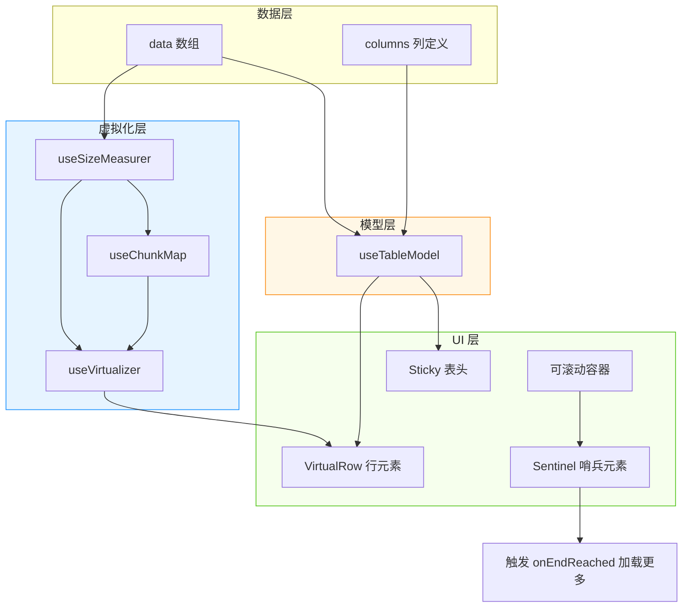
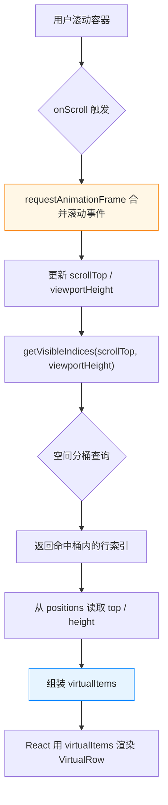
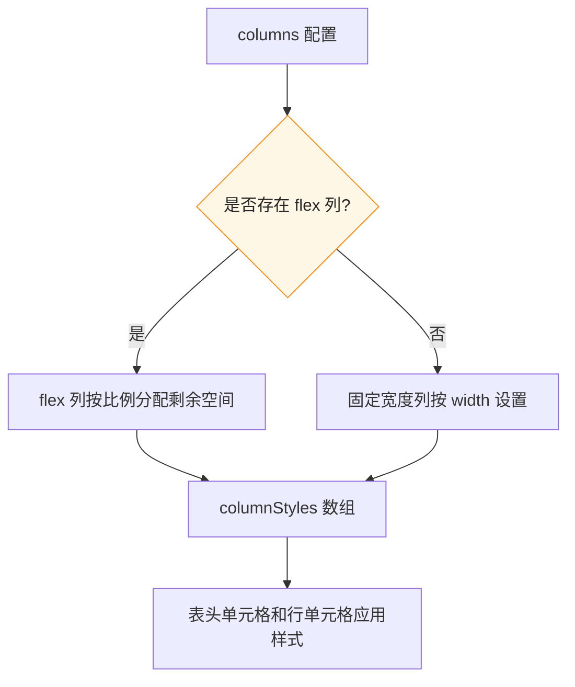
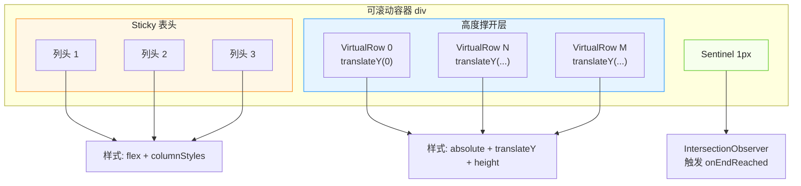

# 自研虚拟表格实现深度解析（面试版）

> 本文围绕 `VirtualTable.tsx` 及其 Hooks，从“如果面试被问到怎么实现一个虚拟表格”的角度，把架构、关键实现、性能优化和踩坑点讲清楚。重点详细拆解 **useVirtualizer**、**useTableModel**、**VirtualTable 组合渲染** 三个核心部分。

---

## 一、先建立直觉：虚拟表格到底做了什么？

想象你面前有一本 10000 页的书，但屏幕只能同时显示 10 页。你不会把整本书都摊开在桌上，而是只拿出当前页附近的几页，翻到第几页就换出对应的几页。虚拟表格就是这个思路：

- **书的所有页** = `data` 中的 10000 行数据
- **屏幕能显示的页数** = 视口高度内能放下的行数
- **当前翻到第几页** = 滚动位置 `scrollTop`
- **桌上实际放的页** = 真实渲染到 DOM 里的行

关键效果：**无论数据量是 1 万还是 10 万，真实 DOM 数量只和视口大小有关，通常 15~30 个。**

---

## 二、整体架构：四个模块怎么分工？



**四个模块的职责一句话概括：**

| 模块 | 一句话职责 | 对应源码 |
|---|---|---|
| `useSizeMeasurer` | 维护每一行在虚拟内容中的精确位置（top / height / bottom） | `hooks/useSizeMeasurer.ts` |
| `useChunkMap` | 把位置数据按空间分桶，让“查找哪些行可见”从 O(n) 变成 O(k) | `hooks/useChunkMap.ts` |
| `useVirtualizer` | 把滚动状态、尺寸、分桶组合起来，输出当前需要渲染的 `virtualItems` | `hooks/useVirtualizer.ts` |
| `useTableModel` | 把原始数据转换成表格模型，管理列、行、勾选状态 | `hooks/useTableModel.ts` |
| `VirtualTable` | 用上面两个 Hook 的结果，渲染出可滚动、可勾选、可无限加载的表格 | `VirtualTable.tsx` |

---

## 三、useVirtualizer：虚拟化引擎（最关键）

`useVirtualizer` 是上层唯一需要直接接触的 Hook。它做了三件事：

1. **维护滚动状态**：监听容器滚动，记录 `scrollTop` 和 `viewportHeight`。
2. **计算可见行**：通过 `useChunkMap` 快速找到当前视口应该显示哪些行。
3. **输出渲染数据**：把行索引转换成 `virtualItems`，每个 item 包含 `start`（位置）和 `size`（高度），供 UI 层 `translateY` 定位。

### 3.1 源码逐行拆解

```ts
import { useState, useCallback, useRef, useEffect } from 'react';
import { useSizeMeasurer } from './useSizeMeasurer';
import { useChunkMap } from './useChunkMap';

export function useVirtualizer(count: number, config: VirtualizerConfig) {
  // 1. 取出配置，设置默认值
  const { estimateSize, overscan, chunkSize } = {
    ...defaultConfig,   // overscan: 300, chunkSize: 800
    ...config,
  };

  // 2. 拿到尺寸测量引擎
  const { positions, totalHeight, initPositions, measureItem } =
    useSizeMeasurer(estimateSize);

  // 3. 拿到空间分桶索引
  const { getVisibleIndices } = useChunkMap(positions, { chunkSize, overscan });

  // 4. 维护滚动状态
  const [scrollTop, setScrollTop] = useState(0);
  const [viewportHeight, setViewportHeight] = useState(0);
  const containerRef = useRef<HTMLDivElement>(null);

  // 5. 数据量变化时，初始化位置
  useEffect(() => {
    initPositions(count);
  }, [count, initPositions]);

  // 6. 初始时获取容器视口高度
  useEffect(() => {
    if (containerRef.current) {
      setViewportHeight(containerRef.current.clientHeight);
    }
  }, []);

  // 7. 核心：计算当前要渲染的虚拟行
  const virtualItems: VirtualItem[] = (() => {
    const indices = getVisibleIndices(scrollTop, viewportHeight);
    return indices.map((idx) => {
      const pos = positions[idx];
      if (!pos) return { key: String(idx), index: idx, start: 0, size: 0 };
      return {
        key: String(idx),
        index: idx,
        start: pos.top,    // 这一行在总内容中的起始位置
        size: pos.height,  // 这一行的高度
      };
    });
  })();

  // 8. 滚动事件处理器
  const handleScroll = useCallback(
    (e: React.UIEvent<HTMLElement>) => {
      const target = e.currentTarget;
      requestAnimationFrame(() => {
        setScrollTop(target.scrollTop);
        if (target.clientHeight !== viewportHeight) {
          setViewportHeight(target.clientHeight);
        }
      });
    },
    [viewportHeight]
  );

  return {
    virtualItems,
    totalHeight,
    containerRef,
    handleScroll,
    measureItem,
  };
}
```

### 3.2 为什么 `positions` 存在 useRef 而不是 useState 里？

这是一个很重要的设计细节。如果 `positions` 放在 `useState` 里，每次 `measureItem` 更新一行高度，都会触发 `useVirtualizer` 重新渲染。但滚动时我们其实不需要频繁重渲染整个虚拟器，只需要在 `totalHeight` 变化时重新撑开容器即可。

所以代码里：

- `positions` 存在 `useRef` 中，更新时不触发 React 重渲染。
- 只把 `totalHeight` 暴露出去，让外层容器高度正确。
- 滚动计算时直接读 `positionsRef.current` 的最新值。

> **面试讲法**：用 ref 缓存位置信息，避免每次测量行高都触发全组件重渲染，只把 `totalHeight` 暴露给 UI 层撑开容器。

### 3.3 `requestAnimationFrame` 的作用

滚动事件触发频率非常高（每秒约 60 次）。如果在 `onScroll` 里直接 `setScrollTop`，React 会同步更新，导致滚动卡顿。

用 `requestAnimationFrame` 后，把多次滚动合并到下一帧再更新，和浏览器刷新同步，避免掉帧。

> **面试讲法**：滚动事件通过 `requestAnimationFrame` 合并，保证状态更新与显示器刷新同步，避免高频 setState 导致掉帧。

### 3.4 `virtualItems` 是怎么算出来的？



`virtualItems` 的结构：

```ts
interface VirtualItem {
  key: string;    // 行的 key，用于 React 的 key
  index: number;  // 在 data 中的索引
  start: number;  // 这一行在总内容中的 top 位置
  size: number;   // 这一行的高度
}
```

UI 层拿到它后，用 `transform: translateY(virtualRow.start)` 把行放到正确位置，用 `height: virtualRow.size` 设定高度。

### 3.5 `scrollToIndex` 怎么实现？

```ts
const scrollToIndex = (index: number, align: 'start' | 'center' | 'end' = 'start') => {
  const pos = positions[index];  // O(1) 直接取位置
  if (!pos || !containerRef.current) return;

  let targetScrollTop: number;
  const { clientHeight } = containerRef.current;

  switch (align) {
    case 'start':  targetScrollTop = pos.top; break;
    case 'center': targetScrollTop = pos.top - (clientHeight - pos.height) / 2; break;
    case 'end':    targetScrollTop = pos.bottom - clientHeight; break;
  }

  setScrollTop(targetScrollTop);
};
```

> **面试讲法**：因为 positions 已经缓存了每一行的精确位置，`scrollToIndex` 是 O(1) 的，不需要再遍历查找。支持 `start/center/end` 三种对齐方式。

---

## 四、useTableModel：表格数据模型

这个 Hook 负责把“原始数据 + 列定义”转换成“表格能用的行和表头”，并管理勾选状态。

### 4.1 源码逐行拆解

```ts
export interface ColumnDef<T> {
  id: string;                      // 列的唯一标识
  header: string;                  // 列头显示文字
  accessor: (row: T) => React.ReactNode;  // 如何从原始数据得到单元格内容
  width?: number;                  // 固定宽度
  flex?: number;                   // 弹性宽度
  minWidth?: number;               // 最小宽度
}

export interface RowData {
  id: string;                     // 行唯一 ID
  cells: React.ReactNode[];       // 这一行所有单元格内容
  originalIndex: number;          // 在原始数据中的索引
}

export function useTableModel<T>({ data, columns, getRowId }: UseTableModelOptions<T>) {
  // 1. 勾选状态用 Set 保存选中的 rowId
  const [selectedIds, setSelectedIds] = useState<Set<string>>(new Set());

  // 2. 把 data + columns 转换成 RowData
  const rows: RowData[] = useMemo(() => {
    return data.map((item, index) => ({
      id: getRowId(item, index),              // 行 ID
      cells: columns.map((col) => col.accessor(item)),  // 每个单元格
      originalIndex: index,                   // 原始索引
    }));
  }, [data, columns, getRowId]);

  // 3. 表头信息
  const headerGroups: HeaderCell[] = useMemo(() => {
    return columns.map((col) => ({
      id: col.id,
      label: col.header,
      width: col.width,
      flex: col.flex,
      minWidth: col.minWidth,
    }));
  }, [columns]);

  // 4. 全选 / 半选状态（O(1) 判断）
  const isAllSelected = useMemo(() => {
    return data.length > 0 && selectedIds.size === data.length;
  }, [data.length, selectedIds.size]);

  const isSomeSelected = useMemo(() => {
    return selectedIds.size > 0 && selectedIds.size < data.length;
  }, [data.length, selectedIds.size]);

  // 5. 切换单行勾选
  const toggleRow = useCallback((id: string) => {
    setSelectedIds((prev) => {
      const next = new Set(prev);
      if (next.has(id)) {
        next.delete(id);
      } else {
        next.add(id);
      }
      return next;
    });
  }, []);

  // 6. 全选 / 取消全选
  const toggleAll = useCallback(() => {
    setSelectedIds((prev) => {
      if (prev.size === data.length && data.length > 0) {
        return new Set();
      }
      return new Set(rows.map((r) => r.id));
    });
  }, [data.length, rows]);

  // 7. 判断某行是否选中
  const getIsSelected = useCallback(
    (id: string) => selectedIds.has(id),
    [selectedIds]
  );

  return {
    rows,
    headerGroups,
    selectedIds,
    isAllSelected,
    isSomeSelected,
    toggleRow,
    toggleAll,
    getIsSelected,
  };
}
```

### 4.2 为什么用 `Set<string>` 而不是对象或数组？

- **数组**：`includes` 查找是 O(n)，全选 1 万行时 `includes` 会慢。
- **对象**：`{ [id]: true }` 也可以 O(1)，但删除和遍历不如 `Set` 方便。
- **Set**：`has/add/delete` 都是 O(1)，天然去重，且可以直接用 `size` 判断数量。

> **面试讲法**：勾选状态用 `Set<string>` 存储选中的 rowId，所有操作都是 O(1)，且用 `size` 就能判断全选、半选、未选状态。

### 4.3 为什么 `useTableModel` 要独立于 `useVirtualizer`？

这是架构解耦的关键。

- `useTableModel` 只关心“数据”和“状态”：有哪些行、有哪些列、哪些行被勾选。
- `useVirtualizer` 只关心“位置”和“渲染范围”：哪些行在视口内、每行在什么位置。

两者互不依赖。`VirtualTable` 只是在渲染时把它们拼起来：

```tsx
const row = table.rows[virtualRow.index];  // 用虚拟索引取实际行数据
```

> **面试讲法**：模型层和虚拟化层完全解耦。模型层管数据，虚拟化层管位置，UI 层通过一个简单索引把它们拼接起来。这样即使以后换数据源或换虚拟化方案，都不用大改。

---

## 五、VirtualTable 组合：把两个 Hook 拼成 UI

`VirtualTable` 是最终的 UI 组件。它的核心工作是：

1. 调用 `useTableModel` 得到行、表头、勾选状态。
2. 调用 `useVirtualizer` 得到当前视口需要渲染的 `virtualItems` 和 `totalHeight`。
3. 渲染一个可滚动容器，里面放 sticky 表头、虚拟行、底部哨兵。

### 5.1 入口代码拆解

```tsx
export function VirtualTable<T>({
  data,
  columns,
  getRowId,
  estimateSize = () => 48,  // 默认行高 48
  overscan = 300,           // 视口外多渲染 300px
  chunkSize = 800,          // 空间分桶大小
  containerHeight = 500,    // 容器高度
  onEndReached,             // 到底加载更多
  isLoading,
  hasMore,
}: VirtualTableProps<T>) {
  // 1. 数据模型
  const table = useTableModel({ data, columns, getRowId });
  const sentinelRef = useRef<HTMLDivElement>(null);

  // 2. 虚拟化
  const { virtualItems, totalHeight, containerRef, handleScroll, measureItem } =
    useVirtualizer(data.length, { estimateSize, overscan, chunkSize });

  // 3. 列宽策略
  const hasFlexColumns = useMemo(
    () => columns.some((col) => col.flex !== undefined && col.flex > 0),
    [columns]
  );

  const columnStyles = useMemo(() => {
    return columns.map((col) => {
      if (hasFlexColumns && col.flex !== undefined && col.flex > 0) {
        return { flex: col.flex, minWidth: col.minWidth || 80 };
      }
      return {
        flex: `0 0 ${col.width || 120}px`,
        width: col.width || 120,
      };
    });
  }, [columns, hasFlexColumns]);
```

### 5.2 列宽策略：支持固定宽度和 flex 弹性



核心逻辑：

- 如果任一列有 `flex`，则启用 flex 布局，所有列按 `flex` 比例分配。
- 否则按 `width` 固定宽度，并用 `flex: 0 0 ${width}px` 禁止压缩/拉伸。

> **面试讲法**：列宽支持两种模式：固定宽度用 `width`，弹性布局用 `flex`。如果存在 flex 列，就用 flex 布局让剩余空间按比例分配；否则每列固定宽度，防止被压缩。

### 5.3 渲染结构：表头 + 虚拟行 + 哨兵



### 5.4 表头为什么用 `transform: translateZ(0)`？

```tsx
<div style={{
  position: 'sticky',
  top: 0,
  zIndex: 2,
  transform: 'translateZ(0)',  // 强制 GPU 合成层
}}>
```

`sticky` 在滚动时可能和下方内容产生渲染竞争，导致表头抖动。`translateZ(0)` 会强制浏览器把表头提升到独立的合成层（Compositing Layer），滚动时只合成不重绘，更稳定。

> **面试讲法**：表头用 `position: sticky` 固定，`translateZ(0)` 强制 GPU 合成层，防止滚动时表头抖动。

### 5.5 虚拟行为什么用 `absolute + translateY`？

```tsx
<div style={{
  position: 'absolute',
  top: 0,
  left: 0,
  width: '100%',
  height: virtualRow.size,
  transform: `translateY(${virtualRow.start}px)`,
}}>
```

所有虚拟行都先绝对定位在容器左上角，再用 `translateY` 把它们推到各自的滚动位置。为什么要这样？

- **absolute 脱离文档流**：不会互相挤占空间，也不会因为滚动触发重排。
- **transform: translateY** 会创建合成层，位置变化只触发合成阶段，不触发 Layout 和 Paint。

对比错误做法：
- 用 `marginTop` 或 `top` 定位 → 每次变化都会触发重排（Layout），性能差。
- 用 `position: relative` 按顺序排列 → 每行都在文档流里，滚动时浏览器要重新计算所有行位置。

> **面试讲法**：每一行都是 `absolute + translateY`。`absolute` 让行脱离文档流，不互相挤占；`transform` 让位置变化只走合成层，不触发重排重绘，性能最好。

### 5.6 高度撑开层：为什么总高度是 `totalHeight`？

```tsx
<div style={{ height: totalHeight, position: 'relative' }}>
  {virtualItems.map(...)}
</div>
```

容器内部有一个 `div`，高度等于所有行的总高度。真实只渲染了视口内的行，但浏览器认为这个容器有完整高度，所以滚动条长度是正常的。

这就好比你把一本 10000 页书的目录页做成和书一样厚，但只翻开中间几页，读者感觉书还是完整的。

> **面试讲法**：用一个高度为 `totalHeight` 的容器撑开滚动区域，让滚动条看起来正常；只在这个容器里渲染视口内的行，通过 `translateY` 把它们放到正确位置。

### 5.7 无限加载：IntersectionObserver 与双轨制

```tsx
useEffect(() => {
  if (!onEndReached || !hasMore || isLoading) return;
  const sentinel = sentinelRef.current;
  const container = containerRef.current;
  if (!sentinel || !container) return;

  const observer = new IntersectionObserver(
    ([entry]) => {
      if (entry.isIntersecting) {
        onEndReached();
      }
    },
    { root: container, rootMargin: '200px' }  // 提前 200px 触发
  );

  observer.observe(sentinel);
  return () => observer.disconnect();
}, [onEndReached, isLoading, hasMore, containerRef]);
```

在容器底部放一个 1px 高的 `sentinel` 元素，用 `IntersectionObserver` 监听它是否进入视口。进入时调用 `onEndReached` 加载更多。

`rootMargin: '200px'` 表示在哨兵进入视口前 200px 就提前触发，用户滚动到底部时数据已经加载好了。

**为什么不用 scroll 事件算到底部？**

- `scroll` 事件高频触发，每次都要计算位置。
- `IntersectionObserver` 是浏览器原生优化，只在元素可见时触发一次。

> **面试讲法**：无限加载用 `IntersectionObserver` 监听底部哨兵，比 scroll 事件更高效。`rootMargin: 200px` 可以提前触发加载，避免用户滑到底部等待。

### 5.8 `VirtualRow` 组件：测量 + 渲染 + 勾选

```tsx
const VirtualRow = React.memo(function VirtualRow({
  virtualRow,
  cells,
  columnStyles,
  isSelected,
  onToggle,
  onMeasure,
}: VirtualRowProps) {
  const rowRef = useRef<HTMLDivElement>(null);

  useEffect(() => {
    const el = rowRef.current;
    if (!el) return;

    const observer = new ResizeObserver(() => {
      onMeasure(virtualRow.index, el);  // 行高变化时上报
    });

    observer.observe(el);
    return () => observer.disconnect();
  }, [virtualRow.index, onMeasure]);

  return (
    <div ref={rowRef} style={{ ...translateY... }}>
      {cells.map((cell, colIdx) => (
        <div key={colIdx} style={columnStyles[colIdx]}>
          {colIdx === 0 ? <input type="checkbox" checked={isSelected} onChange={onToggle} /> : cell}
        </div>
      ))}
    </div>
  );
});
```

`React.memo` 让虚拟行只在 `virtualRow` 或 `cells` 等 props 变化时才重新渲染。因为虚拟行数量少，memo 收益明显。

`ResizeObserver` 监听每行真实高度，变化时调用 `onMeasure` 更新 `positions`。

> **面试讲法**：`VirtualRow` 用 `React.memo` 包裹，避免无意义的重渲染。每个行挂载 `ResizeObserver`，真实高度变化时上报，动态更新位置信息。

---

## 六、面试高频问题 & 标准答法

### Q1：虚拟滚动的核心原理是什么？

**答**：只渲染视口内 + 缓冲区的行，用一个高度等于总内容大小的占位层撑开滚动区域，真实 DOM 只保留可见行。通过 `absolute + transform: translateY` 把行定位到正确的滚动位置，使 DOM 数量恒定在视口可见行数，和数据总量无关。

### Q2：为什么要拆分 useVirtualizer 和 useTableModel？

**答**：这是职责解耦。`useTableModel` 管数据：行列、勾选状态；`useVirtualizer` 管位置：哪些行在视口内、每行在什么位置。`VirtualTable` 通过 `virtualRow.index` 把两者拼接起来。解耦后，换数据源或换虚拟化方案都无需大改。

### Q3：怎么支持动态行高？

**答**：每行渲染后挂载 `ResizeObserver`，监听真实高度变化。变化时调用 `measureItem(index, el)`，更新 `positions` 中当前行的高度，并多米诺式平移后续所有行的 `top/bottom`，保证总高度和滚动位置正确。

### Q4：空间分桶怎么加速可见行查询？

**答**：把 `positions` 按 `chunkSize`（如 800px）切成多个桶，每个桶记录覆盖到的行索引。滚动时根据 `scrollTop + viewportHeight + overscan` 计算命中哪些桶，只扫描这些桶，查询复杂度从 O(n) 降到 O(k)，k 是命中桶数，通常 1~5。

### Q5：为什么用 `transform: translateY` 而不是 `top` 或 `marginTop`？

**答**：`transform` 会触发浏览器合成层，位置变化只走合成阶段，不触发 Layout 和 Paint。而 `top`/`marginTop` 每次变化都会触发重排，性能差很多。`translateY` 是滚动定位性能最优的方案。

### Q6：全选为什么不卡？

**答**：勾选状态用 `Set<string>` 保存在 JS 内存中，不依赖 DOM。全选时只需把 `Set` 填满所有 `rowId`，React 只重新渲染视口内那几十个 `VirtualRow`。数据量再大，实际渲染的 DOM 不变，所以不卡。

### Q7：无限加载怎么避免重复请求？

**答**：`LiveDemo.tsx` 用双轨制：
- `useRef` 保存 `isLoadingRef` 和 `hasMoreRef` 做同步守卫，避免闭包陷阱。
- `useState` 保存 `isUILoading` 和 `isUIHasMore` 驱动 UI。

`IntersectionObserver` 回调里先读 Ref 判断是否正在加载，已经加载中就不会重复触发。

### Q8：列宽怎么实现 flex 自适应？

**答**：遍历所有列，如果存在 `flex` 列，则启用 flex 布局，按 `flex` 比例分配剩余空间；否则每列固定 `width`，并用 `flex: 0 0 ${width}px` 禁止压缩。表头和行单元格共用同一套 `columnStyles`。

---

## 七、源码速查卡片

### 7.1 useVirtualizer 核心输出

```ts
const virtualItems = (() => {
  const indices = getVisibleIndices(scrollTop, viewportHeight);
  return indices.map((idx) => {
    const pos = positions[idx];
    return {
      key: String(idx),
      index: idx,
      start: pos.top,
      size: pos.height,
    };
  });
})();
```

### 7.2 可见行空间分桶查询

```ts
const getVisibleIndices = (scrollTop: number, viewportHeight: number) => {
  if (viewportHeight === 0) return [];
  const startChunk = Math.floor((scrollTop - overscan) / chunkSize);
  const endChunk = Math.floor((scrollTop + viewportHeight + overscan) / chunkSize);

  const indicesSet = new Set<number>();
  for (let c = startChunk; c <= endChunk; c++) {
    const chunk = chunksMap.get(c);
    if (chunk) chunk.forEach((idx) => indicesSet.add(idx));
  }
  return Array.from(indicesSet).sort((a, b) => a - b);
};
```

### 7.3 行高多米诺更新

```ts
const updateItemHeight = (index: number, height: number) => {
  const pos = positionsRef.current[index];
  if (!pos || pos.height === height) return;

  const heightDiff = height - pos.height;
  pos.height = height;
  pos.bottom = pos.top + height;

  for (let i = index + 1; i < positionsRef.current.length; i++) {
    positionsRef.current[i].top = positionsRef.current[i - 1].bottom;
    positionsRef.current[i].bottom = positionsRef.current[i].top + positionsRef.current[i].height;
  }

  const lastItem = positionsRef.current[positionsRef.current.length - 1];
  setTotalHeight(lastItem ? lastItem.bottom : 0);
};
```

### 7.4 VirtualTable 组合点

```tsx
const table = useTableModel({ data, columns, getRowId });
const { virtualItems, totalHeight, containerRef, handleScroll, measureItem } =
  useVirtualizer(data.length, { estimateSize, overscan, chunkSize });

// 渲染时拼接
virtualItems.map((virtualRow) => {
  const row = table.rows[virtualRow.index];
  return (
    <VirtualRow
      key={virtualRow.key}
      virtualRow={virtualRow}
      cells={row.cells}
      isSelected={table.getIsSelected(row.id)}
      onToggle={() => table.toggleRow(row.id)}
      onMeasure={measureItem}
    />
  );
});
```

---

## 八、面试口述三段式（直接背）

### 第一段：开场讲问题

> “如果表格数据量很大，比如 1 万行，直接渲染会带来三个问题：初始渲染阻塞主线程、滚动掉帧、全选或勾选时 React 要遍历所有行，导致卡顿。所以要做虚拟化。”

### 第二段：讲架构和核心实现

> “我们的方案是自研的，拆成四个模块：
> - `useSizeMeasurer` 维护每一行在虚拟内容中的位置；
> - `useChunkMap` 做空间分桶，把可见行查询从 O(n) 降到 O(k)；
> - `useVirtualizer` 组合前两者，输出当前要渲染的 virtualItems；
> - `useTableModel` 管行列数据和勾选状态。
> UI 层 `VirtualTable` 用一个高度等于总内容的 Spacer 撑开滚动区域，只渲染 virtualItems 对应的行，每行用 `absolute + transform: translateY` 定位。”

### 第三段：讲优化细节

> “滚动事件用 `requestAnimationFrame` 合并更新；`positions` 放在 ref 里避免频繁重渲染；勾选用 `Set` 让全选变成 O(1)；无限加载用 `IntersectionObserver` 而不是 scroll 事件；动态行高用 `ResizeObserver` 测量并多米诺更新后续位置。”

---

## 九、参考链接

- [MDN: ResizeObserver](https://developer.mozilla.org/zh-CN/docs/Web/API/ResizeObserver)
- [MDN: IntersectionObserver](https://developer.mozilla.org/zh-CN/docs/Web/API/IntersectionObserver)
- [MDN: transform](https://developer.mozilla.org/zh-CN/docs/Web/CSS/transform)
- [React 官方文档：useRef](https://zh-hans.react.dev/reference/react/useRef)
- [React 官方文档：useMemo](https://zh-hans.react.dev/reference/react/useMemo)
- [React 官方文档：useCallback](https://zh-hans.react.dev/reference/react/useCallback)
