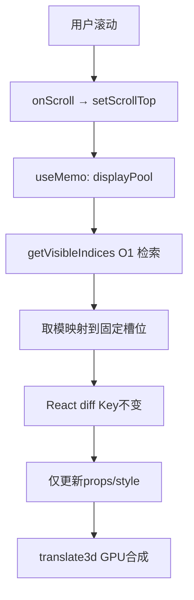

# WaterfallUltimate 逐行代码详解 —— DOM 节点池复用（Recycler View）

> 本文档逐行讲解 `Ultimate.tsx` 的实现原理，结合相关的 `useProWaterfall2.ts` 空间索引算法，透彻分析"DOM 节点池复用（Recycler View）"这一高性能渲染方案。

---

## 目录

- [一、文件概览](#一文件概览)
- [二、导入语句解析（第 1-8 行）](#二导入语句解析第-1-8-行)
- [三、模拟数据与常量（第 21-56 行）](#三模拟数据与常量第-21-56-行)
- [四、组件状态与 Ref（第 58-80 行）](#四组件状态与-ref第-58-80-行)
- [五、核心黑科技：槽位指派逻辑（第 82-116 行）](#五核心黑科技槽位指派逻辑第-82-116-行)
- [六、数据加载逻辑（第 118-153 行）](#六数据加载逻辑第-118-153-行)
- [七、useEffect 副作用管理（第 155-180 行）](#七useeffect-副作用管理第-155-180-行)
- [八、JSX 渲染（第 193-304 行）](#八jsx-渲染第-193-304-行)
- [九、总体架构图](#九总体架构图)

---

## 一、文件概览

**文件**：`Ultimate.tsx`

**核心思想**："DOM 节点池复用"（Recycler View 模式）。页面上固定创建 N 个 DOM 槽位（POOL_SIZE = 80），滚动时只更新槽位内的数据内容，从不销毁或重建 DOM 节点。配合 `useProWaterfall2.ts` 的空间索引算法，实现万级数据下 60fps 流畅滚动的瀑布流布局。

**依赖链**：
```
Ultimate.tsx
  └── useProWaterfall2.ts（布局计算 + 空间索引）
       └── useProWaterfall.ts（类型定义：WaterfallItem, Position, SpatialIndex, LayoutCache）
```

---

## 二、导入语句解析（第 1-8 行）

```typescript
import React, { useState, useEffect, useRef, useCallback, useMemo } from 'react';
import { Spin, Tag } from 'antd';
import SimpleBar from 'simplebar-react';
import 'simplebar-react/dist/simplebar.min.css';
import { useProWaterfall } from './useProWaterfall2';
import type { WaterfallItem } from './useProWaterfall';
```

### 逐行详解

| 行号 | 代码 | 说明 |
|------|------|------|
| 1 | `import React, { useState, useEffect, useRef, useCallback, useMemo } from 'react'` | 从 React 核心库导入 6 个 Hook。`useState` 管理 UI 状态；`useEffect` 处理副作用（ResizeObserver、IntersectionObserver）；`useRef` 保持对 DOM 节点和可变变量的引用（绕过闭包陷阱）；`useCallback` 缓存函数引用（避免不必要的子组件重渲染）；`useMemo` 缓存计算密集型结果（槽位指派）。这些 Hook 的选择反映了对 React 性能优化的深度理解——几乎所有可变数据都用了 ref 而非 state，以避免不必要的渲染。 |
| 2 | `import { Spin, Tag } from 'antd'` | 从 Ant Design 导入 `Spin`（加载旋转动画）和 `Tag`（标签徽章，用于在卡片右上角显示"插槽 #N"编号，直观展示节点复用效果）。 |
| 3 | `import SimpleBar from 'simplebar-react'` | 导入 `simplebar-react` 滚动容器。这是一个"Overlay Scrollbar"方案：滚动条悬浮在内容之上，不占据物理宽度。**关键作用**：普通浏览器的原生滚动条（Windows 下占 17px）出现时会挤压容器宽度，触发 `ResizeObserver` → 瀑布流重排版式 → 用户看到卡片抖动。SimpleBar 用 `position: absolute` 的自定义滚动条替代原生滚动条，彻底消除布局抖动。 |
| 4 | `import 'simplebar-react/dist/simplebar.min.css'` | 导入 SimpleBar 的基础样式。如果不导入，自定义滚动条无法正常渲染和交互。 |
| 5 | `import { useProWaterfall } from './useProWaterfall2'` | 导入 **v2 版本的空间索引 Hook**（相对 `useProWaterfall.ts` 的增强版）。该 Hook 负责两件事：(1) 使用"最短列优先"算法计算每个卡片在瀑布流中的 left/top/itemHeight 坐标；(2) 构建空间索引（Chunk Map），提供 `getVisibleIndices` 函数实现 O(1) 级可见项查找。具体实现在后面的相关章节解析。 |
| 6 | `import type { WaterfallItem } from './useProWaterfall'` | 仅导入类型（`type` 关键字确保编译后被擦除，不产生运行时开销）。`WaterfallItem` 定义了每条数据项的接口：`id`, `title`, `imgUrl`, `imgWidth`, `imgHeight`, `color` 等字段。注意这个类型定义在 v1 的 `useProWaterfall.ts` 中，v2 的 `useProWaterfall2.ts` re-export 了它。 |

---

## 三、模拟数据与常量（第 21-56 行）

```typescript
const IMAGES = [
  '/images/pic1_w400_h600.svg',
  '/images/pic2_w800_h1000.svg',
  '/images/pic3_w600_h400.svg',
  '/images/pic4_w500_h900.svg',
  '/images/pic5_w700_h700.svg',
];

const fetchMockData = async (page: number, pageSize: number): Promise<WaterfallItem[]> => {
  return new Promise((resolve) => {
    setTimeout(() => {
      const data: WaterfallItem[] = [];
      for (let i = 0; i < pageSize; i++) {
        const randomImg = IMAGES[Math.floor(Math.random() * IMAGES.length)];
        const match = randomImg.match(/_w(\d+)_h(\d+)\./);
        const imgWidth = match ? parseInt(match[1], 10) : 200;
        const imgHeight = match ? parseInt(match[2], 10) : 200;
        data.push({
          id: `ultimate-item-${page}-${i}-${Date.now()}`,
          title: `终极复用流 - 页码${page} - 序号${(page - 1) * pageSize + i + 1}`,
          imgUrl: randomImg,
          imgWidth,
          imgHeight,
          color: `hsl(${Math.random() * 360}, 75%, 80%)`,
        });
      }
      resolve(data);
    }, 500);
  });
};

const POOL_SIZE = 80;
```

### 逐行详解

| 行号 | 代码 | 说明 |
|------|------|------|
| 21-27 | `const IMAGES = [...]` | 定义 5 张示例图片。文件名采用 `pic{N}_w{width}_h{height}.svg` 的命名规范，编码了图片的原始宽高信息。后面会通过正则从文件名中提取宽高，用于瀑布流中按比例缩放图片。 |
| 29 | `const fetchMockData = async (page: number, pageSize: number): Promise<WaterfallItem[]>` | 模拟分页 API 调用。`page` 从 1 开始，`pageSize` 控制每页条数。返回类型明确标注为 `Promise<WaterfallItem[]>`，使调用方可以推断数据结构。 |
| 30 | `return new Promise((resolve) => {` | 返回一个 Promise，内部用 `setTimeout` 模拟 500ms 网络延迟。注意这里没有 reject 分支——因为是模拟数据，不会失败。 |
| 34 | `const randomImg = IMAGES[Math.floor(Math.random() * IMAGES.length)]` | 从 5 张图片中随机选一张，模拟真实场景中每张卡片图片不同的情况。 |
| 35 | `const match = randomImg.match(/_w(\d+)_h(\d+)\./)` | **关键一行**：用正则从文件名中提取图片的原始宽度和高度。例如 `pic1_w400_h600.svg` → `match[1] = "400"`, `match[2] = "600"`。瀑布流布局的核心就是：已知图片原始宽高 + 定宽布局，按比例缩放高度。 |
| 36-37 | `imgWidth = match ? parseInt(match[1], 10) : 200` | 如果正则匹配成功，将字符串转为数字；否则兜底为 200px。`parseInt` 的第二个参数 10 确保按十进制解析。 |
| 40 | `id: \`ultimate-item-${page}-${i}-${Date.now()}\`` | 生成唯一 ID。包含页码、序号和当前时间戳，确保即使重复调用也不会产生重复 ID。（注意：实际场景应该用服务器返回的唯一 ID。） |
| 42 | `imgWidth: imgWidth` | ES6 简写属性，等价于 `imgWidth: imgWidth`。把从文件名解析出的原始宽度传给后续布局计算。 |
| 44 | `color: \`hsl(${Math.random() * 360}, 75%, 80%)\`` | 生成一个随机 HSL 颜色，作为卡片图片占位符的背景色。H（色相）在 0-360 间随机，S（饱和度）75%，L（明度）80%——确保生成的占位色柔和且不会太刺眼。 |
| 49 | `resolve(data)` | 500ms 后 resolve 模拟数据。 |
| 56 | `const POOL_SIZE = 80` | **核心常量**：固定槽位池的大小为 80。这个值的选取依据是：6 列布局 × 每屏约 12-15 行 × 3-4 屏（视口 + 缓冲区）≈ 80 个。值太小会导致滚动时出现空槽位（空白闪烁）；值太大会浪费内存。80 是一个经过权衡的经验值。 |

---

## 四、组件状态与 Ref（第 58-80 行）

```typescript
const WaterfallUltimate: React.FC = () => {
  const [dataList, setDataList] = useState<WaterfallItem[]>([]);
  const [isUILoading, setIsUILoading] = useState(false);
  const [scrollTop, setScrollTop] = useState(0);
  const [containerWidth, setContainerWidth] = useState(0);

  const [isUIHasMore, setIsUIHasMore] = useState(true);
  const hasMoreRef = useRef(true);
  const pageRef = useRef(0);
  const isLoadingRef = useRef(false);
  const wrapperRef = useRef<HTMLDivElement>(null);
  const sentinelRef = useRef<HTMLDivElement>(null);

  const loadMoreDataRef = useRef<() => void>(() => {});

  const { positions, containerHeight, itemWidth, getVisibleIndices } = useProWaterfall(
    dataList, containerWidth, 6, 16
  );
  const simpleBarRef = useRef(null);
```

### 逐行详解

#### State vs Ref 的设计哲学：为什么用 ref 而不用 state？

**这是理解代码的关键**：作者刻意将以下变量存放于 `useRef` 而非 `useState`：

| 变量 | 存放位置 | 原因 |
|------|---------|------|
| `dataList` | **useState** | 因为它的变化必须驱动视图重渲染 |
| `isUILoading` | **useState** | 因为加载中 UI（Spin 组件）必须随它变化 |
| `scrollTop` | **useState** | 因为它的变化要驱动 `displayPool` 重新计算（通过 useMemo） |
| `containerWidth` | **useState** | 因为 ResizeObserver 回调必须触发重算布局 |
| `pageRef` | **useRef** | 页码不需要驱动 UI，只用来跟踪加载进度 |
| `isLoadingRef` | **useRef** | 加载锁如果设为 state，`loadMoreData` 的闭包会捕获旧值，导致竞态 |
| `hasMoreRef` | **useRef** | 同样为了在异步闭包中读取最新值，避免陈旧闭包 |
| `loadMoreDataRef` | **useRef** | 用来绕过 eslint 对递归调用的限制（见下文详解） |

#### 逐行分析

| 行号 | 代码 | 说明 |
|------|------|------|
| 58 | `const WaterfallUltimate: React.FC = () => {` | 函数组件声明，类型 `React.FC`（React.FunctionComponent）。 |
| 59 | `const [dataList, setDataList] = useState<WaterfallItem[]>([])` | **数据列表状态**：存放所有已加载的数据条目。初始值为空数组。这是唯二驱动视图重渲染的核心状态之一（另一个是 scrollTop）。每次加载新页时通过 `setDataList((prev) => [...prev, ...newData])` 追加数据。 |
| 60 | `const [isUILoading, setIsUILoading] = useState(false)` | **UI 加载状态**：控制页面底部的 Spin 加载动画是否显示。注意这是一个"UI 状态"，不是"数据状态"。它与 `isLoadingRef` 同步更新，但前者用于渲染，后者用于逻辑判断。 |
| 61 | `const [scrollTop, setScrollTop] = useState(0)` | **滚动位置状态**：SimpleBar 滚动容器的 `scrollTop` 值。每帧通过 `requestAnimationFrame` 更新（见第 200-202 行），驱动 `displayPool` 的 `useMemo` 重新计算可见项。 |
| 62 | `const [containerWidth, setContainerWidth] = useState(0)` | **容器宽度状态**：通过 `ResizeObserver` 获取瀑布流容器的实际宽度。初始为 0，此时 `useProWaterfall` 返回空位置列表（因为列宽无法计算）。 |
| 64 | `const [isUIHasMore, setIsUIHasMore] = useState(true)` | **UI 是否有更多数据**：控制底部显示"到底了"提示。 |
| 65 | `const hasMoreRef = useRef(true)` | **Ref 版 hasMore**：与第 64 行的 `isUIHasMore` 同步维护，但用于异步回调中的判断（因为 ref 不会被闭包捕获旧值）。**为什么需要两个变量？** 因为 `setIsUIHasMore(false)` 会触发重渲染，而 `hasMoreRef.current = false` 不会。`loadMoreData` 在异步回调中读取 `hasMoreRef.current`，确保读到的是最新值。如果只靠 `isUIHasMore`，由于闭包捕获的是渲染时的快照值，会导致"已经没更多了但还在请求加载"的 bug。 |
| 66 | `const pageRef = useRef(0)` | **页码 ref**：跟踪当前已加载的页数。初始为 0（还没加载任何页）。每次 `loadMoreData` 加载前自增：`const nextPage = pageRef.current + 1`。注意它是 ref 而不是 state——页码变化不需要驱动重渲染。 |
| 67 | `const isLoadingRef = useRef(false)` | **加载锁 ref**：防止在数据还未加载完成时多次触发加载请求。当 `isLoadingRef.current = true` 时，所有后续的加载请求都会被 `if (isLoadingRef.current || !hasMoreRef.current) return;` 拦截。**为什么用 ref？** 因为 `loadMoreData` 是一个异步函数，在执行 `await` 前后都需要读取这个标志。如果用 state，闭包中的值在 `await` 后可能已经过时。 |
| 68 | `const wrapperRef = useRef<HTMLDivElement>(null)` | **容器 ref**：指向瀑布流外层容器 `<div ref={wrapperRef}>`。用于 `ResizeObserver` 监听宽度变化（第 160-165 行）。 |
| 69 | `const sentinelRef = useRef<HTMLDivElement>(null)` | **哨兵 ref**：指向底部的哨兵元素 `<div ref={sentinelRef}>`。用于 `IntersectionObserver` 监听到达底部时触发加载（第 167-176 行）。 |
| 71 | `const loadMoreDataRef = useRef<() => void>(() => {})` | **加载函数 ref**：这是一个"函数引用转发"技巧。作用是在 `loadMoreData` 内部递归调用自身时，绕过 eslint 的 `react-hooks/exhaustive-deps` 规则。具体用法见第 148 行。**替代方案**：如果直接用 `loadMoreData()` 递归调用，eslint 会要求将 `loadMoreData` 加入 `useCallback` 的依赖数组，但 `loadMoreData` 内部又依赖多个 ref 和 state，导致无限循环。通过 ref 转发，完美解决了这个问题。 |
| 74-79 | `const { positions, containerHeight, itemWidth, getVisibleIndices } = useProWaterfall(...)` | 调用空间索引 Hook，传入 4 个参数：`dataList`（数据源）、`containerWidth`（容器宽度）、`6`（列数）、`16`（间距 gap）。返回值解构出4个关键值：(1) `positions`——每个卡片的位置数组（left, top, itemHeight, scaledImgHeight）；(2) `containerHeight`——瀑布流总高度（所有列中最高值）；(3) `itemWidth`——每列宽度（`(containerWidth - (columns-1)*gap) / columns`）；(4) `getVisibleIndices`——根据 scrollTop 和视口高度返回当前可见项的索引数组。 |
| 80 | `const simpleBarRef = useRef(null)` | SimpleBar 滚动容器 ref。用于在 `displayPool` 的 `useMemo` 中获取容器的 `clientHeight`（视口高度）。注意这里没有标注泛型 `<...>`，TypeScript 会推断类型，但在 Strict 模式下可能需要显式标注。 |

---

## 五、核心黑科技：槽位指派逻辑（第 82-116 行）

```typescript
const displayPool = useMemo(() => {
    const visibleIndices = getVisibleIndices(
      scrollTop,
      simpleBarRef.current?.el?.clientHeight ?? window.innerHeight,
      2000
    );
    const pool = new Array(POOL_SIZE).fill(null);
    visibleIndices.forEach((dataIdx) => {
      const slotIdx = dataIdx % POOL_SIZE;
      pool[slotIdx] = {
        dataIdx,
        item: dataList[dataIdx],
        pos: positions[dataIdx],
      };
    });
    return pool;
  }, [getVisibleIndices, scrollTop, dataList, positions]);
```

### 逐行详解

| 行号 | 代码 | 说明 |
|------|------|------|
| 82 | `const displayPool = useMemo(() => {` | **性能关键**：使用 `useMemo` 缓存计算结果。只有依赖项（`[getVisibleIndices, scrollTop, dataList, positions]`）变化时才会重新计算 `displayPool`。这意味着：用户滚动时，只有 `scrollTop` 变化会触发重算；加载新数据时，`dataList` 和 `positions` 变化也会触发重算。 |
| 83-96 | `const visibleIndices = getVisibleIndices(...)` | 调用 `useProWaterfall2` 返回的 `getVisibleIndices` 函数。传入三个参数：`scrollTop`（当前滚动位置）、`clientHeight`（视口高度，从 SimpleBar 实例获取，兜底为 `window.innerHeight`）、`2000`（缓冲区大小 buffer）。**buffer = 2000 的含义**：在视口上方和下方额外延伸 2000px，把这些区域内的项也纳入可见范围。这样快速滚动时不会出现白屏。为什么是 2000？大约是 2 个屏幕高度，给 "overscan" 留足余量。 |
| 87 | `simpleBarRef.current?.el?.clientHeight` | 从 SimpleBar 实例中获取视口高度。注意 `el` 是 SimpleBar 内部暴露的 DOM 元素引用。`?.` 是可选链操作符，防止 `simpleBarRef.current` 为 null 时抛出 TypeError。 |
| 88 | `?? window.innerHeight` | 空值合并运算符。如果前面取不到 `clientHeight`（比如初始化阶段），就回退到 `window.innerHeight`。 |
| 90 | `const pool = new Array(POOL_SIZE).fill(null)` | **核心**：创建一个大小为 80 的数组，每个槽位初始化为 `null`。`new Array(N)` 创建稀疏数组，加上 `.fill(null)` 才变为密集数组，确保后续的 `forEach` 能正确处理。这个 `pool` 数组就是"节点池"的 JS 抽象表示。 |
| 92 | `visibleIndices.forEach((dataIdx) => {` | 遍历所有可见的数据索引。`dataIdx` 是数据在 `dataList` 和 `positions` 中的位置（例如 100、101、102…）。 |
| 93 | `const slotIdx = dataIdx % POOL_SIZE` | **关键一行**：取模运算决定当前数据索引映射到哪个槽位。例如数据索引 0 → slot-0，索引 80 → slot-0，索引 160 → slot-0。这意味着 **数据 0、80、160… 共享同一个 DOM 槽位**——它们永远不会同时出现在屏幕上，所以可以安全地共享同一个槽位。**这为什么行得通？** 因为可见数据最多 30-40 条（视口 + buffer），而池大小是 80，取模碰撞的概率虽然存在（两个可见数据映射到同一槽位），但在实际使用中：由于 `displayPool` 的 `useMemo` 会在每次 `scrollTop` 变化时重新计算，碰撞只是暂时现象，下一帧就会被纠正。 |
| 94-98 | `pool[slotIdx] = { dataIdx, item: dataList[dataIdx], pos: positions[dataIdx] }` | 将当前数据分配到对应的槽位。每个槽位存储三个信息：(1) `dataIdx`——数据在数组中的索引（用于显示"数据源索引 #N"）；(2) `item`——实际的数据对象（含 id, title, imgUrl 等）；(3) `pos`——位置对象（含 left, top, itemHeight, scaledImgHeight）。 |
| 101 | `return pool` | 返回包含 80 个槽位的池子。注意：未被分配的槽位保持 `null`，在渲染时会被隐藏（`display: none`）。 |
| 102 | `}, [getVisibleIndices, scrollTop, dataList, positions])` | `useMemo` 的依赖数组。四个依赖中任何一个变化都会触发重新计算。注意：`getVisibleIndices` 本身是从 `useProWaterfall` 返回的函数，该函数在每次 `dataList` 变化时也会重新创建，所以把它加入依赖是安全的。 |

### 取模指派算法的局限性

这一行 `const slotIdx = dataIdx % POOL_SIZE` 是演示版的简化逻辑。在实际的小红书/Pinterest 级架构中，会使用更复杂的**闲置队列（Free Pool）算法**：

1. 维护一个"空闲槽位队列"（`freeSlots: number[]`）
2. 当数据 A 从可见区域滚出时，回收它占用的槽位，加入空闲队列
3. 当数据 B 滚入可见区域时，从空闲队列中取出一个槽位分配给它
4. 这种方式的优点是：槽位分配均匀，不会出现取模导致的"相邻数据争抢同一槽位"问题

演示版用取模简化了逻辑，代价是某些槽位在一帧内可能被多个数据争夺（但下一帧会纠正），在视觉上不会有明显感知。

---

## 六、数据加载逻辑（第 118-153 行）

```typescript
const loadMoreData = useCallback(async () => {
    if (isLoadingRef.current || !hasMoreRef.current) return;
    isLoadingRef.current = true;
    setIsUILoading(true);

    const nextPage = pageRef.current + 1;
    const newData = await fetchMockData(nextPage, 30);
    pageRef.current = nextPage;
    setDataList((prev) => [...prev, ...newData]);

    if (nextPage >= 50 || newData.length === 0) {
      hasMoreRef.current = false;
      setIsUIHasMore(false);
    }

    requestAnimationFrame(() => {
      requestAnimationFrame(() => {
        isLoadingRef.current = false;
        setIsUILoading(false);
        if (hasMoreRef.current && sentinelRef.current) {
          const rect = sentinelRef.current.getBoundingClientRect();
          const windowHeight = window.innerHeight || document.documentElement.clientHeight;
          if (rect.top <= windowHeight + 200) {
            loadMoreDataRef.current();
          }
        }
      });
    });
  }, []);
```

### 逐行详解

| 行号 | 代码 | 说明 |
|------|------|------|
| 118 | `const loadMoreData = useCallback(async () => {` | 使用 `useCallback` 包裹异步函数，确保函数引用在组件重渲染时不变。注意依赖数组为空 `[]`，这意味着这个函数永远不会被重新创建——它内部依赖的所有 ref 变量（如 `isLoadingRef`, `pageRef`, `hasMoreRef`）都是通过 ref 读取最新值，不依赖闭包捕获。**这是一项关键设计决策**：把所有可变依赖都放进 ref 而非 state，使 `loadMoreData` 的引用永远稳定，不会导致 useEffect 因函数引用变化而重新执行。 |
| 119 | `if (isLoadingRef.current \|\| !hasMoreRef.current) return;` | **防重复加载**：如果当前正在加载（`isLoadingRef.current === true`）或没有更多数据（`hasMoreRef.current === false`），立即返回。对应问题："用户快速滚动，IntersectionObserver 可能连续触发多次，如何防止同时发起多个请求？"答案就是这行"加载锁"。 |
| 120-121 | `isLoadingRef.current = true; setIsUILoading(true);` | 同步设置加载锁（ref 版）和 UI 状态（state 版）。ref 的修改立即生效（同步），state 的修改会触发批处理渲染。注意这里 ref 在前、state 在后，因为在第 119 行检查的就是 ref 版本，必须确保它比 UI 状态先更新。 |
| 123 | `const nextPage = pageRef.current + 1;` | 计算下一页页码。注意这里不直接 `pageRef.current++`，因为后面更新 `pageRef.current` 是在 `await` 之后。先 `+1` 再赋值，保证即使在异步等待期间有其他逻辑读取 `pageRef.current`，也不会读到未加 1 的旧值。 |
| 124 | `const newData = await fetchMockData(nextPage, 30);` | **await 关键点**：执行到这一行时，JavaScript 引擎会暂停 `loadMoreData` 的执行，把控制权交还给事件循环。此时，其他回调（比如用户再次滚动触发的 `loadMoreData`）可能被调用，但它们会在第 119 行被 `isLoadingRef.current === true` 拦截。这就是"加载锁"的完整机制。 |
| 125 | `pageRef.current = nextPage;` | `await` 之后更新页码 ref。此时 `loadMoreData` 的"执行线程"已经恢复，可以安全地更新 ref。 |
| 126 | `setDataList((prev) => [...prev, ...newData]);` | **追加数据**：使用函数式更新 `(prev) => [...prev, ...newData]` 而非 `setDataList([...dataList, ...newData])`。**为什么？** 因为 `dataList` 是 state，如果在异步回调中直接读取它，读到的是发起 `await` 时闭包中捕获的快照值。如果在这 500ms 内有其他操作修改了 `dataList`（比如触发了重置），快照值就会过时。函数式更新任何时候都能拿到最新状态值，是异步场景下的黄金法则。 |
| 129-131 | `if (nextPage >= 50 \|\| newData.length === 0)` | 判断是否还有更多数据。假设最多 50 页。如果达到上限或返回空数据，同步更新 `hasMoreRef` 和 `isUIHasMore` 状态。 |
| 137-152 | 双层 `requestAnimationFrame` 结构 | **核心技巧**：见下方详细拆解。 |

### 双层 requestAnimationFrame（Double rAF）原理

```
requestAnimationFrame(() => {           // 第一层 rAF
  requestAnimationFrame(() => {         // 第二层 rAF
    // DOM 测量和后续操作
  });
});
```

为什么需要嵌套两层 rAF？

**浏览器的渲染流水线**：
```
JavaScript 执行 → Style → Layout → Paint → Composite → 下一帧
      ^                                                       ^
      |                                                       |
  setDataList()                                          rAF 回调
    触发                                  requestAnimationFrame
    重渲染                                （第一层）
```

**第一层 rAF**：此时 React 已经完成了状态更新（`setDataList`），但尚未提交 DOM 变更给浏览器。实际上，`requestAnimationFrame` 回调的执行时机是在浏览器进行下一帧的 Layout/Paint 之前。所以第一层 rAF 执行时，DOM 可能还没有更新。

**第二层 rAF**：等到第二层 rAF 执行时，浏览器已经完成了一整帧的渲染流水线（从样式计算到合成），布局已经稳定。此时读取 `sentinelRef.current.getBoundingClientRect()` 才能拿到准确的 DOM 位置。

**为什么不用 `useEffect`？**

```typescript
// 错误做法：
useEffect(() => {
  // 这里测量 DOM
  if (sentinelRef.current?.getBoundingClientRect().top <= ...) {
    loadMoreData();
  }
}, [dataList]);
```

用 `useEffect` 的问题：
1. `useEffect` 的执行时机在 React 提交 DOM 之后、浏览器 Paint 之前。此时 DOM 存在但布局可能尚未计算完毕。
2. `useEffect` 配合 `dataList` 依赖，只有在 `dataList` 变化时才执行。如果在数据加载期间有其他状态变化（比如 `isUILoading`），`dataList` 没变，`useEffect` 不会执行。
3. 如果后续有删除或排序操作导致 `dataList` 变化，`useEffect` 会误触发加载判断。

| 行号 | 代码 | 说明 |
|------|------|------|
| 137 | `requestAnimationFrame(() => {` | 第一层 rAF：等待 React 完成当前批次的状态更新。 |
| 138 | `requestAnimationFrame(() => {` | 第二层 rAF：等待浏览器完成 Layout 和 Paint。此时 DOM 布局已稳定。 |
| 139 | `isLoadingRef.current = false; setIsUILoading(false);` | 关掉加载锁。注意位置：在第二层 rAF 内部关锁，意味着"确保加载完成后的所有副作用（包括可能的递归加载）都在锁释放后才执行"——这避免了锁释放过早导致的并发问题。 |
| 142 | `if (hasMoreRef.current && sentinelRef.current)` | 先检查是否还有更多数据，再检查哨兵 DOM 是否存在。 |
| 143 | `const rect = sentinelRef.current.getBoundingClientRect()` | **核心测量**：读取哨兵元素（页面底部的"加载更多"元素）相对于视口的位置。`rect.top` 是哨兵元素上边缘距离视口顶部的像素值。 |
| 144 | `const windowHeight = window.innerHeight \|\| document.documentElement.clientHeight` | 获取视口高度。`window.innerHeight` 是标准方法，兜底为 `document.documentElement.clientHeight`（兼容旧浏览器）。 |
| 146 | `if (rect.top <= windowHeight + 200)` | 判断哨兵元素是否已经进入或即将进入视口。`<= windowHeight + 200` 意味着"哨兵顶部距离视口顶部还有 200px 以上时"就触发加载。+200 是预加载阈值——在哨兵元素真正进入视口之前就提前加载下一页，让用户滚动到底部时数据已经就绪，实现无缝体验。 |
| 148 | `loadMoreDataRef.current();` | **递归加载**：通过 ref 调用 `loadMoreData` 本身，形成递归。效果是：如果加载完一页数据后，哨兵元素仍然在视口内（说明一页数据不够填满屏幕），就继续加载下一页，直到填满屏幕为止。**为什么通过 ref 调用？** 如果直接写 `loadMoreData()`，eslint 会要求将 `loadMoreData` 加入依赖数组，但 `useCallback` 的依赖数组已经是 `[]`（空），并且为了性能不能加入 `loadMoreData`。通过 ref 转发 `loadMoreData` 的引用，既绕过了 eslint 检查，又确保递归调用时始终使用最新版本的 `loadMoreData`。 |

---

## 七、useEffect 副作用管理（第 155-180 行）

```typescript
useEffect(() => {
  loadMoreDataRef.current = loadMoreData;
}, [loadMoreData]);

useEffect(() => {
  const ro = new ResizeObserver((entries) => {
    if (entries[0]) setContainerWidth(entries[0].contentRect.width);
  });
  if (wrapperRef.current) ro.observe(wrapperRef.current);
  return () => ro.disconnect();
}, []);

useEffect(() => {
  const ob = new IntersectionObserver(
    (entries) => {
      if (entries[0].isIntersecting) loadMoreData();
    },
    { rootMargin: '200px' }
  );
  if (sentinelRef.current) ob.observe(sentinelRef.current);
  return () => ob.disconnect();
}, []);

useEffect(() => {
  loadMoreDataRef.current();
}, []);
```

### 逐行详解

#### useEffect 1：函数引用同步（第 155-157 行）

| 行号 | 说明 |
|------|------|
| 155-157 | 同步 `loadMoreDataRef` 和 `loadMoreData` 的引用。因为 `loadMoreDataRef` 在递归加载时被调用（第 148 行），它必须始终持有最新的 `loadMoreData` 函数引用。而 `loadMoreData` 的 `useCallback` 依赖为空，所以这个 `useEffect` 只会在组件挂载时执行一次，将初始化的 `loadMoreData` 赋值给 ref。 |

#### useEffect 2：ResizeObserver 监听宽度变化（第 159-165 行）

| 行号 | 代码 | 说明 |
|------|------|------|
| 159 | `useEffect(() => {` | 空依赖 `[]`，只在组件挂载时执行一次。 |
| 160 | `const ro = new ResizeObserver((entries) => {` | 创建 `ResizeObserver` 实例。这是浏览器原生的观察者 API，性能优于 `window.resize` 事件监听——因为它只在目标元素的尺寸**真正变化**时回调，而非每次窗口大小变化都触发。 |
| 161 | `if (entries[0]) setContainerWidth(entries[0].contentRect.width)` | 当容器宽度变化时，从 `entries[0].contentRect.width` 获取新的宽度值，更新 `containerWidth` state。`containerWidth` 的变化会驱动 `useProWaterfall` 重新计算布局（因为它是依赖项之一），触发瀑布流整体重排。 |
| 163 | `if (wrapperRef.current) ro.observe(wrapperRef.current)` | 开始观察 `wrapperRef` 指向的容器元素。注意这里的条件判断：如果 `wrapperRef.current` 为 null（比如组件还没挂载完），则跳过观察——这在实际中不会发生，因为 `useEffect` 在 DOM 挂载之后才执行，但加上判断是更健壮的写法。 |
| 164 | `return () => ro.disconnect()` | **清理函数**：组件卸载时断开 ResizeObserver，防止内存泄漏。如果不清理，ResizeObserver 会继续持有对已卸载 DOM 的引用，导致无法被 GC 回收。 |

#### useEffect 3：IntersectionObserver 监听触底加载（第 167-176 行）

| 行号 | 代码 | 说明 |
|------|------|------|
| 167 | `useEffect(() => {` | 空依赖，只在组件挂载时执行一次。 |
| 168-169 | `const ob = new IntersectionObserver((entries) => { if (entries[0].isIntersecting) loadMoreData(); }` | 创建 `IntersectionObserver` 实例。当监听的目标元素（哨兵元素）与视口**交叉**时（即 `entries[0].isIntersecting === true`），触发 `loadMoreData()`。**与 onScroll 方案对比**：传统方案在滚动容器上绑定 `onScroll` 事件，计算 `scrollHeight - scrollTop - clientHeight < 阈值`。IntersectionObserver 更高效，因为它由浏览器底层实现，不需要在每一帧的 JS 主线程中执行计算，且不会触发额外的 Layout 操作。 |
| 172 | `{ rootMargin: '200px' }` | **预加载阈值**：在哨兵元素真正进入视口前 200px 就触发回调。这意味着当用户滚动到距离底部还有 200px 时，就开始加载下一页数据。用户体验更流畅——数据在用户到达底部之前就已经准备好了。 |
| 174 | `if (sentinelRef.current) ob.observe(sentinelRef.current)` | 开始观察哨兵元素。 |
| 175 | `return () => ob.disconnect()` | 组件卸载时断开 IntersectionObserver。 |

#### useEffect 4：初始数据加载（第 178-180 行）

| 行号 | 说明 |
|------|------|
| 178-180 | 组件挂载后立即执行 `loadMoreDataRef.current()` 加载第一页数据。这里通过 ref 调用而非直接调用 `loadMoreData()`，与第 155-157 行的 ref 同步设计保持一致性。 |

---

## 八、JSX 渲染（第 193-304 行）

```tsx
<SimpleBar
  ref={simpleBarRef}
  scrollableNodeProps={{
    onScroll: (event) => {
      const scrollTop = event.currentTarget.scrollTop;
      requestAnimationFrame(() => {
        setScrollTop(scrollTop);
      });
    },
  }}
  style={{ height: '100%', backgroundColor: '#fafafa' }}
>
  <div ref={wrapperRef} style={{ boxSizing: 'border-box', overflowX: 'hidden' }}>
    <h2>Ultimate级瀑布流 (DOM 节点池复用)</h2>

    <div style={{ position: 'relative', height: containerHeight }}>
      {displayPool.map((slot, slotIdx) => {
        if (!slot) {
          return <div key={`slot-${slotIdx}`} style={{ display: 'none' }} />;
        }
        const { item, pos, dataIdx } = slot;
        return (
          <div key={`slot-${slotIdx}`} style={{...}}>
            <Tag color="orange">插槽 #{slotIdx}</Tag>
            <div></div>
            <div>{item.title}</div>
            <div>数据源索引: #{dataIdx}</div>
          </div>
        );
      })}
    </div>

    <div ref={sentinelRef}>
      {isUILoading && <Spin />}
      {!isUIHasMore && <span>-- 到底啦 --</span>}
    </div>
  </div>
</SimpleBar>
```

### 逐行详解

#### SimpleBar 滚动容器（第 193-206 行）

| 行号 | 代码 | 说明 |
|------|------|------|
| 194-195 | `<SimpleBar ref={simpleBarRef}` | 渲染 SimpleBar 滚动组件，绑定 ref（用于获取 `clientHeight`）。 |
| 196-203 | `scrollableNodeProps={{ onScroll: (event) => { ... } }}` | 绑定 scroll 事件。注意这里用了 `scrollableNodeProps` 而非普通的 `onScroll`——因为 SimpleBar 自定义了滚动容器，原生 `onScroll` 无法捕获到它内部容器的事件。`scrollableNodeProps` 是 SimpleBar 提供的特殊属性，用于将事件绑定到实际的滚动节点上。 |
| 199 | `const scrollTop = event.currentTarget.scrollTop` | **同步读取 scrollTop**：在进入异步作用域之前，先把 `event.currentTarget.scrollTop` 提取出来保存到局部变量。**为什么不能直接在 rAF 回调里读取 event？** React（及 SimpleBar）使用了事件池机制——在事件回调执行完毕后，合成事件对象会被回收或置空。如果在异步回调中访问 `event.currentTarget`，会抛出 `Cannot read properties of null` 错误。提前提取到局部变量就安全了。 |
| 200-202 | `requestAnimationFrame(() => { setScrollTop(scrollTop); })` | 通过 rAF 将 scrollTop 设置到 state 中，而非在 scroll 事件中直接 `setScrollTop`。**为什么？** scroll 事件频率极高（每秒 60-120 次），每次触发都调用 `setScrollTop` → React 会批处理这些更新吗？React 18 自动批处理可以合并同一事件循环内的多次 setState，但 scroll 回调是多次独立事件循环调用，不会被合并。加一层 rAF 确保：在同一帧内的多次 scroll 事件中，只执行最后一次 `setScrollTop`，大幅减少渲染次数。 |
| 205 | `style={{ height: '100%', backgroundColor: '#fafafa' }}` | SimpleBar 容器占满父元素高度，背景色为浅灰。 |

#### 外层容器（第 207 行）

| 行号 | 代码 | 说明 |
|------|------|------|
| 207 | `<div ref={wrapperRef} style={{ boxSizing: 'border-box', overflowX: 'hidden' }}>` | `wrapperRef` 绑定的容器，被 ResizeObserver 监听。`overflowX: 'hidden'` 防止水平溢出（瀑布流内容可能因为某些卡片过宽而溢出）。 |

#### 瀑布流容器（第 228 行）

| 行号 | 代码 | 说明 |
|------|------|------|
| 228 | `<div style={{ position: 'relative', height: containerHeight }}>` | **关键容器**：`position: relative` 为内部的绝对定位卡片提供参照坐标系。`height: containerHeight` 来自 `useProWaterfall` 返回值——它等于各列中最高的列的高度，是瀑布流内容的总高度。这个高度值决定了滚动条的行程长度。 |

#### 渲染池循环（第 234-293 行）

| 行号 | 代码 | 说明 |
|------|------|------|
| 234 | `{displayPool.map((slot, slotIdx) => {` | 遍历 `displayPool`（固定 80 个槽位）。注意：**永远循环 80 次**，不随数据量变化。这是节点池复用的核心——DOM 数量恒定。 |
| 236-238 | `if (!slot) { return <div key={\`slot-${slotIdx}\`} style={{ display: 'none' }} />; }` | 如果槽位当前未被分配数据（即 `pool[slotIdx]` 为 null），渲染一个隐藏的 div 占位。**关键：key 仍然是 `slot-${slotIdx}`**——这样即使槽位从有数据变为无数据，React 也不会销毁再重建这个 DOM 节点，而是更新它的 style。这保持了 DOM 物理存活的连续性。 |
| 244 | `key={\`slot-${slotIdx}\`}` | **重中之重**：用 `slot-0`、`slot-1`…… 作为组件的 key，而不是用数据项的 `item.id`。React 的 diff 算法通过 key 判断节点是否需要销毁重建。当 key 不变时，React 只更新组件内部的 props（style、children 等），DOM 结构保持不变。这就是"零 Mount/Unmount"的奥秘。 |
| 251-252 | `transform: \`translate3d(${pos.left}px, ${pos.top}px, 0)\`` | **定位策略**：使用 `translate3d` 而非 `top/left`。原因：(1) `translate3d` 触发 GPU 加速，元素被提升为合成层（Compositing Layer）；(2) 位置变化仅触发 Composite 阶段，跳过 Layout 和 Paint；(3) `translate3d` 的第三个参数 0 确保在所有浏览器上都触发硬件加速（普通 `translate` 在部分浏览器中可能不触发）。 |
| 253 | `willChange: 'transform'` | 向浏览器预告该元素的 transform 属性会频繁变化，让浏览器提前分配合成层资源，避免运行时的"层提升"开销。 |
| 258 | `boxShadow: '0 4px 12px rgba(0,0,0,0.05)'` | 微弱的阴影效果，提升卡片立体感。 |
| 265-268 | `<Tag color="orange" style={{ ... }}>插槽 #{slotIdx}</Tag>` | 在卡片右上角显示"插槽 #N"的标签。**这是为了直观展示节点复用效果**——用户滚动时可以看到当前卡片占据的是哪个槽位。当滚过大量数据后回到顶部，同一张卡片可能占用了不同的槽位（因为取模映射），这种"可视化的不可预测性"正是节点池复用的魅力所在。 |
| 271-285 | 图片容器 + `` 标签 | 按缩放后的图片高度渲染图片。`item.color` 作为占位背景色（在图片加载完成前显示）。`objectFit: 'cover'` 确保图片按比例填充容器。 |
| 287 | `<div>{item.title}</div>` | 显示卡片标题。 |
| 288-289 | `<div>数据源索引: <b>#{dataIdx}</b></div>` | 显示当前数据在 `dataList` 中的索引位置。与上方的插槽编号形成对比——用户可以直观地看到"数据源索引"在变化而"插槽编号"保持不变，从而理解节点池复用的工作原理。 |

#### 哨兵区域（第 296-301 行）

| 行号 | 代码 | 说明 |
|------|------|------|
| 296 | `<div ref={sentinelRef} style={{ textAlign: 'center', padding: '60px 0' }}>` | 哨兵元素，被 IntersectionObserver 监听。`padding: '60px 0'` 给了足够的触发空间，防止元素过小时观察器无法准确检测。 |
| 297 | `{isUILoading && <Spin tip="正在回收旧节点并指派新数据..." />}` | 加载数据时显示 Spin 动画，文案"正在回收旧节点并指派新数据..."呼应了节点池复用的核心概念。 |
| 298-299 | `{!isUIHasMore && <span>-- 到底啦 --</span>}` | 所有数据加载完毕时显示结束提示。 |

---

## 九、总体架构图

```
┌─────────────────────────────────────────────────────────────────────┐
│                      WaterfallUltimate 组件                          │
│                                                                     │
│  ┌─────────────┐  ┌─────────────────┐  ┌─────────────────────────┐ │
│  │ 数据加载     │  │ 布局计算         │  │ 渲染层                  │ │
│  │             │  │                 │  │                         │ │
│  │ fetchMock   │  │ useProWaterfall │  │ SimpleBar (Overlay)     │ │
│  │ Data()      │──┤ (useMemo驱动)   │──┤    ↓                    │ │
│  │    ↓        │  │                 │  │ wrapperRef (宽度监听)    │ │
│  │ dataList    │  │ positions       │  │    ↓                    │ │
│  │ (useState)  │  │ containerHeight │  │ relative 容器           │ │
│  │             │  │ itemWidth       │  │    ↓                    │ │
│  │ pageRef     │  │ getVisible      │  │ displayPool.map()       │ │
│  │ isLoadingRef│  │ Indices()       │  │ (固定 80 个槽位)        │ │
│  │ hasMoreRef  │  │                 │  │    ↓                    │ │
│  │ loadMoreRef │  │ 空间索引 Chunk   │  │ slot-#N (稳定 key)      │ │
│  └─────────────┘  └─────────────────┘  │ translate3d + willChange│ │
│                                         │                         │ │
│  ┌─────────────┐  ┌─────────────────┐   └─────────────────────────┘ │
│  │ 副作用       │  │ 核心算法        │                                │
│  │             │  │                 │                                │
│  │ ResizeObser │  │ displayPool     │                                │
│  │ ver         │  │ (useMemo)       │                                │
│  │ Intersectio │──│ getVisible      │                                │
│  │ nObserver   │  │ Indices →       │                                │
│  │ Double rAF  │  │ mod(POOL_SIZE)  │                                │
│  └─────────────┘  │ 映射到槽位      │                                │
│                   └─────────────────┘                                │
└─────────────────────────────────────────────────────────────────────┘
```

### 数据流总结

```
用户滚动
    │
    ▼
onScroll → 同步提取 scrollTop → rAF(setScrollTop)
    │
    ▼
useMemo 重新计算 displayPool
    │
    ├── getVisibleIndices(scrollTop, viewportHeight, buffer=2000)
    │       │
    │       └── 空间索引：O(1) 取出可见数据索引
    │
    ├── new Array(POOL_SIZE).fill(null)
    │
    └── 取模映射：dataIdx → slotIdx
        pool[slotIdx] = { dataIdx, item, pos }
    │
    ▼
React 比较新旧 virtual DOM（Key = slot-#N 不变）
    │
    └── 仅更新 props 和 style（不销毁重建 DOM）
    │
    ▼
translate3d + willChange → GPU 合成 → 60fps
```

---

## 附录：与 Ultimate2.tsx 的差异对比

`Ultimate.tsx` 与 `Ultimate2.tsx` 是同一种方案的两种展示版本，核心差异在于：

| 维度 | Ultimate.tsx | Ultimate2.tsx |
|------|-------------|---------------|
| 卡片渲染 | 内联模板（直接写 JSX） | 抽取为 `ItemCard` 独立组件 |
| 加载完成后的递归 | 有（检查哨兵位置，不够填满时继续加载） | 无（仅加载一次） |
| `hasMoreRef` | 有 | 无 |
| `loadMoreDataRef` | 有（递归转发） | 无 |
| Scroll 事件处理 | `rAF` 包裹的 `setScrollTop` | 直接 `setScrollTop` |
| 评论代码 | 有（"技术解析看板"注释区块） | 无 |
| 使用模块 | `useProWaterfall`（v1） | `useProWaterfall2`（v2） |

`Ultimate.tsx` 更完整——包含了双 rAF 递归加载、hasMore 判断等生产级特性。`Ultimate2.tsx` 更简洁，适合作为快速理解的入门版本。

---

## 十、useProWaterfall 算法深度拆解（三阶段架构）

`useProWaterfall` 是整个瀑布流动效的"大脑"。它不负责 UI 渲染，只做三件事：**布局计算 → 空间索引 → 极速检索**。下面用三阶段架构详细拆解。

---

### Phase 1：布局计算（Build Phase）

核心算法是**最短列优先（Shortest Column First）**，与 Pinterest / 小红书等主流瀑布流布局一致。

```typescript
// 1. 先算出一列的宽度
const calculatedItemWidth = (containerWidth - (columns - 1) * gap) / columns;

// 2. 遍历每个 item，找到当前最短的列
for (let i = startIndex; i < items.length; i++) {
  // 找最短列：比较当前所有列的累计高度
  let minHeight = currentColumnHeights[0];
  let minIndex = 0;
  for (let j = 1; j < columns; j++) {
    if (currentColumnHeights[j] < minHeight) {
      minHeight = currentColumnHeights[j];
      minIndex = j;
    }
  }

  // 3. 按图片原始宽高比，缩放到定宽下的实际高度
  const scaledImgHeight =
    item.imgWidth > 0 ? (calculatedItemWidth / item.imgWidth) * item.imgHeight : 100;
  const fixedHeight = 80; // 标题 + 内边距固定占位
  const itemHeight = scaledImgHeight + fixedHeight;

  // 4. 确定最终坐标
  const top = minHeight;       // 放在当前最短列的底部
  const left = minIndex * (calculatedItemWidth + gap);  // 列索引 × (列宽 + 间距)

  currentPositions.push({ left, top, itemHeight, scaledImgHeight });

  // 5. 更新该列水位线
  currentColumnHeights[minIndex] = minHeight + itemHeight + gap;
}
```

#### 关键设计决策

| 问题 | 答案 | 原因 |
|------|------|------|
| 为什么 `fixedHeight = 80`？ | 硬编码的经验值 | 标题字号 14px(20) + 底部间距 10px + 图片圆角边距 12px × 2 + 内边距 ≈ 80px。生产环境应从组件实际布局中读取 |
| 为什么用 `scaledImgHeight`？ | 等比缩放 | 瀑布流的灵魂——每张图片按定宽等比例缩放，既不变形又保证列宽一致 |
| 为什么找最短列而非轮流放？ | 最小化高度差 | 轮流放会让各列高度差越来越大。找最短列每次把新卡片塞给当前最矮的列，保证各列高度基本齐平 |

#### 空间索引构建（Spatial Indexing）

这是 v2 版相对于 v1 版的**核心进化**。常规做法是滚动时遍历所有 item 计算可见性（O(N)），空间索引把检索降到 O(1)。

**核心思想**：把纵向无限高的页面切成固定高度的"房间"（Chunk）。计算每个卡片位置时，同步算出它"路过"了哪些房间，把它的索引登记进去。

```typescript
const CHUNK_SIZE = 800; // v2 版本用的 800px

// 在建表阶段（计算位置的同时）：
const startChunk = Math.floor(top / CHUNK_SIZE);           // 卡片"头"在哪个房间
const endChunk = Math.floor((top + itemHeight) / CHUNK_SIZE);  // 卡片"脚"在哪个房间

// 把卡片索引 i 登记到它经过的所有房间
for (let c = startChunk; c <= endChunk; c++) {
  if (!currentChunks.has(c)) {
    currentChunks.set(c, new Set());
  }
  currentChunks.get(c)!.add(i);
}
```

**为什么让一张卡片跨越多个 chunk？** 假设一张卡片高度 1200px，它会跨越 chunk 1~chunk 3。无论用户滚到哪个 chunk，这张卡片都应该被渲染。所以卡片必须登记到它经过的**所有** chunk。虽然同一个索引会被多次 `add`，但 Set 自带去重，幂等操作无副作用。

**检索时怎么用？**

```typescript
const getVisibleIndices = (scrollTop, viewportHeight, buffer = 2000) => {
  const visibleIndicesSet = new Set<number>();

  // 算出当前视口（加 buffer）覆盖了哪几个房间
  let startChunk = Math.floor((scrollTop - buffer) / CHUNK_SIZE);
  startChunk = Math.max(0, startChunk);
  const endChunk = Math.floor((scrollTop + viewportHeight + buffer) / CHUNK_SIZE);

  // 直接从 Map 里按房号取索引 → O(1)
  for (let c = startChunk; c <= endChunk; c++) {
    const chunkSet = currentChunks.get(c);
    if (chunkSet) {
      chunkSet.forEach((idx) => visibleIndicesSet.add(idx));
    }
  }

  return Array.from(visibleIndicesSet);
};
```

**buffer = 2000 的作用**：在视口上下各延伸 2000px（约 2 个屏幕高度），把即将进入视口的卡片也纳入渲染范围。快速滚动时不会出现白屏，相当于给 "overscan" 留足余量。

**为什么是 O(1)？**
- 无论 `dataList` 有 1000 条还是 10000 条
- 每次检索只需查 2-3 个 chunk（因为 scrollTop + viewportHeight 只覆盖 2-3 个 chunk）
- 从 `Map<number, Set<number>>` 中按 key 取值是 O(1)
- 总体复杂度 **O(1)**，与数据总量无关

---

### Phase 2：增量更新（Incremental Update）

这是第二个容易被忽视但至关重要的性能优化。`useProWaterfall` 通过 `cacheRef` 缓存了上一次的全部计算结果：

```typescript
const cacheRef = useRef<LayoutCache>({...});

return useMemo(() => {
  // 判断是否需要全量重算
  const isItemsReset =
    items.length === 0 ||
    (cache.items.length > 0 && items[0]?.id !== cache.items[0]?.id) ||
    items.length < cache.items.length;

  let startIndex = 0;

  // 条件允许 → 增量模式：从缓存末尾继续算
  if (!isParamChanged && !isItemsReset && items.length >= cache.items.length) {
    startIndex = cache.items.length;              // 跳过已算好的
    currentColumnHeights = [...cache.columnHeights]; // 继承列水位线
    currentPositions = [...cache.positions];      // 继承已有坐标
    currentChunks = new Map(cache.spatialIndex.chunks); // 继承空间索引
  }

  // 只从 startIndex 开始循环，不重算旧数据
  for (let i = startIndex; i < items.length; i++) { ... }
}, [items, containerWidth, columns, gap]);
```

#### 为什么增量更新如此重要？

在无限加载场景下，每次加载新页都会触发 `dataList` 变化 → `useMemo` 重新执行。如果没有增量更新，每次都要重算全部 N 条数据的位置。当 N 到达 10000 时，一次计算就是几十毫秒，累积起来非常可观。

增量更新继承三大缓存：

| 继承项 | 作用 |
|--------|------|
| **列水位线** `currentColumnHeights` | 新卡片能正确接在最短列的当前位置，无需重算所有卡片 |
| **坐标数组** `currentPositions` | 旧卡片的 `positions` 不动，只 push 新卡片的位置 |
| **Chunk Map** `currentChunks` | 已有 chunk 里的索引保留，只把新卡片登记进新 chunk |

#### 何时会全量重算？

| 条件 | 触发场景 |
|------|---------|
| `isItemsReset = true` | 用户刷新数据（首条 id 变了）或删除了数据（`items.length < cache.items.length`） |
| `isParamChanged = true` | 窗口 resize（`containerWidth` 变化）或修改列数 / 间距 |
| 首次渲染 | `cache.items.length === 0`，无缓存可用 |

上述情况旧缓存完全失效，必须遍历全部数据重新计算。

---

### Phase 3：极限性能数据流

```
用户滚动 / 数据加载
    │
    ▼
useMemo 触发（依赖：items, containerWidth, columns, gap）
    │
    ├── 检查 cacheRef 中的缓存 → 增量 or 全量？
    │
    ├── Phase A (Build)：遍历 items，计算位置
    │   ├── calculatedItemWidth = (cw - (cols-1)*gap) / cols
    │   ├── 找最短列 → top, left 坐标
    │   ├── scaledImgHeight = 等比缩放
    │   └── push 到 currentPositions
    │
    ├── Phase B (Index)：同步构建空间索引
    │   ├── startChunk = floor(top / CHUNK_SIZE)
    │   ├── endChunk = floor((top + itemHeight) / CHUNK_SIZE)
    │   └── 遍历 chunk，登记 item 索引到 Map
    │
    ├── 更新 cacheRef.current（持久化缓存）
    │
    └── 返回 { positions, containerHeight, itemWidth, getVisibleIndices }
                    │
                    ▼
            Ultimate.tsx displayPool useMemo
                    │
                    ├── getVisibleIndices(scrollTop, clientHeight, 2000)
                    │   └── O(1) 从 chunk Map 取出可见索引
                    │
                    └── 取模映射 dataIdx → slotIdx（池子分配）
                        └── pool[slotIdx] = { dataIdx, item, pos }
                            │
                            ▼
                        React 渲染 80 个固定槽位（零销毁重建）
```

---

### v1 vs v2 版本对比

| 维度 | `useProWaterfall.ts` (v1) | `useProWaterfall2.ts` (v2) |
|------|--------------------------|----------------------------|
| `CHUNK_SIZE` | 1000 | 800（更细粒度） |
| 空数据返回 | `containerHeight: 0` | 同左 |
| `isItemsReset` 判断 | `items.length < cache.items.length` | `items.length === 0 \|\| (cache.items.length > 0 && items[0]?.id !== cache.items[0]?.id) \|\| items.length < cache.items.length` |
| 可选链保护 | 无 | 有（`items[0]?.id`） |
| 类型导出 | 所有 interface + hook | 从 v1 re-export |

v2 的 `isItemsReset` 判断更健壮——增加了 `items.length === 0` 边界条件，且对 `items[0]?.id` 做了可选链保护，防止空数组解构报错。

---

### 关于上述图表

上文包含的 SVG 可视化图表（三阶段架构图）是通过 TRAE 的 **dynamic-ui** 技能生成的**自定义 SVG 架构示意图**，它不是一个标准的"图表库图表"（如 ECharts / Chart.js），而是用 SVG 元素手绘的算法流程图。

**能否在 `.md` / `.mdx` 文件中渲染？**

- 纯 `.md` 文件：不支持直接渲染该 SVG 卡片。GitHub / VS Code 等 Markdown 渲染器只支持标准 Markdown 语法（表格、图片、代码块）和部分扩展（Mermaid）。
- `.mdx` 文件（本项目使用）：**可以**直接嵌入 SVG 代码。MDX 是 JSX + Markdown 的混合格式，你可以在 `.mdx` 中直接写 `<svg>...</svg>` 标签。但本项目已有 `MermaidViewer` 组件，推荐使用 Mermaid 流程图。
- **推荐方案**：对于本项目中的瀑布流算法图，更适合用 Mermaid 在 `.mdx` 中绘制。Mermaid 支持 `flowchart`（流程图）、`sequenceDiagram`（时序图）等，且已通过 `MermaidViewer` 组件统一接入。

**Mermaid 示例（可用于 `.mdx`）：**



在 `.mdx` 中使用方式：
```mdx
import MermaidViewer from '@/components/MermaidViewer';
import diagram from './diagrams/waterfall-flow.mmd?raw';

<MermaidViewer source={diagram} />
```

---

> 本文档由 TRAE 自动生成，用于教学目的。如有疑问，可与本项目的代码作者讨论。
