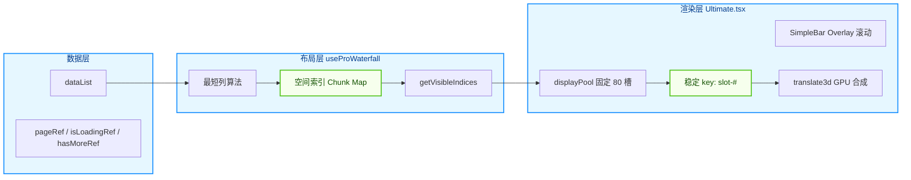
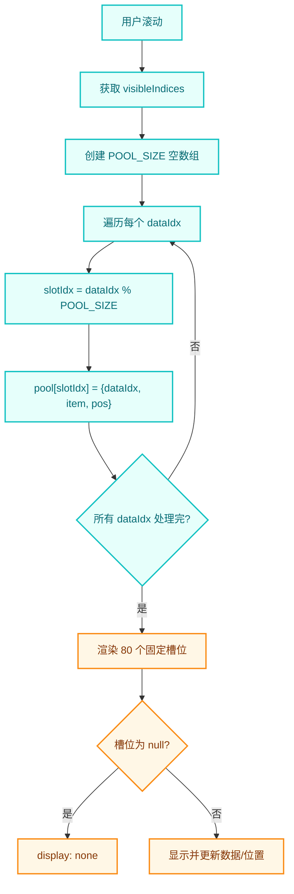
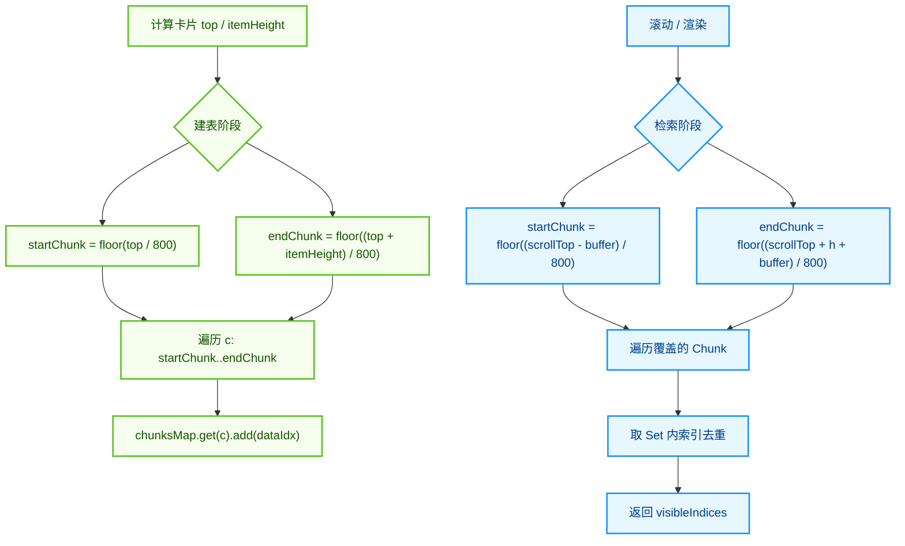
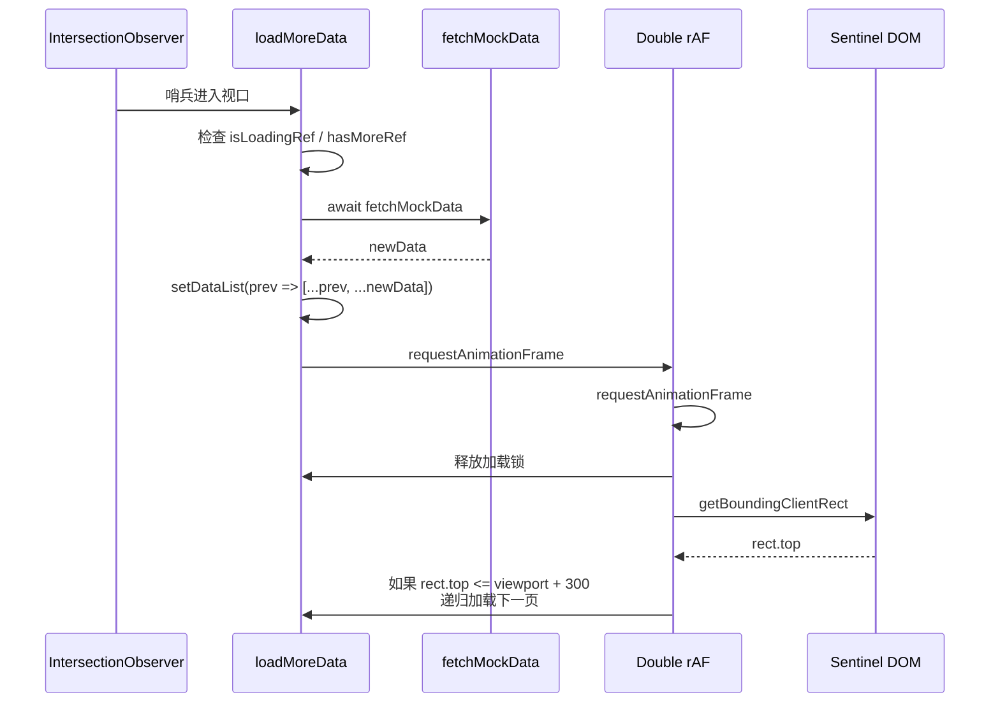
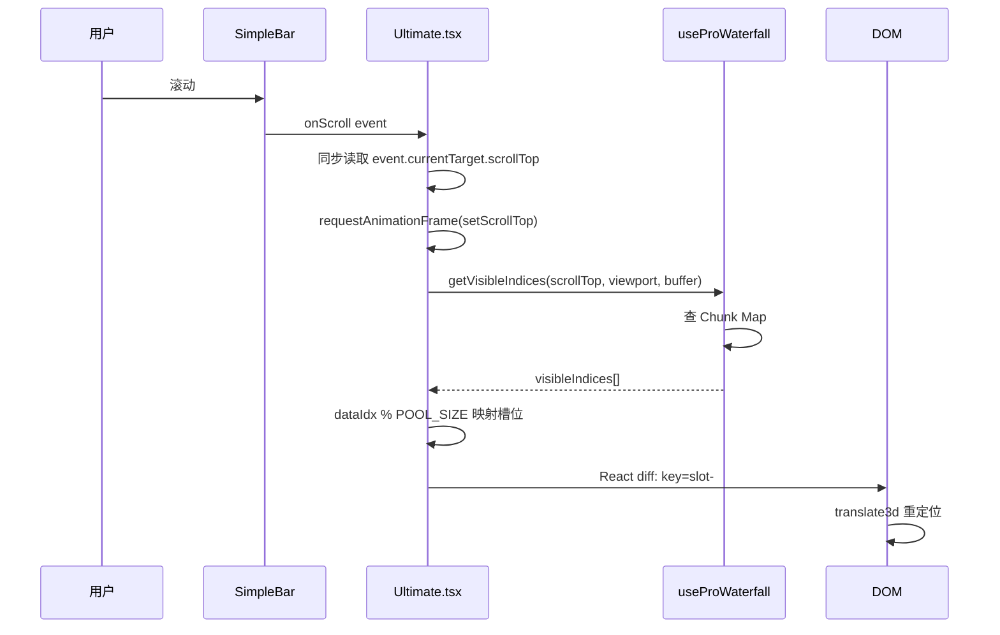

# 虚拟瀑布流面试精讲 —— 从 `Ultimate.tsx` 看 DOM 节点池复用

> **目标读者**：准备面试、希望把项目里的高性能瀑布流讲清楚的前端开发者。
>
> **对应源码**：`src/pages/performance/Waterfall/Ultimate.tsx`、`useProWaterfall2.ts`、`useProWaterfall.ts`。
>
> **阅读建议**：把本文当成“面试官连环追问”的逐题拆解，每道题都给出可直接背诵的“面试金句” + 源码佐证 + 关键流程图。

---

## 一句话总结

我们的“终极版”虚拟瀑布流不是传统意义上的“只渲染可见项”，而是只维护 **固定数量的 DOM 槽位（80 个）**，滚动时通过**空间索引**快速找出当前应该显示的几十条数据，再把这些数据**映射到固定槽位**上，React 只需要更新 props/style，永远不发生 Mount/Unmount，从而在 10 万级数据量下依然保持 60 FPS。

---

## 目录

1. [Q1：请整体介绍一下这个瀑布流的架构](#q1请整体介绍一下这个瀑布流的架构)
2. [Q2：普通虚拟列表有什么问题？为什么还需要“节点池复用”？](#q2普通虚拟列表有什么问题为什么还需要节点池复用)
3. [Q3：节点池复用最核心的实现是什么？](#q3节点池复用最核心的实现是什么)
4. [Q4：空间索引（Spatial Indexing）是怎么工作的？](#q4空间索引spatial-indexing是怎么工作的)
5. [Q5：瀑布流的布局坐标是怎么算出来的？](#q5瀑布流的布局坐标是怎么算出来的)
6. [Q6：无限滚动加载是怎么实现的？如何防止并发和初始不满屏？](#q6无限滚动加载是怎么实现的如何防止并发和初始不满屏)
7. [Q7：为什么用“双层 requestAnimationFrame”？](#q7为什么用双层-requestanimationframe)
8. [Q8：为什么用 SimpleBar 自定义滚动条？](#q8为什么用-simplebar-自定义滚动条)
9. [Q9：滚动事件里为什么要用 rAF 同步 scrollTop？](#q9滚动事件里为什么要用-raf-同步-scrolltop)
10. [Q10：这个方案做了哪些性能优化？](#q10这个方案做了哪些性能优化)
11. [Q11：生产环境还要注意什么？](#q11生产环境还要注意什么)
12. [面试金句速记](#面试金句速记)
13. [相关文件](#相关文件)

---

## Q1：请整体介绍一下这个瀑布流的架构

### 面试答法

整个架构可以分成三层：**数据层、布局层、渲染层**。

- **数据层**：维护 `dataList`，以及分页、加载锁、是否有更多数据等状态。为了让异步逻辑读取到最新值，页码、加载锁、hasMore 都用 `useRef` 而不是 `useState`。
- **布局层**：由 `useProWaterfall` 负责。它只做三件事：
  1. 用“最短列优先”算法计算每张卡片的 `left/top/height`；
  2. 在计算位置的同时，把卡片索引登记到“空间分片 Chunk Map”里；
  3. 提供 `getVisibleIndices` 函数，让渲染层以 O(1) 复杂度拿到当前可见索引。
- **渲染层**：`Ultimate.tsx` 不再 `map dataList`，而是 `map` 一个固定大小的 `displayPool`（80 个槽位）。每个槽位的 `key` 是 `slot-0`、`slot-1` 这种固定值，滚动时只改变槽位里的数据和位置，React 不会销毁或重建 DOM。



### 源码对应

```typescript
// Ultimate.tsx
const { positions, containerHeight, itemWidth, getVisibleIndices } = useProWaterfall(
  dataList,
  containerWidth,
  4,
  16
);

const displayPool = useMemo(() => {
  const visibleIndices = getVisibleIndices(scrollTop, clientHeight, 3000);
  const pool = new Array(POOL_SIZE).fill(null);
  visibleIndices.forEach((dataIdx) => {
    const slotIdx = dataIdx % POOL_SIZE;
    pool[slotIdx] = { dataIdx, item: dataList[dataIdx], pos: positions[dataIdx] };
  });
  return pool;
}, [getVisibleIndices, scrollTop, dataList, positions]);
```

### 面试金句

> “我把渲染层从‘有多少数据就渲染多少节点’改成了‘永远只渲染 80 个固定槽位’，用稳定 key 把 React 的 Diff 从‘结构变更’降级为‘属性更新’，实现真正的零销毁滚动。”

---

## Q2：普通虚拟列表有什么问题？为什么还需要“节点池复用”？

### 面试答法

传统虚拟列表的原理是：只渲染视口内的 item，滚出视口就 `Unmount`，滚入视口就重新 `Mount`。

这样做的问题有两个：

1. **GC 压力**：频繁创建和销毁 DOM 节点，JS 引擎会频繁触发垃圾回收，导致掉帧。
2. **挂载开销**：复杂卡片在 Mount 时可能会执行 `useEffect`、图片懒加载、埋点上报等，这些逻辑会占用主线程，造成滚动时的视觉抖动。

我们的方案是“节点池复用”，类似于 Android 的 RecyclerView：页面上只存在固定数量的 DOM 槽位，滚动时只是更新这些槽位的内容和位置，DOM 节点不会被销毁。

### 面试金句

> “传统虚拟列表解决的是‘不要渲染全部数据’，但没有解决‘销毁和重建 DOM’带来的开销。节点池复用进一步把问题从‘可见数据量’下沉到‘可见 DOM 数量’，让滚动过程中 GC 和 Mount 开销趋近于零。”

---

## Q3：节点池复用最核心的实现是什么？

### 面试答法

核心是两个点：**固定槽位 + 稳定 key**。

1. **固定槽位**：创建一个长度为 `POOL_SIZE`（这里是 80）的数组，循环渲染这 80 个槽位，而不是 `dataList.map`。
2. **数据映射到槽位**：通过 `dataIdx % POOL_SIZE` 决定某条数据进入哪个槽位。因为可见数据最多只有几十条，而池子有 80 个，所以取模碰撞的概率可控，下一帧也会重新计算纠正。
3. **稳定 key**：每个槽位的 key 是 `slot-${slotIdx}`，而不是 `item.id`。只要 key 不变，React 就只会更新这个 DOM 节点的 props 和 style，不会执行销毁重建。



### 源码对应

```tsx
{
  displayPool.map((slot, slotIdx) => {
    if (!slot) {
      return <div key={`slot-${slotIdx}`} style={{ display: 'none' }} />;
    }

    const { item, pos, dataIdx } = slot;

    return (
      <div
        key={`slot-${slotIdx}`} // 关键：Key 是槽位索引，保持 DOM 节点物理上的长生不老
        style={{
          position: 'absolute',
          transform: `translate3d(${pos.left}px, ${pos.top}px, 0)`,
          willChange: 'transform',
        }}
      >
        {/* ... */}
      </div>
    );
  });
}
```

### 面试金句

> “节点池复用的精髓在于 key 的设计。如果 key 用 item.id，React 每次都会做节点的销毁和重建；如果 key 用 slot 索引，React 的 Diff 就只比较同一位置节点的属性，DOM 节点可以长生不老。”

---

## Q4：空间索引（Spatial Indexing）是怎么工作的？

### 面试答法

空间索引是解决“快速找到可见元素”的问题。

传统做法是滚动时遍历所有 `dataList` 判断 `top/height` 是否在视口内，复杂度是 O(N)。如果数据量达到 1 万、10 万，每一帧都遍历，CPU 会吃不消。

我们的做法：

1. **建表阶段**：在计算每张卡片的 `top` 和 `height` 时，同时把它登记到一个 Map 里。把纵向空间按 800px 切成一个个“Chunk”（房间），卡片的头在哪个房间、脚在哪个房间，就把它索引加到对应房间。
2. **检索阶段**：滚动时，根据 `scrollTop` 和视口高度，算出当前覆盖了哪几个 Chunk，直接 Map 取值，复杂度是 O(1)。



### 源码对应

```typescript
// useProWaterfall2.ts
const startChunk = Math.floor(top / CHUNK_SIZE);
const endChunk = Math.floor((top + itemHeight) / CHUNK_SIZE);
for (let j = startChunk; j <= endChunk; j++) {
  if (!currentChunks.has(j)) {
    currentChunks.set(j, new Set());
  }
  currentChunks.get(j)!.add(i);
}

const getVisibleIndices = (scrollTop: number, viewportHeight: number, buffer: number) => {
  const visibleIndicesSet = new Set<number>();
  let startChunk = Math.floor((scrollTop - buffer) / CHUNK_SIZE);
  startChunk = startChunk >= 0 ? startChunk : 0;
  const endChunk = Math.floor((scrollTop + viewportHeight + buffer) / CHUNK_SIZE);

  for (let c = startChunk; c <= endChunk; c++) {
    const chunkSet = currentChunks.get(c);
    if (chunkSet) {
      chunkSet.forEach((idx) => visibleIndicesSet.add(idx));
    }
  }
  return Array.from(visibleIndicesSet);
};
```

### 面试金句

> “空间索引借鉴了碰撞检测里的空间分割思想。我把纵向空间按 800px 分桶，建表阶段把卡片索引写进桶里，检索阶段只需要查当前覆盖的 2-3 个桶，复杂度从 O(N) 降到 O(1)，10 万条数据也能稳 60 FPS。”

---

## Q5：瀑布流的布局坐标是怎么算出来的？

### 面试答法

瀑布流布局的核心是“最短列优先”：

1. 先算每列宽度：`itemWidth = (containerWidth - (columns - 1) * gap) / columns`。
2. 维护一个数组 `columnHeights`，记录每列当前累计高度。
3. 遍历每个 item，找到 `columnHeights` 中最小的那一列，把新卡片放在这列的底部。
4. 计算卡片高度：根据图片原始宽高比，等比缩放到当前定宽，再加上标题、内边距等固定高度。
5. 更新该列高度：`columnHeights[minIndex] += itemHeight + gap`。

为了保证无限滚动时不需要重算全部数据，`useProWaterfall` 内部做了**增量更新**：用 `cacheRef` 缓存上一次的位置和索引，每次只计算新增的数据。

### 源码对应

```typescript
for (let i = startIndex; i < items.length; i++) {
  const item = items[i];

  let minIndex = 0;
  let minHeight = currentColumnHeights[0];
  for (let j = 1; j < currentColumnHeights.length; j++) {
    if (minHeight > currentColumnHeights[j]) {
      minHeight = currentColumnHeights[j];
      minIndex = j;
    }
  }

  const scaledImgHeight =
    item.imgWidth > 0 ? (calculatedItemWidth / item.imgWidth) * item.imgHeight : 100;
  const fixedHeight = 80;
  const itemHeight = scaledImgHeight + fixedHeight;

  const left = minIndex * (calculatedItemWidth + gap);
  const top = minHeight;

  currentPositions.push({ left, top, itemHeight, scaledImgHeight });
  currentColumnHeights[minIndex] = top + itemHeight + gap;
}
```

### 面试金句

> “瀑布流不是按顺序从左到右摆，而是每次找到当前最短的列，把新卡片塞进去，这样才能保证多列高度差最小，避免出现某一列特别长导致的底部空洞。”

---

## Q6：无限滚动加载是怎么实现的？如何防止并发和初始不满屏？

### 面试答法

无限滚动用 **IntersectionObserver** 监听底部哨兵元素（sentinel），当哨兵进入视口（或距离视口 200px 内）就触发 `loadMoreData`。

为了防止并发加载，我们用 `isLoadingRef` 作为加载锁：

```typescript
if (isLoadingRef.current || !hasMoreRef.current) return;
isLoadingRef.current = true;
```

解决“初始不满屏”和“滚轮太快”：加载完一页后，用双层 `requestAnimationFrame` 测量哨兵位置，如果哨兵仍然在视口内（说明数据还没填满屏幕），就通过 `loadMoreDataRef` 递归调用自己，继续加载下一页。



### 源码对应

```typescript
const loadMoreData = useCallback(async () => {
  if (isLoadingRef.current || !hasMoreRef.current) return;
  isLoadingRef.current = true;
  setIsUILoading(true);

  const nextPage = pageRef.current + 1;
  const newData = await fetchMockData(nextPage, 30);
  pageRef.current = nextPage;
  setDataList((prev) => [...prev, ...newData]);

  requestAnimationFrame(() => {
    requestAnimationFrame(() => {
      isLoadingRef.current = false;
      setIsUILoading(false);
      if (hasMoreRef.current && sentinelRef.current) {
        const rect = sentinelRef.current.getBoundingClientRect();
        if (rect.top <= windowHeight + 300) {
          loadMoreDataRef.current(); // 递归加载
        }
      }
    });
  });
}, []);
```

### 面试金句

> “我用 IntersectionObserver 代替 scroll 事件监听触底，性能更高；再用 isLoadingRef 做锁，防止并发请求；最后用双层 rAF 递归检查哨兵位置，确保初始数据不满屏时自动补满，滚轮再快也不会断流。”

---

## Q7：为什么用“双层 requestAnimationFrame”？

### 面试答法

`setDataList` 之后，React 的渲染是异步的。如果立即读取 DOM，拿到的还是旧布局。我们需要等待两个周期：

1. **第一层 rAF**：等待 React 完成当前宏任务里的所有状态更新，并提交新的虚拟 DOM。
2. **第二层 rAF**：等待浏览器完成 Layout、Paint、Composite，新的 DOM 已经“上墙”，此时测量才准确。

不用 `useEffect` 监听 `dataList` 是因为：

- `useEffect` 执行时 DOM 可能还没完成最终布局；
- 监听 `dataList` 会让逻辑碎片化，删除/排序时容易误触发。

### 面试金句

> “双层 rAF 跨越了 React 的渲染周期和浏览器的重绘周期，确保我测量哨兵位置时，物理布局已经绝对稳固。这比用 useEffect 监听 dataList 更精确、更解耦。”

---

## Q8：为什么用 SimpleBar 自定义滚动条？

### 面试答法

Windows 下原生滚动条通常占 15-17px 宽度。当内容超过视口时，滚动条出现，会挤压容器可用宽度，触发 `ResizeObserver`，导致瀑布流重新计算 `itemWidth` 和 `left`，用户会看到所有卡片突然向左抖动。

SimpleBar 是 **Overlay Scrollbar** 方案：自定义滚动条 `position: absolute` 悬浮在内容之上，不占据物理宽度。这样无论滚动条是否出现，容器宽度都是恒定的，彻底消除了滚动条引起的重排抖动。

### 面试金句

> “我用 Overlay 滚动条解耦了‘滚动功能’和‘布局宽度’。原生滚动条会挤压容器导致瀑布流重排，SimpleBar 让滚动条悬浮在内容之上，容器宽度像素级恒定，彻底消除视觉抖动。”

---

## Q9：滚动事件里为什么要用 rAF 同步 scrollTop？

### 面试答法

两个原因：

1. **React 事件对象会被回收**。如果在异步回调里直接读取 `event.currentTarget.scrollTop`，可能会报 `Cannot read properties of null` 的错误。必须在同步阶段先提取数值快照。
2. **滚动事件频率很高**。直接用 `setScrollTop` 会触发大量渲染，加上 `requestAnimationFrame` 可以确保同一帧内的多次滚动事件只执行最后一次更新，减少不必要的重渲染。

### 源码对应

```tsx
<SimpleBar
  scrollableNodeProps={{
    onScroll: (event) => {
      const scrollTop = event.currentTarget.scrollTop; // 同步快照
      requestAnimationFrame(() => {
        setScrollTop(scrollTop);
      });
    },
  }}
/>
```

### 面试金句

> “我深刻理解 React 的事件回收机制。在同步阶段提取 scrollTop 快照，再用 rAF 批量更新 state，既避免了空指针异常，又减少了高频滚动下的渲染次数。”

---

## Q10：这个方案做了哪些性能优化？

### 面试答法

可以按“计算、渲染、加载”三个维度总结：

| 维度     | 优化点                       | 效果                                    |
| -------- | ---------------------------- | --------------------------------------- |
| **计算** | 空间索引 Chunk Map           | 可见项检索从 O(N) 降到 O(1)             |
| **计算** | 增量更新                     | 无限加载时只算新增数据，不重算全部      |
| **渲染** | DOM 节点池复用               | 固定 80 个 DOM，滚动无 Mount/Unmount    |
| **渲染** | `translate3d` + `willChange` | 只触发 Composite，跳过 Layout/Paint     |
| **加载** | IntersectionObserver         | 原生 API 监听触底，比 scroll 事件更高效 |
| **加载** | 双层 rAF 递归加载            | 自动补满初始屏幕，防止滚轮太快断流      |
| **布局** | SimpleBar Overlay 滚动条     | 避免滚动条出现挤压容器导致的重排        |



### 面试金句

> “这个方案的性能优化是立体的：计算层用空间索引和增量更新把复杂度降到最低，渲染层用节点池和 GPU 合成把 DOM 开销降到零，加载层用 IntersectionObserver 和双 rAF 把体验做到无缝。”

---

## Q11：生产环境还要注意什么？

### 面试答法

1. **槽位分配算法**：当前用的是 `dataIdx % POOL_SIZE` 简化版，适合演示。生产环境应该用“空闲队列”算法，维护一个空闲槽位列表，数据滚出时回收槽位，滚入时分配，避免相邻数据争抢同一槽位。
2. **图片高度未知**：演示里从文件名解析图片宽高，真实场景图片高度通常异步获取。需要等图片加载完成后再计算真实高度，或者先按占位高度渲染，加载后补位。
3. **数据删除/排序**：当前增量更新假设数据只追加。如果支持删除或排序，需要让 `isItemsReset` 判断更准确，并触发全量重算。
4. **SSR 兼容性**：`ResizeObserver`、`IntersectionObserver`、`window.innerHeight` 在服务端不存在，需要兜底或只在客户端执行。
5. **内存与池子大小**：池子不是越大越好。要根据屏幕大小、列数、卡片高度估算一个覆盖 3-4 屏的值，平衡内存和滚动空白风险。

### 面试金句

> “这个方案在面试场景下足够惊艳，但落地生产时还要注意：槽位分配从取模升级为空闲队列、图片高度异步获取后的重布局、删除排序导致的全量重算、以及 SSR 下浏览器 API 的兜底。”

---

## 面试金句速记

| 场景     | 金句                                                                                                        |
| -------- | ----------------------------------------------------------------------------------------------------------- |
| 整体架构 | “我把渲染层从‘有多少数据渲染多少节点’改成了‘永远只渲染固定槽位’，用稳定 key 把 React Diff 降级为属性更新。” |
| 节点复用 | “DOM 节点池复用让滚动过程中 Mount/Unmount 和 GC 开销趋近于零。”                                             |
| 空间索引 | “借鉴碰撞检测的空间分割思想，把纵向空间按 800px 分桶，检索复杂度从 O(N) 降到 O(1)。”                        |
| 布局算法 | “瀑布流每次找最短列塞卡片，保证多列高度差最小，避免底部空洞。”                                              |
| 加载策略 | “IntersectionObserver 监听触底 + isLoadingRef 防并发 + 双 rAF 递归补满。”                                   |
| 渲染时序 | “双 rAF 跨越了 React 渲染周期和浏览器重绘周期，确保 DOM 测量在布局稳定后执行。”                             |
| 滚动条   | “Overlay 滚动条解耦了滚动功能和布局宽度，消除滚动条出现导致的重排抖动。”                                    |
| 事件处理 | “在同步阶段提取 scrollTop 快照，避免 React 事件回收导致的空指针异常。”                                      |

---

## 相关文件

- `src/pages/performance/Waterfall/Ultimate.tsx` —— 终极版瀑布流组件（节点池复用）
- `src/pages/performance/Waterfall/useProWaterfall2.ts` —— 空间索引 + 布局算法 Hook（v2）
- `src/pages/performance/Waterfall/useProWaterfall.ts` —— 类型定义与 v1 算法
- `src/pages/performance/Waterfall/ULTIMATE_RECYCLING_DEEP_DIVE.md` —— 节点复用深度解析
- `src/pages/performance/Waterfall/ULTIMATE_CODE_WALKTHROUGH.md` —— 逐行代码详解
- `src/pages/performance/Waterfall/ALGORITHM_EXPLAINED.md` —— 空间索引算法解析

---

> 如果你对某个问题还想深入，比如想看到“空闲队列版槽位分配”的代码实现，或者想把这套方案改成 `.mdx` 页面接入到项目的 `MermaidViewer` 组件里，随时可以继续问我。
