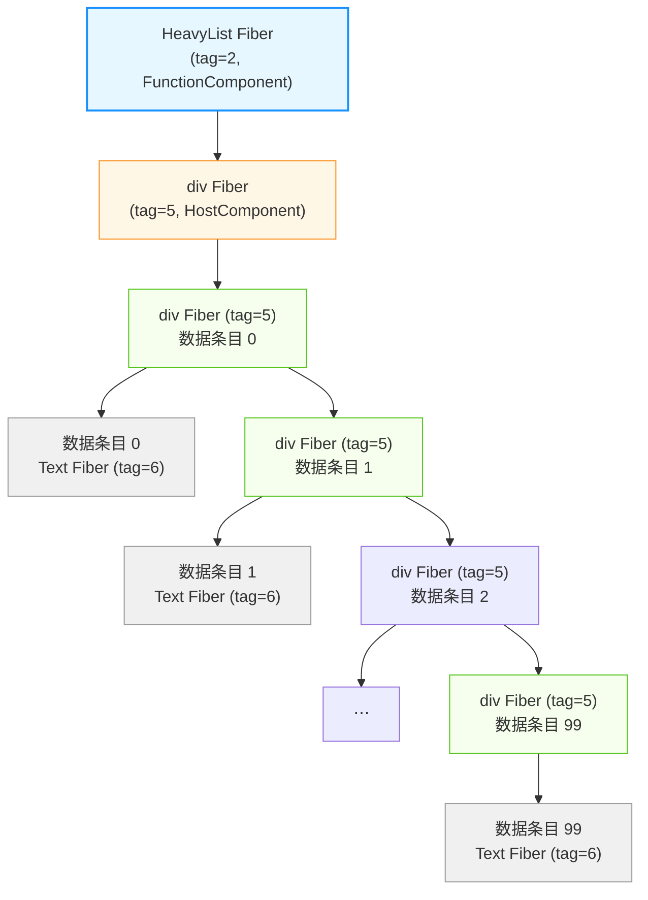
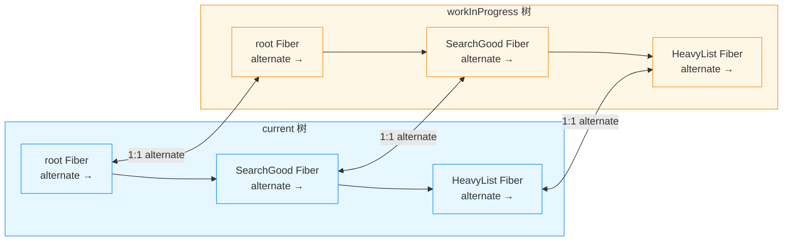
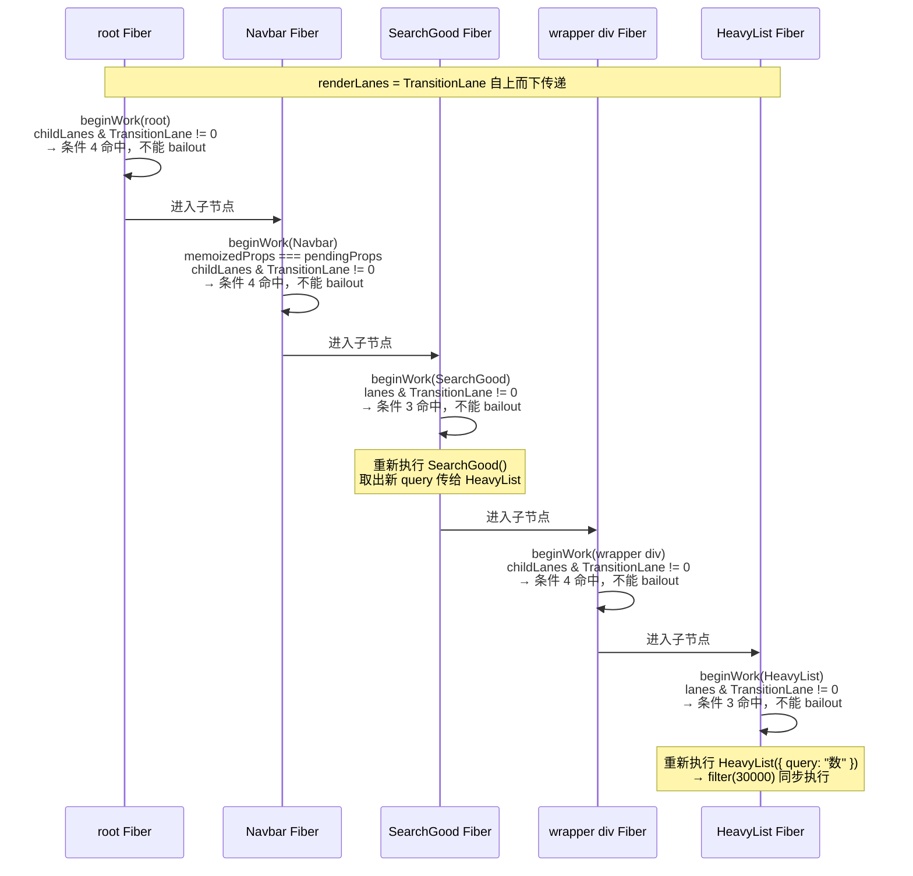
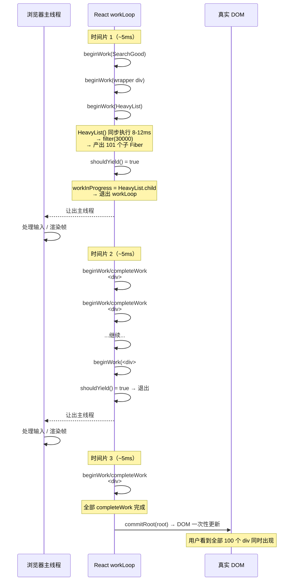
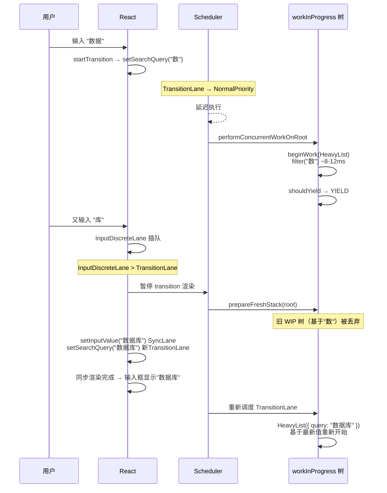
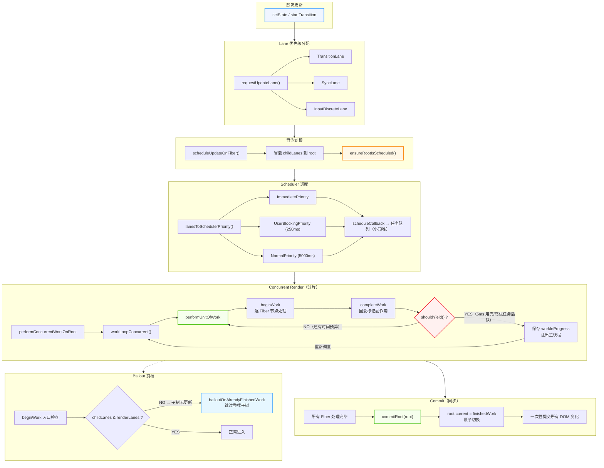

# React 调度机制深度解析

> 从 `HeavyList` 的 `filter(30000)` 出发，层层深入 Fiber、优先级注入、时间分片、bailout 与双缓冲。

---

## 零、起点：一个搜索框过滤的例子

```tsx
const HeavyList: React.FC<{ query: string }> = ({ query }) => {
  const items = Array.from({ length: 30000 }, (_, i) => `数据条目 ${i}`);
  const filtered = items.filter((item) => item.includes(query));

  return (
    <div>
      {filtered.slice(0, 100).map((item) => (
        <div key={item}>{item}</div>
      ))}
    </div>
  );
};
```

当用户在搜索框中输入文字时，`filter(30000)` 跑约 8-12ms。如果在 `startTransition` 中执行 `setSearchQuery`，输入就能保持流畅。但"为什么流畅"的答案藏在 Fiber 节点、Lane 优先级、Scheduler 调度器和双缓冲机制之中。

本文从最微观的 Fiber 节点开始，逐层上升到调度架构，最后落到宏观的内存模型。

---

## 一、Fiber 节点：React 的最小工作单元

### 1.1 Fiber 是什么

Fiber 节点本质上就是一个**普通的 JavaScript 对象**，没有 class，没有 prototype。React 每次渲染时为每个组件实例和每个 DOM 元素创建对应的 Fiber 节点，通过指针把它们串成一棵链表树。

`HeavyList` 组件的 Fiber 节点：

```js
const heavyListFiber = {
  tag: 2,          // FunctionComponent = 2
  type: HeavyList, // 指向你写的那个函数
  key: null,

  pendingProps:  { query: '数据' },  // 这一轮要用的 props
  memoizedProps: { query: '' },      // 上一轮已经用过的 props

  memoizedState: null, // Hook 链表

  // 三根指针把 Fiber 树串起来
  return: parentFiber,          // 父节点
  child: divHostFiber,          // 第一个子节点
  sibling: null,                // 下一个兄弟节点

  // 优先级
  lanes: TransitionLane,        // 标记为过渡更新

  // 双缓冲
  alternate: currentFiber,      // 指向 current 树上对应的老节点
  flags: 0,                     // 待执行的副作用标记
};
```

### 1.2 tag —— 告诉 React 怎么处理这个 Fiber

```js
export const FunctionComponent = 2;    // HeavyList → 调用函数
export const HostComponent = 5;        // <div> → 创建/更新 DOM 元素
export const HostText = 6;             // "数据条目 0" → 创建/更新文本节点
```

`HeavyList` 产生的完整 Fiber 树：



**共计 1（HeavyList）+ 1（外层 div）+ 100（条目 div）+ 100（文本节点）= 202 个 Fiber 节点。**

---

## 二、startTransition 的优先级注入全链路

`startTransition(() => setSearchQuery("数"))` 让 `HeavyList` 的更新变成"低优先级"的完整链路如下。

### 第一步：设置上下文标志

```js
function startTransition(scope) {
  const prevTransition = ReactCurrentBatchConfig.transition;
  // ↑ 保存旧值（可能是 null）

  ReactCurrentBatchConfig.transition = { name: 'Pending' };
  // ↑ 设置为对象！不是 null

  try {
    setPending(true);
    scope();            // setSearchQuery("数")
  } finally {
    ReactCurrentBatchConfig.transition = prevTransition;
    // ↑ 恢复
  }
}
```

`ReactCurrentBatchConfig.transition` 是一个模块级全局变量。在 transition 外为 `null`，transition 内为 `{ name: 'Pending' }`。**所有 setState 的底层函数在请求优先级时都会检查这个变量。**

### 第二步：requestUpdateLane 的分叉判断

```js
function dispatchSetState(fiber, queue, action) {
  // ★★★ 核心：请求一条 Lane ★★★
  const lane = requestUpdateLane(fiber);
  //                    ↑
  //             这就是 setSearchQuery("数") 变成低优先级的根源

  const update = {
    lane,       // ← TransitionLane（不是 SyncLane）
    action,     // ← "数"
  };
  enqueueUpdate(fiber, queue, update);
  scheduleUpdateOnFiber(fiber, lane);
}
```

`requestUpdateLane` 的三岔判断逻辑：

```js
function requestUpdateLane(fiber) {
  if (!(fiber.mode & ConcurrentMode)) return SyncLane;

  // ★★★ 核心判断：当前是否在 transition 中？ ★★★
  const transition = ReactCurrentBatchConfig.transition;
  if (transition !== null) {
    return claimNextTransitionLane();  // → TransitionLane
  }

  const currentEventLane = currentEventLane;
  if (currentEventLane !== NoLane) {
    return currentEventLane;  // → InputDiscreteLane（输入事件）
  }

  return SyncLane;
}
```

**同一个 `handleChange` 中两个 `setState` 获得不同优先级的原因：**

```
setInputValue(value)    → ReactCurrentBatchConfig.transition = null
                           currentEventLane = InputDiscreteLane
                           → InputDiscreteLane（高优先级）

setSearchQuery(value)   → ReactCurrentBatchConfig.transition = { name: 'Pending' }
                           → TransitionLane（低优先级）
```

### 第三步：Lane → Scheduler 优先级映射

```js
function scheduleUpdateOnFiber(root, lane) {
  markRootUpdated(root, lane);

  if (lane === SyncLane) {
    performSyncWorkOnRoot(root);  // 直接同步执行
  } else {
    const schedulerPriority = lanesToSchedulerPriority(lane);
    // TransitionLane → NormalPriority

    scheduleCallback(schedulerPriority, performConcurrentWorkOnRoot.bind(null, root));
  }
}

function lanesToSchedulerPriority(lanes) {
  if (includesSyncLane(lanes))           return ImmediatePriority;    // 立刻执行
  if (includesInputDiscreteLanes(lanes))  return UserBlockingPriority; // 250ms 超时
  if (includesTransitionLanes(lanes))     return NormalPriority;       // ★ 5000ms 超时
  return IdlePriority;
}
```

**所谓"低优先级"就是：NormalPriority 在 Scheduler 的小顶堆中排在其他任务之后，只有主线程空闲时才执行。**

### 第四步：renderLanes 下发时的 Update 过滤

```js
function processUpdateQueue(fiber, queue, renderLanes) {
  let update = queue.firstUpdate;
  while (update !== null) {
    // ★★★ 只处理与 renderLanes 有交集的 update ★★★
    if (isSubsetOfLanes(update.lane, renderLanes)) {
      newState = computeUpdate(newState, update.action);
    }
    update = update.next;
  }
  return newState;
}
```

Lane 本质是一个 32 位位图：

```
NoLane             = 0b0000000000000000000000000000000
SyncLane           = 0b0000000000000000000000000000001  // 第 0 位
InputDiscreteLane  = 0b0000000000000000000000000000010  // 第 1 位
TransitionLane1    = 0b0000000000000000000000000010000  // 第 4 位
TransitionLane2    = 0b0000000000000000000000000100000  // 第 5 位
// ... 共 16 条 transition 车道
```

### 第五步：输入事件插队时丢弃旧 WIP

```js
function prepareFreshStack(root) {
  rootFiber = root.current;
  workInProgress = createWorkInProgress(rootFiber, null);
  // ↑ workInProgress 被全新创建
  // 旧的 workInProgress 不再被引用 → GC 回收
}
```

旧 WIP 树（基于 `searchQuery = "数"`）被丢弃为孤儿。新的 TransitionLane 基于 `searchQuery = "数据"` 重新调度。

---

## 三、为什么 scheduleUpdateOnFiber 必须冒泡到根

`scheduleUpdateOnFiber(fiber, lane)` 中有一个关键操作——把 lane 一路向上冒泡：

```js
function scheduleUpdateOnFiber(fiber, lane) {
  // ★★★ 从当前 fiber 一路向上冒泡到 root ★★★
  let node = fiber;
  while (node !== null) {
    node.childLanes = mergeLanes(node.childLanes, lane);
    node = node.return;
  }
  markRootUpdated(root, lane);
  ensureRootIsScheduled(root);
}
```

为什么不能只从 HeavyList 的 Fiber 开始？要回答这个问题，需要逐一审视四个候选理由。

### 候选理由一：Context ❌

Context 的消费者可能在 Fiber 树的任何位置。当 Provider 的 value 变化时，React 需要从 Provider 往下遍历找到所有消费者。

但问题是：**Context 只要求从 Provider 所在的 Fiber 节点开始向下传播，并不要求从整棵树的根开始。** 如果 Provider 在第三层，从第三层开始走就够了。

**结论：Context 不是"必须从根开始"的理由。**

### 候选理由二：已删除节点 ❌

如果父组件的条件渲染删除了 HeavyList，而 HeavyList 上还挂着一个 `setSearchQuery` 的 Update，直接从旧 WIP 树中找 HeavyList 的 Fiber 确实会找到一个"已死亡"的节点。

但问题在于：**只有当父组件的某个其他 state 变化时，HeavyList 才可能被删除。这个"其他 state"本身会触发一次从根开始的更新。**

```
setShowList(false) → SearchGood 重新执行
                    → reconcile 发现 HeavyList 消失
                    → delete HeavyList fiber
```

如果只有 `setSearchQuery("数")` 被调用而 `showList` 不变，`SearchGood()` 返回的 JSX 仍然是 `{true && <HeavyList/>}`，HeavyList 不会被删除。

**结论：已删除节点不是"必须从根开始"的理由。**

### 候选理由三：双缓冲 ✅

这是**真正的原因**。

```js
function prepareFreshStack(root) {
  workInProgress = createWorkInProgress(root.current, null);
  // ↑ 从 root.current 的根节点开始，逐层创建 WIP 副本
}
```

`alternate` 是双向的一对一映射：



如果 WIP 树是一棵断开的子树：

```js
// 设想：只从 HeavyList 开始建 WIP
heavyListWIP = createWorkInProgress(currentHeavyList, null);
// ... 只在这条分支上跑 beginWork/completeWork ...

function commitRoot(root, finishedWork) {
  // ★★★ finishedWork 只是一段子树 ★★★
  root.current = finishedWork;
  // ↑ root.current 被指向残缺的树
  // SearchGood、Navbar、App 全没了！
}
```

技术上可以做子树提交（回溯 return 指针拼接到旧树），但 React 选择了"全树原子切换"的一致性模型，因为：

1. **effectList 完整性**：commit 阶段遍历的 effect list 是从根到叶子的完整链表。局部 WIP 无法提供全局的 Placement/Update/Deletion 信息。
2. **useEffect 的可预测性**：所有 effect 的清理和重新执行基于同一时刻的完整快照。
3. **简化开发者的 mental model**：`setState` 总是触发一次从根开始的 reconciliation。

**结论：双缓冲机制要求从根创建完整的 WIP 树，这是"必须从根开始"的真实原因。**

### 候选理由四：bailout —— 不是原因，是补偿机制

bailout 不是"从根开始"的原因，而是 React 用来抵消"从根开始"性能开销的手段。详见第四章。

---

## 四、Bailout 机制：让"全量遍历"变成"O(1) 剪枝"

### 4.1 bailout 的四个条件

```js
function beginWork(current, workInProgress, renderLanes) {
  // ★★★ 四个条件全部满足才触发 bailout ★★★
  if (
    // 条件 1：新旧 props 引用相等
    current.memoizedProps === workInProgress.pendingProps &&
    // 条件 2：context 没有变化
    !hasLegacyContextChanged() &&
    // 条件 3：当前 fiber 自身没有 lane 待处理
    !checkIfLanesIntersect(workInProgress.lanes, renderLanes) &&
    // 条件 4：所有子孙都没有 lane 待处理 ← 这是冒泡结果
    !checkIfLanesIntersect(workInProgress.childLanes, renderLanes)
  ) {
    return bailoutOnAlreadyFinishedWork(current, workInProgress, renderLanes);
  }
  // 否则正常处理
}
```

**条件 4 就是冒泡上来的 `childLanes` 被消费的地方。**

### 4.2 HeavyList 场景中的冒泡与遍历

`setSearchQuery("数")` 触发后，childLanes 从下往上冒泡：

```mermaid
flowchart TD
    HL["HeavyList.lanes &#124;= TransitionLane<br/>标记自己"] -->|"向上冒泡"| INPUT["Input.childLanes &#124;= TransitionLane"]
    INPUT -->|"向上冒泡"| SG["SearchGood.childLanes &#124;= TransitionLane"]
    SG -->|"向上冒泡"| NAV["Navbar.childLanes &#124;= TransitionLane"]
    NAV -->|"向上冒泡"| ROOT["root.childLanes &#124;= TransitionLane"]

    style HL fill:#fff1f0,stroke:#f5222d,stroke-width:2px
    style ROOT fill:#f6ffed,stroke:#52c41a,stroke-width:2px
```



Scheduler 执行 `workLoopConcurrent`，从 root 向下遍历：



### 4.3 bailout 时的跳过

```js
function bailoutOnAlreadyFinishedWork(current, workInProgress, renderLanes) {
  if (!checkIfLanesIntersect(workInProgress.childLanes, renderLanes)) {
    // 子孙也没有更新 → 整棵子树完全没变化
    return null;  // workLoop 知道这条分支处理完了
  }

  // 子孙有更新 → 只克隆当前节点，但跳过组件函数的执行
  cloneChildFibers(current, workInProgress);
  return workInProgress.child;
}
```

**bailout 跳过的是组件函数的执行。** 如果一个组件 bailout 了，它的函数体完全不跑，`useState` 不执行，`useEffect` 不受影响，没有任何 JS 代码被调用。

### 4.4 为什么不从 HeavyList 直接开始

如果直接从 HeavyList 开始可以跳过上面几层的检查——但问题是：

1. **每层的 checkIfLanesIntersect 是 O(1) 的位运算**，性能损失可以忽略
2. **从根开始是架构一致性模型的必然要求**（双缓冲需要完整树）
3. **Context 需要从 Provider 向下传播**——虽然 Provider 不一定在根，但 React 选择统一从根出发，不做"从哪里开始"的决策优化

实际运行中，bailout 让从根开始的遍历和"跳转到触发点"的遍历在性能上没有本质区别。

---

## 五、时间切片：Fiber 级的分片真相

### 5.1 分片粒度是 Fiber 节点，不是计算量

很多人误以为"时间切片把 30000 条 filter 拆成 10 片，每片 3000 条"。**这是错的。**

时间切片的检查点在 **Fiber 节点之间**，不在 Fiber 节点内部：

```js
function workLoopConcurrent() {
  while (workInProgress !== null && !shouldYield()) {
    // 一次 performUnitOfWork 处理一个 Fiber 节点
    workInProgress = performUnitOfWork(workInProgress);
  }
}
```

`HeavyList` 的 `filter(30000)` 执行在 `beginWork(HeavyList Fiber)` 中，**这个执行是同步且不可打断的**：

```
时间线：
  beginWork(HeavyList Fiber)
    ↓
  renderWithHooks(HeavyList, { query: "数" })
    ↓
  HeavyList() {                     ← 同步执行，约 8-12ms
    Array.from(30000)               ← ~2ms
    .filter(...)                    ← ~5-10ms
    .slice(0,100).map(...)          ← <0.5ms
    return JSX                      ← 产出 101 个虚拟 DOM
  }
    ↓
  reconcileChildren(HeavyList JSX)
    ↓
  shouldYield()                     ← ★★★ 在这里检查 ★★★
```

**时间分片的核心不是打断 HeavyList 的执行，而是利用了"heavy 函数最终产出了很多子节点需要 React 继续处理"这件事，在这些子节点的 Fiber 处理间隙释放主线程。**

### 5.2 HeavyList 的完整分片过程



**render 阶段是分片的，commit 阶段是同步的。** 用户不会看到"先出 30 个 div，再出 30 个"的现象。

### 5.3 输入事件插入时的完整处理



### 5.4 最核心的两个认知

**认知 1：分片的粒度是 Fiber 节点，不是计算量**

`HeavyList` 内部 `filter(30000)` 这 8-12ms 的纯计算，React **无法打断**。你能感觉到不卡的原因不是"这 12ms 被切片了"，而是：

- **延迟执行**：filter 从"输入发生时必须立刻做"，变成"等输入空闲时再做"
- **丢弃重做**：用户输入第三个字时，前两个字的 filter 结果被直接丢弃，不产生任何 DOM 操作
- **释放间隙**：filter 执行完后的那 100 个 div Fiber 节点被摊到多个帧里处理

**认知 2：时间分片救的不是 filter(30K)，而是 filter(30K) 之后的事**

如果 `filter(30000)` 本身就需要 100ms，那即使 `startTransition` 也救不了——这 100ms 的函数执行是同步的，浏览器会卡。`startTransition` 的真正收益在于：

1. **延迟开始**——等到浏览器空闲再执行 HeavyList()
2. **丢弃重做**——用户再次输入时扔掉旧的 filter 结果
3. **分片产出**——把 100 个 div 的 DOM 准备工作摊到多帧

---

## 六、双缓冲：Vue / Solid 不用，为什么 React 非用不可？

### 6.1 什么是 React 的双缓冲

每次更新时，React 维护两棵 Fiber 树：

- **current 树**：当前屏幕显示的 UI 对应的 Fiber 树
- **workInProgress 树**：正在后台构建的新 Fiber 树

```js
render 阶段 → 在 workInProgress 树上工作
commit 阶段 → root.current = workInProgress
              → WIP 树变成 current 树
              → 旧 current 树的 alternate 被覆盖
```

### 6.2 为什么 Vue / Solid 不需要

Vue 3 和 SolidJS 都使用**细粒度响应式**。它们在编译阶段就收集了依赖关系：

```ts
// Vue 编译后的代码
// 编译时已经知道：count 变化时更新哪个 DOM 文本节点
setup() {
  const count = ref(0);
  // template: <div>{{ count }}</div>
  // 编译结果：创建 text node，count 变化时直接更新这个 text node
}
```

Vue 和 Solid 没有"组件树 → Fiber 树 → DOM"的中间映射层。它们的更新是**精准命中目标 DOM 节点**的，不需要从根重新遍历，也不需要双缓冲来保存中间状态。

### 6.3 为什么 React 需要

React 是**运行时递归 reconcilation**。在 render 阶段开始前，React 不知道哪个组件会更新、哪个不会。它只能在运行时从根开始，一层层调用 `beginWork`，通过返回值判断有没有子节点需要处理。

双缓冲的作用：render 阶段在**副本**（WIP 树）上工作，不破坏当前正在显示的 UI。commit 阶段用副本整体替换正式树。如果 render 阶段出错或被中断，`root.current` 仍然指向完整的、正常的 current 树，用户看到的 UI 没有任何损坏。

### 6.4 为什么会导致"必须从根开始"

双缓冲机制的 `prepareFreshStack` 从 `root.current` 创建完整的 WIP 树：

```js
workInProgress = createWorkInProgress(root.current, null);
```

如果 WIP 树不完整，commit 阶段的 `root.current = finishedWork` 就会把整棵应用的根指向一棵残缺的树。

**这就是"必须从根开始"且"冒泡到根"的最终原因——不是因为性能考虑，而是因为双缓冲架构要求**：

1. 从 root 创建完整的 WIP 树
2. 在 WIP 树上做增量修改
3. 原子性地切换到新树

---

## 七、Fiber 内存成本：万级 DOM 的真相

### 7.1 一个 Fiber 节点占多少内存

一个 Fiber 对象在 V8 引擎中约占用：

| 项目 | 大小 |
|------|------|
| JS 对象头 | ~24 字节 |
| 约 20 个属性（指针 / Smi） | 8 × 20 = 160 字节 |
| 隐藏类共享 | 不计入单个实例 |
| **合计** | **约 120~160 字节** |

### 7.2 万级 DOM 的实际占用

```
10,000 个 DOM → 10,000 个 Fiber 节点
10,000 × 160 字节 = 1.6 MB

同时存在 2 棵 Fiber 树（current + workInProgress）：
1.6 × 2 = 3.2 MB

加上真实 DOM 节点（约 300 字节/个）：
10,000 × 300 = 3 MB（DOM）+ 3.2 MB（Fiber）= 6.2 MB
```

**在 2025 年的设备上，这个数字不值一提。**

### 7.3 Fiber 不存储什么

| Fiber 中存储的 | 数据本质 | 为什么不多占内存 |
|--------------|---------|----------------|
| `tag: 5` | 整数 | 所有 HostComponent 共享同一个数字 5 |
| `type: 'div'` | 字符串引用 | 整个应用 `'div'` 只存一份 |
| `stateNode` | 指向真实 DOM 的指针 | 真实的 DOM 本来就在，Fiber 只加了个引用 |
| `pendingProps` | 指向 props 的指针 | props 来自 createElement，Fiber 不复制 |
| `alternate` | 指向另一个 Fiber | 让两棵树共享数据，不需要复制 props/state |

### 7.4 真正的瓶颈

Fiber 内存开销在真实场景中几乎从不成为瓶颈。真正限制性能的是：

1. **浏览器 Layout**（布局计算）—— 最贵
2. **Recalculate Style**（样式重算）—— 第二贵
3. **Paint**（绘制）—— 第三贵
4. **Fiber 内存**（3 MB 额外）—— 几乎可以忽略

### 7.5 逃生舱：虚拟列表

```tsx
function VirtualHeavyList({ query }) {
  const [startIndex, endIndex] = useVirtualScroll(10000);
  const visibleItems = allItems.slice(startIndex, endIndex);
  // ★★★ 只渲染 20 个 div → 只创建 20+ 个 Fiber ★★★
  return visibleItems.map(item => <div key={item}>{item}</div>);
}
```

---

## 八、总结：Fiber 架构的一致性与代价

### 核心架构路径



### 关键认知

| 概念 | 一句话 |
|------|--------|
| **Fiber** | 每个 DOM/组件对应一个约 160 字节的 JS 对象，通过指针串成链表树 |
| **优先级注入** | startTransition 设全局变量 → requestUpdateLane 检查 → 返回 TransitionLane |
| **冒泡到根** | 不是因为 Context 或性能，而是双缓冲要求从根创建完整的 WIP 树 |
| **Bailout** | 从根开始但每层做 O(1) 的 childLanes 位运算检查，不命中就跳过整棵子树 |
| **时间分片** | 分片粒度是 Fiber 节点，`filter(30000)` 本身不可打断，但产出子节点的渲染可以分片 |
| **双缓冲** | current + WIP 两棵树，commit 阶段原子切换，保证 UI 一致性 |
| **内存** | 10,000 个 DOM 的 Fiber 双缓冲约 3.2 MB，在 2025 年不是问题 |
